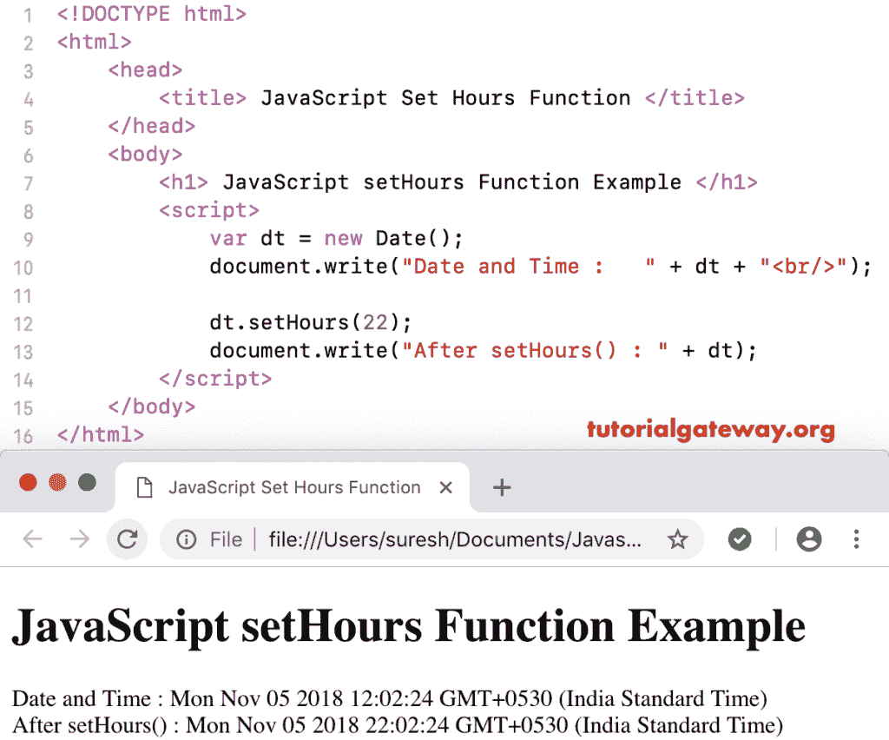

# 设置小时函数

> 原文：<https://www.tutorialgateway.org/javascript-sethours-function/>

函数是一个日期函数，用于根据本地时间设置给定日期的小时、分钟和秒。`setHours()`函数的语法是:

```
 Date.setHours(Hours_Value, Minutes, Seconds, Milliseconds)
```

在 JavaScript`setHours()`函数中，分钟、秒和毫秒参数是可选的。

## JavaScript 设置小时函数示例

我们使用`setHours()`函数将当前时间设置为 22 小时。

```
<!DOCTYPE html>
<html>
<head>
    <title> JavaScript Set Hours Functions </title>
</head>
<body>
    <h1> JExample </h1>
<script>
  var dt = Date();  
  document.write("Date and Time : " + dt + "<br/>");

  dt.setHours(22);
  document.write("After : " + dt);
</script>
</body>
</html>
```

```
Example

Date and Time: Mon Nov 05 2018 12:02:24 GMT+0530 (Indian Standard Time)
After : Mon Nov 05 2018 22:02:24 GMT+0530 (Indian Standard Time)
```

## JavaScript 设置小时数示例 2

在这个 [JavaScript](https://www.tutorialgateway.org/javascript/) 设置小时的例子中，我们将自定义日期的小时设置为凌晨 02 点

```
<!DOCTYPE html>
<html>
<head>
    <title> JavaScript Set Hours Functions </title>
</head>
<body>
    <h1> JavaScript setHours Function Example </h1>
<script>
  var dt = Date("April 1, 2017 19:11:22");
  document.write("Date and Time : " + dt + "<br/>");

  dt.setHours(02);
  document.write("After setHours() : " + dt);
</script>
</body>
</html>
```



在这个 JavaScript 设置小时的例子中，我们将小时设置为 22，分钟设置为 34，秒设置为 12

```
<!DOCTYPE html>
<html>
<head>
    <title> JavaScript Set Hours Functions </title>
</head>
<body>
    <h1> Example </h1>
<script>
  var dt = Date("April 1, 2017 19:11:22");
  document.write("Date and Time : " + dt + "<br/>");

  dt.setHours(22, 34, 12);
  document.write("After : " + dt);
</script>
</body>
</html>
```

```
Example

Date and Time: Tue Nov 06 2018 09:12:57 GMT+0530 (Indian Standard Time)
After : Tue Nov 06 2018 22:34:12 GMT+0530 (Indian Standard Time)
```