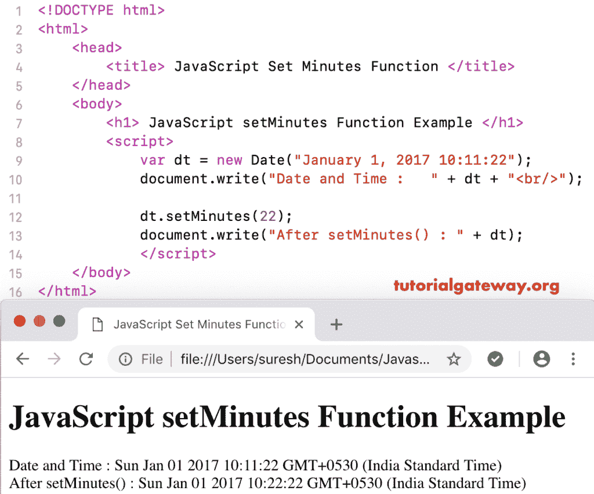

# JavaScript 设置分钟函数

> 原文:[https://www . tutorialgateway . org/JavaScript-setminutes-function/](https://www.tutorialgateway.org/javascript-setminutes-function/)

JavaScript setMinutes 函数用于根据本地时间设置给定日期的分钟、秒和毫秒。JavaScript setMinutes 函数的语法是:

```
 Date.setMinutes(Minutes, Seconds, Milliseconds)
```

在这个 Javascript 集分钟函数中，秒和毫秒参数是可选的。

## 函数示例

这里，我们使用 setMinutes 将当前日期的分钟数设置为 22。

```
<!DOCTYPE html>
<html>
<head>
    <title> JavaScript Set Minutes Functions </title>
</head>
<body>
    <h1> Example </h1>
<script>
  var dt = Date();  
  document.write("Date and Time : " + dt + "<br/>");

  dt.setMinutes(22);
  document.write("After : " + dt);
</script>
</body>
</html>
```

```
Example

Date and Time: Thu Nov 08 2018 11:58:36 GMT+0530 (Indian Standard Time)
After : Thu Nov 08 2018 11:22:36 GMT+0530 (Indian Standard Time)
```

## JavaScript 设置分钟示例 2

在这个 setMinutes 函数示例中，我们将自定义日期的分钟数设置为 22。

```
<!DOCTYPE html>
<html>
<head>
    <title> JavaScript Set Minutes Functions </title>
</head>
<body>
    <h1> JavaScript setMinutes Function Example </h1>
<script>
  var dt = Date("January 1, 2017 10:11:22");
  document.write("Date and Time : " + dt + "<br/>");

  dt.setMinutes(22);
  document.write("After setMinutes() : " + dt);
</script>
</body>
</html>
```



在这个 [JavaScript](https://www.tutorialgateway.org/javascript/) 示例中，我们将分钟设置为 45，秒设置为 05。

```
<!DOCTYPE html>
<html>
<head>
    <title> JavaScript Set Minutes Functions </title>
</head>
<body>
    <h1> Example </h1>
<script>
  var dt = Date("January 1, 2017 10:11:22");
  document.write("Date and Time : " + dt + "<br/>");

  dt.setMinutes(45, 05);
  document.write("After : " + dt);
</script>
</body>
</html>
```

```
Example

Date and Time: Sun Jan 01 2017 10:11:22 GMT+0530 (Indian Standard Time)
After : Sun Jan 01 2017 10:45:05 GMT+0530 (Indian Standard Time)
```