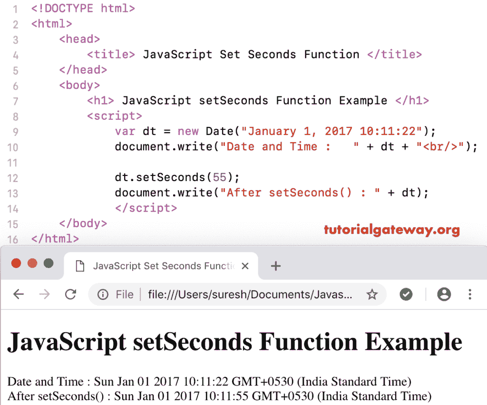

# 设置秒函数

> 原文：<https://www.tutorialgateway.org/javascript-setseconds-function/>

JavaScript setSeconds 函数用于根据本地时间设置给定日期的秒数和毫秒数。JavaScript setSeconds 函数的语法是:

```
 Date.setSeconds(Seconds, Milliseconds)
```

## JavaScript 设置秒函数示例

在此设置中，秒函数毫秒参数是可选的。你可以使用它，也可以避免它。在这里，我们使用设置秒来设置当前日期的 22 秒。

```
<!DOCTYPE html>
<html>
<head>
    <title> JavaScript Set Seconds Functions </title>
</head>
<body>
    <h1> Example </h1>
<script>
  var dt = Date();  
  document.write("Date and Time : " + dt + "<br/>");

  dt.setSeconds(22);
  document.write("After : " + dt);
</script>
</body>
</html>
```

```
Example

Date and Time: Thu Nov 08 2018 11:59:48 GMT+0530 (Indian Standard Time)
After : Thu Nov 08 2018 11:59:22 GMT+0530 (Indian Standard Time)
```

在这个 [JavaScript](https://www.tutorialgateway.org/javascript/) 设置秒的例子中，我们将自定义日期的秒设置为 55。

```
<!DOCTYPE html>
<html>
<head>
    <title> JavaScript Set Seconds Functions </title>
</head>
<body>
    <h1> JavaScript set Seconds Function Example </h1>
<script>
  var dt = Date("January 1, 2017 10:11:22");
  document.write("Date and Time : " + dt + "<br/>");

  dt.setSeconds(55);
  document.write("After setSeconds() : " + dt);
</script>
</body>
</html>
```

