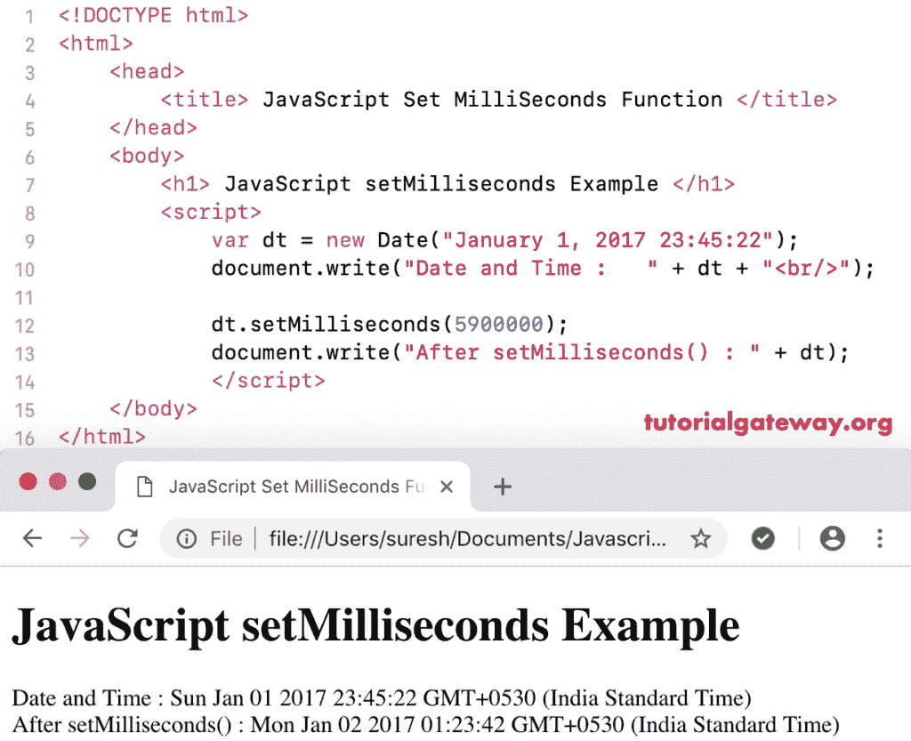

# JavaScript `setMilliseconds()`

> 原文：<https://www.tutorialgateway.org/javascript-setmilliseconds/>

函数是一个日期函数，用于根据本地时间设置给定日期的毫秒数。JavaScript 毫秒函数的语法是:

```
 Date.setMilliseconds(Milliseconds)
```

## 函数示例

这里，我们使用设置毫秒将当前日期的毫秒数设置为 4500000。

```
<!DOCTYPE html>
<html>
<head>
    <title> JavaScript Set Milliseconds Functions </title>
</head>
<body>
    <h1> Example </h1>
<script>
  var dt = Date();  
  document.write("Date and Time : " + dt + "<br/>");

  dt.setMilliseconds(4500000);
  document.write("After : " + dt);
</script>
</body>
</html>
```

```
Example

Date and Time: Thu Nov 08 2018 12:20:32 GMT+0530 (Indian Standard Time)
After : Thu Nov 08 2018 13:35:32 GMT+0530 (Indian Standard Time)
```

在这个 [JavaScript](https://www.tutorialgateway.org/javascript/) 设置毫秒的例子中，我们将自定义日期的毫秒设置为 5900000。

```
<!DOCTYPE html>
<html>
<head>
    <title> JavaScript Set Milliseconds Functions </title>
</head>
<body>
    <h1> JavaScript set Milliseconds Function Example </h1>
<script>
  var dt = Date("January 1, 2017 23:45:22");
  document.write("Date and Time : " + dt + "<br/>");

  dt.setMilliseconds(5900000);
  document.write("After setMilliseconds() : " + dt);
</script>
</body>
</html>
```

