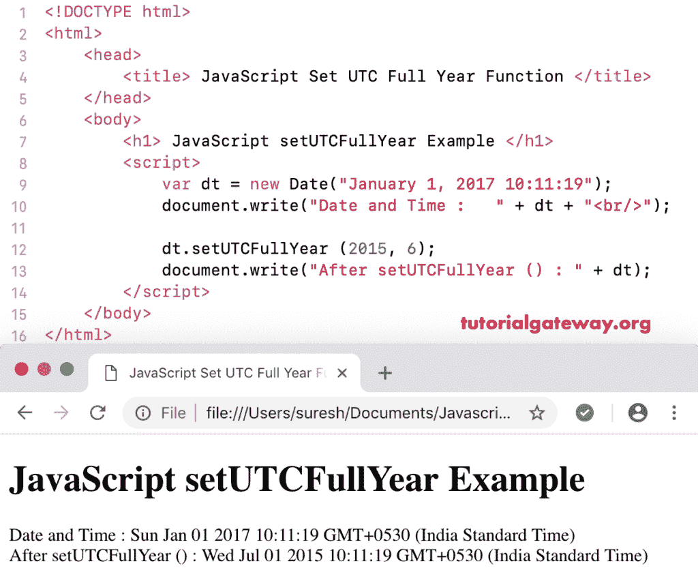

# JavaScript `setUTCFullYear()`

> 原文：<https://www.tutorialgateway.org/javascript-setutcfullyear/>

函数的作用是:根据世界时设置指定日期的年、月、日。`setUTCFullYear()`函数的语法是:

```
 Date.setUTCFullYear(Year_Number, Month, Day_Number)
```

在此设置的世界协调时整年方法中，月和日数是可选参数。

## 函数示例

我们使用`setUTCFullYear()`函数根据世界时将当前年份设置为 2001 年。

```
<!DOCTYPE html>
<html>
<head>
    <title> JavaScript Set UTC Full Year Functions </title>
</head>
<body>
    <h1> Example </h1>
<script>
  var dt = Date();  
  document.write("Date and Time : " + dt + "<br/>");

  dt.setUTCFullYear (2001);
  document.write("After : " + dt);
</script>
</body>
</html>
```

```
Example

Date and Time: Thu Nov 08 2018 12:38:49 GMT+0530 (Indian Standard Time)
After : Thu Nov 08 2001 12:38:49 GMT+0530 (Indian Standard Time)
```

## 设置世界协调时整年函数示例 2

在这个 [JavaScript](https://www.tutorialgateway.org/javascript/) 设置 UTC 整年的例子中，我们将自定义日期年份设置为 2015 年，将月份设置为 6(7 月)按照世界时。

```
<!DOCTYPE html>
<html>
<head>
    <title> JavaScript Set UTC Full Year Functions </title>
</head>
<body>
    <h1> JavaScript set UTC Full Year Function Example </h1>
<script>
  var dt = Date("January 1, 2017 10:11:19");
  document.write("Date and Time : " + dt + "<br/>");

  dt.setUTCFullYear (2015, 6);
  document.write("After setUTCFullYear () : " + dt);
</script>
</body>
</html>
```



在这个 JavaScript setUTCFullYear 示例中，我们将年份设置为 2015 年，月设置为 12 月，日设置为 31 日

```
<!DOCTYPE html>
<html>
<head>
    <title> JavaScript Set UTC Full Year Functions </title>
</head>
<body>
    <h1> Example </h1>
<script>
  var dt = Date("January 1, 2017 10:11:19");
  document.write("Date and Time : " + dt + "<br/>");

  dt.setUTCFullYear (2005, 11, 31);
  document.write("After : " + dt);
</script>
</body>
</html>
```

```
Example

Date and Time: Sun Jan 08 2017 10:11:19 GMT+0530 (Indian Standard Time)
After: Sat Dec 31 2005 10:11:19 GMT+0530 (Indian Standard Time)
```