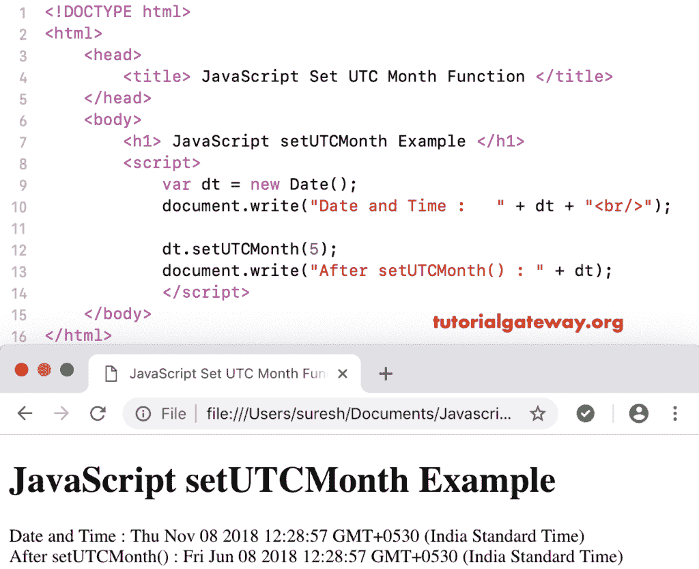

# JavaScript setUTCMonth

> 原文：<https://www.tutorialgateway.org/javascript-setutcmonth/>

函数是一个日期函数，用于根据世界时间设置指定日期的月份。JavaScript`setUTCMonth()`函数的语法是:

```
 Date.setUTCMonth(Month_Number)
```

这里，月号应该在 0 到 11 之间。其中 0 = 1 月，11 = 12 月。

## JavaScript`setUTCMonth()`函数示例

我们使用`setUTCMonth()`函数根据世界时将当前日期月份设置为 5(6 月)。

```
<!DOCTYPE html>
<html>
<head>
    <title> JavaScript Set UTC Month Functions </title>
</head>
<body>
    <h1> Example </h1>
<script>
  var dt = Date();  
  document.write("Date and Time : " + dt + "<br/>");

  dt.setUTCMonth(5);
  document.write("After : " + dt);
</script>
</body>
</html>
```

```
Example

Date and Time: Thu Nov 08 2018 12:28:57 GMT+0530 (Indian Standard Time)
After : Fri jun 08 2018 12:28:57 GMT+0530 (Indian Standard Time)
```

在本 [JavaScript](https://www.tutorialgateway.org/javascript/) 设置 UTC`Month()`函数示例中，我们根据世界时将自定义日期月份设置为 11(12 月)。

```
<!DOCTYPE html>
<html>
<head>
    <title> JavaScript Set UTC Month Functions </title>
</head>
<body>
    <h1> JavaScript set UTC Month Function Example </h1>
<script>
  var dt = Date("May 1, 2016 10:11:19");
  document.write("Date and Time : " + dt + "<br/>");

  dt.setUTCMonth(11);
  document.write("After setUTCMonth() : " + dt);
</script>
</body>
</html>
```

