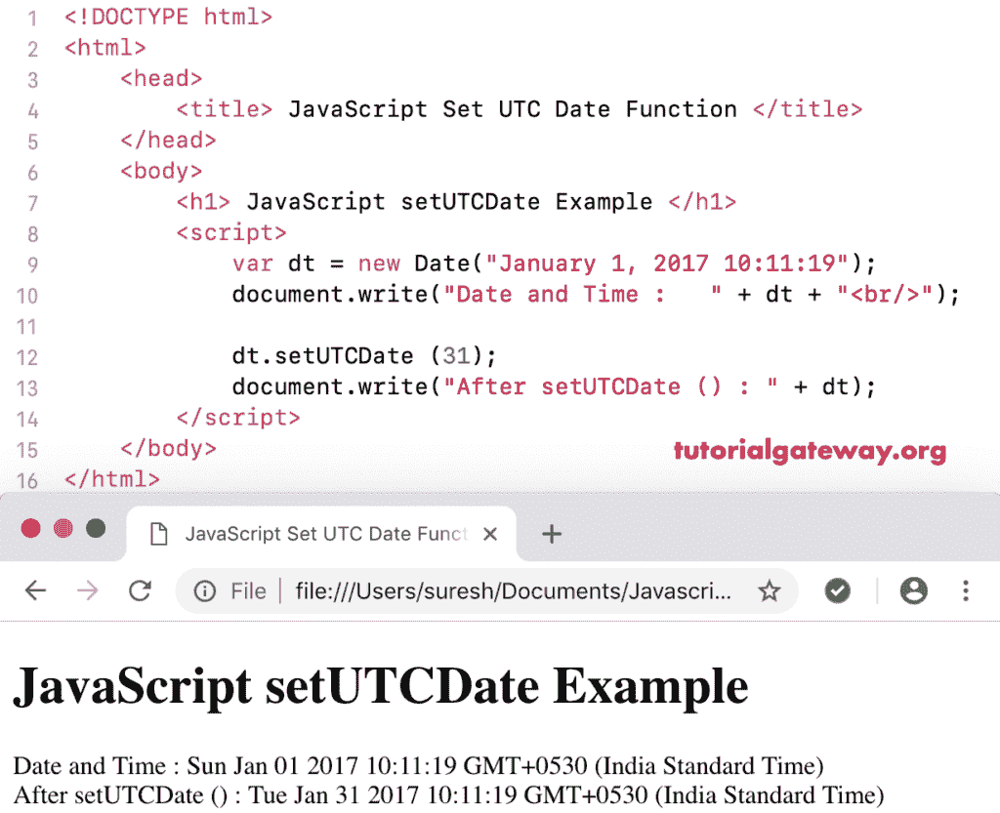

# JavaScript setUTCDate

> 原文:[https://www.tutorialgateway.org/javascript-setutcdate/](https://www.tutorialgateway.org/javascript-setutcdate/)

函数的作用是:根据世界时在给定的日期设置一个月中的某一天。JavaScript 设置日期函数的语法是:

```
 Date.setUTCDate(Day_Number)
```

## JavaScript 设置日期函数示例

我们使用这个设置日期功能来根据世界时将当前日期设置为 30 日。

```
<!DOCTYPE html>
<html>
<head>
    <title> JavaScript Set UTC Date Functions </title>
</head>
<body>
    <h1> Example </h1>
<script>
  var dt = Date();  
  document.write("Date and Time : " + dt + "<br/>");

  dt.setUTCDate (30);
  document.write("After : " + dt);
</script>
</body>
</html>
```

```
Example

Date and Time: Thu Nov 08 2018 12:40:51 GMT+0530 (Indian Standard Time)
After : Fri Nov 30 2018 12:40:51 GMT+0530 (Indian Standard Time)
```

## 设置世界协调时日期函数示例 2

在这个 [JavaScript](https://www.tutorialgateway.org/javascript/) 设置日期的例子中，我们根据世界时将自定义日期的日期设置为 31。

```
<!DOCTYPE html>
<html>
<head>
    <title> JavaScript Set UTC Date Functions </title>
</head>
<body>
    <h1> JavaScript setUTCDate Function Example </h1>
<script>
  var dt = Date("January 1, 2017 10:11:19");
  document.write("Date and Time : " + dt + "<br/>");

  dt.setUTCDate (31);
  document.write("After setUTCDate () : " + dt);
</script>
</body>
</html>
```



如果我们将月数设置为大于 31，则设置日期将转到下一个月

```
<!DOCTYPE html>
<html>
<head>
    <title> JavaScript Set UTC Date Functions </title>
</head>
<body>
    <h1> Example </h1>
<script>
  var dt = Date("January 1, 2017 10:11:19");
  document.write("Date and Time : " + dt + "<br/>");

  dt.setUTCDate (35);
  document.write("After : " + dt);
</script>
</body>
</html>
```

```
Example

Date and Time: Sun Jan 01 2017 10:11:19 GMT+0530 (Indian Standard Time)
After : Sat feb 04 2017 10:11:19 GMT+0530 (Indian Standard Time)
```