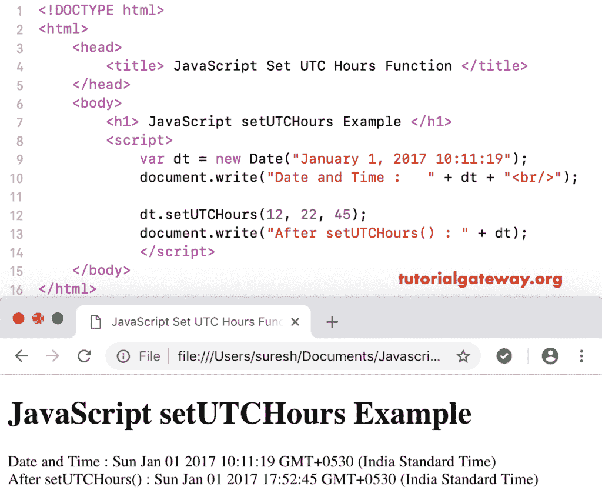

# javascript setutchours

> 原文：<https://www.tutorialgateway.org/javascript-setutchours/>

函数是一个日期函数，用于根据通用时间设置指定日期的小时、分钟、秒和毫秒。JavaScript setUTCHours 函数的语法是:

```
 Date.setUTCHours(Hours, Minutes, Seconds, Milliseconds)
```

## JavaScript 设置时间函数示例

在此方法中，分钟、秒和毫秒是可选参数。我们使用 setUTCHours 将当前日期时间设置为 12(按照世界时)。

```
<!DOCTYPE html>
<html>
<head>
    <title> JavaScript Set UTC Hours Functions </title>
</head>
<body>
    <h1> Example </h1>
<script>
  var dt = Date();  
  document.write("Date and Time : " + dt + "<br/>");

  dt.setUTCHours(12);
  document.write("After : " + dt);
</script>
</body>
</html>
```

```
Example

Date and Time: Thu Nov 08 2018 12:31:28 GMT+0530 (Indian Standard Time)
After : Thu Nov 08 2018 17:31:28 GMT+0530 (Indian Standard Time)
```

在这个 [JavaScript](https://www.tutorialgateway.org/javascript/) 设置 UTC Hours 的例子中，我们根据世界时将自定义日期小时设置为 12，分钟设置为 22，秒钟设置为 45。

```
<!DOCTYPE html>
<html>
<head>
    <title> JavaScript Set UTC Hours Functions </title>
</head>
<body>
    <h1> JavaScriptsetUTCHours Function Example </h1>
<script>
  var dt = Date("January 1, 2017 10:11:19");
  document.write("Date and Time : " + dt + "<br/>");

  dt.setUTCHours(12, 22, 45);
  document.write("After setUTCHours() : " + dt);
</script>
</body>
</html>
```

