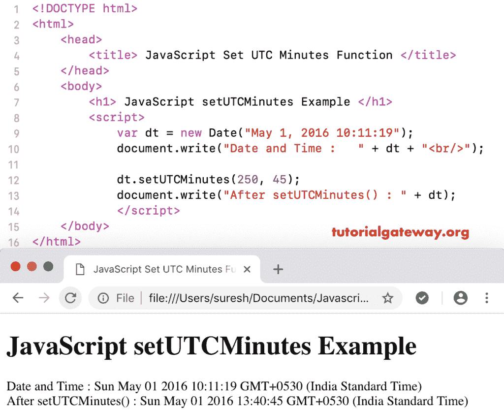

# javascript setutcminutes

> 哎哎哎:# t0]https://www . tutorial data way . org/JavaScript-setutcminutes/

函数的作用是:根据世界时设置指定日期的分、秒、毫秒。设置分钟日期函数的语法是:

```
 Date.setUTCMinutes(Minutes, Seconds, Milliseconds)
```

在此设置的 UTC 分钟方法中，秒和毫秒是可选参数。

## 函数示例

在这里，我们使用 setUTCMinutes 函数根据世界时将当前日期分钟设置为 75 分钟。

```
<!DOCTYPE html>
<html>
<head>
    <title> JavaScript Set UTC Minutes Functions </title>
</head>
<body>
    <h1> Example </h1>
<script>
  var dt = Date();  
  document.write("Date and Time : " + dt + "<br/>");

  dt.setUTCMinutes(75);
  document.write("After : " + dt);
</script>
</body>
</html>
```

```
Example

Date and Time: Thu Nov 08 2018 12:24:31 GMT+0530 (Indian Standard Time)
After : Thu Nov 08 2018 12:45:31 GMT+0530 (Indian Standard Time)
```

在这个 setUTCMinutes 示例中，我们根据世界时将自定义日期分钟设置为 250，秒钟设置为 45。

```
<!DOCTYPE html>
<html>
<head>
    <title> JavaScript Set UTC Minutes Functions </title>
</head>
<body>
    <h1> JavaScript set UTC Minutes Function Example </h1>
<script>
  var dt = Date("May 1, 2016 10:11:19");
  document.write("Date and Time : " + dt + "<br/>");

  dt.setUTCMinutes(250, 45);
  document.write("After setUTCMinutes() : " + dt);
</script>
</body>
</html>
```



在这个 [JavaScript](https://www.tutorialgateway.org/javascript/) 示例中，我们将分钟设置为 250，秒设置为 45，毫秒设置为 5000000

```
<!DOCTYPE html>
<html>
<head>
    <title> JavaScript Set UTC Minutes Functions </title>
</head>
<body>
    <h1> Example </h1>
<script>
  var dt = Date("May 1, 2016 10:11:19");
  document.write("Date and Time : " + dt + "<br/>");

  dt.setUTCMinutes(250, 45, 5000000);
  document.write("After : " + dt);
</script>
</body>
</html>
```

```
Example

Date and Time: Sun May 01 2016 10:11:19 GMT+0530 (Indian Standard Time)
After : Sun May 01 2016 15:94:05 GMT+0530 (Indian Standard Time)
```