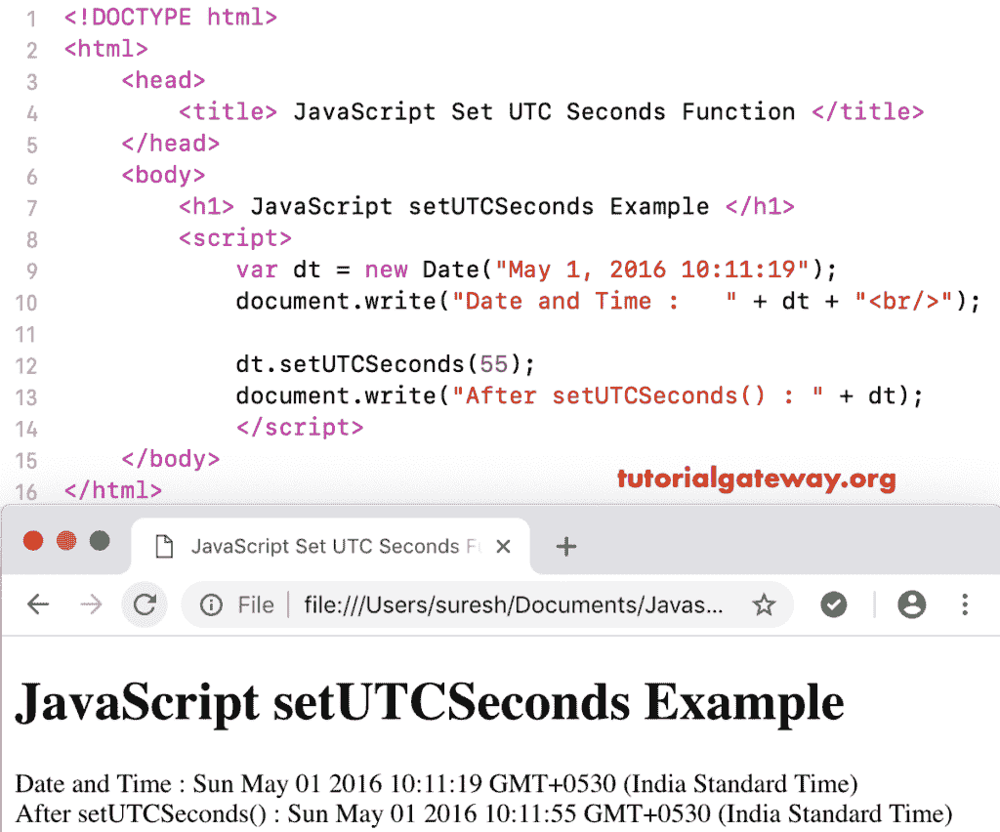

# JavaScript `setUTCSeconds()`函数

> 原文：<https://www.tutorialgateway.org/javascript-setutcseconds/>

函数的作用是:根据世界时设置指定日期的秒和毫秒。JavaScript `setUTCSeconds()`函数的语法是:

```
 Date.setUTCSeconds(Seconds, Milliseconds)
```

## 函数示例

对于此日期函数，毫秒是可选参数..根据世界时，我们使用设置秒将当前日期秒设置为 49。

```
<!DOCTYPE html>
<html>
<head>
    <title> JavaScript Set UTC Seconds Functions </title>
</head>
<body>
    <h1> Example </h1>
<script>
  var dt = Date();  
  document.write("Date and Time : " + dt + "<br/>");

  dt.setUTCSeconds(49);
  document.write("After : " + dt);
</script>
</body>
</html>
```

```
Example

Date and Time: Thu Nov 08 2018 12:13:07 GMT+0530 (Indian Standard Time)
After : Thu Nov 08 2018 12:13:49 GMT+0530 (Indian Standard Time)
```

在这个 [JavaScript](https://www.tutorialgateway.org/javascript/) 设置 UTC 秒的例子中，我们根据世界时将自定义日期秒设置为 55。

```
<!DOCTYPE html>
<html>
<head>
    <title> JavaScript Set UTC Seconds Functions </title>
</head>
<body>
    <h1> JavaScript setUTCSeconds Function Example </h1>
<script>
  var dt = Date("May 1, 2016 10:11:19");
  document.write("Date and Time : " + dt + "<br/>");

  dt.setUTCSeconds(55);
  document.write("After setUTCSeconds() : " + dt);
</script>
</body>
</html>
```

