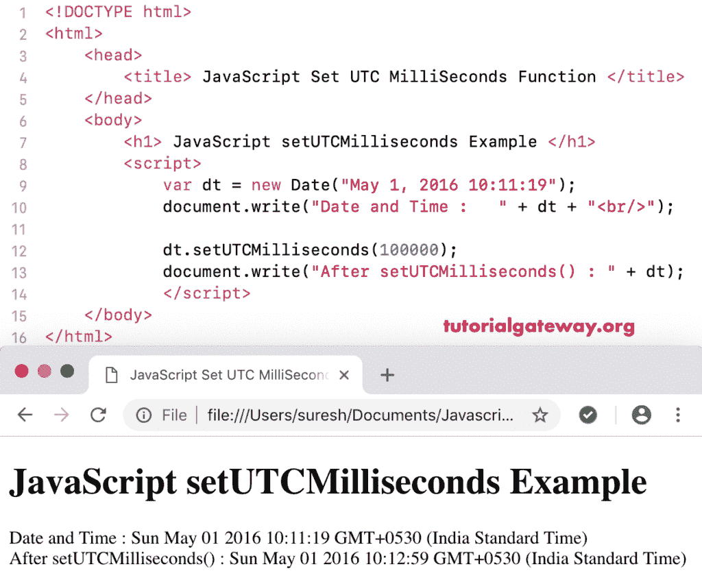

# JavaScript setutcmails

> 原文：<https://www.tutorialgateway.org/javascript-setutcmilliseconds/>

函数是一个日期函数，用于根据世界时间设置指定日期的毫秒数。JavaScript`setutcmails()`函数的语法是:

```
 Date.setUTCMilliseconds(Milliseconds)
```

## 函数示例

我们正在使用 setutcmails 根据世界时将当前日期毫秒设置为 500000。

```
<!DOCTYPE html>
<html>
<head>
    <title> JavaScript Set UTC Milliseconds Functions </title>
</head>
<body>
    <h1> Example </h1>
<script>
  var dt = Date();  
  document.write("Date and Time : " + dt + "<br/>");

  dt.setUTCMilliseconds(500000);
  document.write("After : " + dt);
</script>
</body>
</html>
```

```
Example

Date and Time: Thu Nov 08 2018 12:19:19 GMT+0530 (Indian Standard Time)
After : Thu Nov 08 2018 12:27:39 GMT+0530 (Indian Standard Time)
```

在这个 [JavaScript](https://www.tutorialgateway.org/javascript/) 设置 UTC 毫秒的例子中，我们根据世界时将自定义日期毫秒设置为 100000。

```
<!DOCTYPE html>
<html>
<head>
    <title> JavaScript Set UTC Milliseconds Functions </title>
</head>
<body>
    <h1> JavaScript set UTC Milliseconds Function Example </h1>
<script>
  var dt = Date("May 1, 2016 10:11:19");
  document.write("Date and Time : " + dt + "<br/>");

  dt.setUTCMilliseconds(100000);
  document.write("After setUTCMilliseconds() : " + dt);
</script>
</body>
</html>
```

