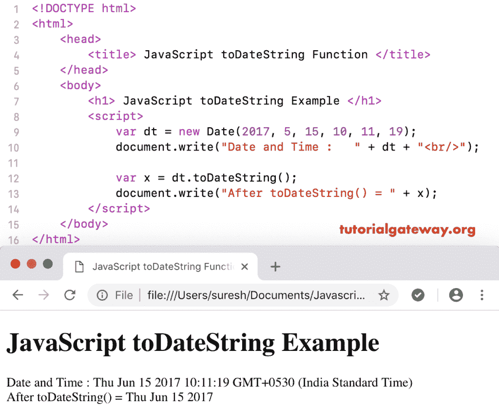

# JavaScript toDateString

> 原文：<https://www.tutorialgateway.org/javascript-todatestring/>

函数以人类可读的格式返回给定日期的日期部分。JavaScript toDateString 函数的语法是:

```
 Date.toDateString()
```

## 今日测试函数示例

我们使用 toDateString 函数返回今天日期的数据部分。

```
<!DOCTYPE html>
<html>
<head>
    <title> JavaScript toDateString Function  </title>
</head>
<body>
    <h1> Example </h1>
<script>
  var dt = Date();  
  document.write(dt + "<br/>");

  var x = dt.toDateString();
  document.write("After = " + x);
</script>
</body>
</html>
```

```
Example

Fri Nov 09 2018 11:56:52 GMT+0530 (Indian Standard Time)
After = Fri Nov 09 2018
```

这个 [JavaScript](https://www.tutorialgateway.org/javascript/) 到日期字符串示例以人类可读的格式返回自定义日期的字符串日期。

```
<!DOCTYPE html>
<html>
<head>
    <title> JavaScript to Date String Function  </title>
</head>
<body>
    <h1> JavaScript to Date String Example </h1>
<script>
  var dt = Date(2017, 5, 15, 10, 11, 19);
  document.write("Date and Time : " + dt + "<br/>");

  var x = dt.toDateString();
  document.write("After toDateString() = " + x);
</script>
</body>
</html>
```

