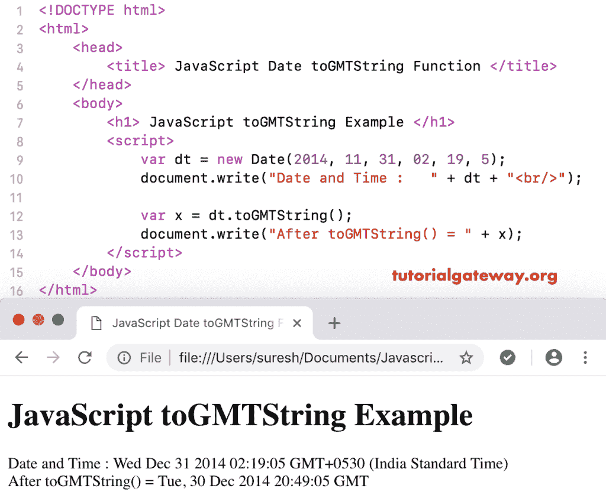

# javascript togmtstring

> 原文:[https://www.tutorialgateway.org/javascript-togmtstring/](https://www.tutorialgateway.org/javascript-togmtstring/)

函数的作用是:使用 GMT 将日期和时间转换成字符串对象。这个 JavaScript 字符串日期函数的基本语法是:

```
 Date.toGMTString()
```

## 函数示例

我们正在使用 toGMTString 函数将今天的日期和时间转换为字符串对象。

```
<!DOCTYPE html>
<html>
<head>
    <title> JavaScript Date to GMT String Function  </title>
</head>
<body>
    <h1> Example </h1>
<script>
  var dt = Date();  
  document.write("Date and Time : " + dt + "<br/>");

  var x = dt.toGMTString();
  document.write("After = " + x);
</script>
</body>
</html>
```

```
Example

Date and Time: Fri Nov 09 2018 11:59:15 GMT+0530 (Indian Standard Time)
After = Fri, 09 Nov 2018 06:29:15 GMT
```

## JavaScript 到 GMT 字符串函数示例 2

这个 [JavaScript](https://www.tutorialgateway.org/javascript/) 示例使用 GMT 将自定义日期和时间转换为字符串。

```
<!DOCTYPE html>
<html>
<head>
    <title> JavaScript date toGMTString Function  </title>
</head>
<body>
    <h1> JavaScript toGMTString Example </h1>
<script>
  var dt = Date(2014, 11, 31, 02, 19, 5);
  document.write("Date and Time : " + dt + "<br/>");

  var x = dt.toGMTString();
  document.write("After toGMTString() = " + x);
</script>
</body>
</html>
```

