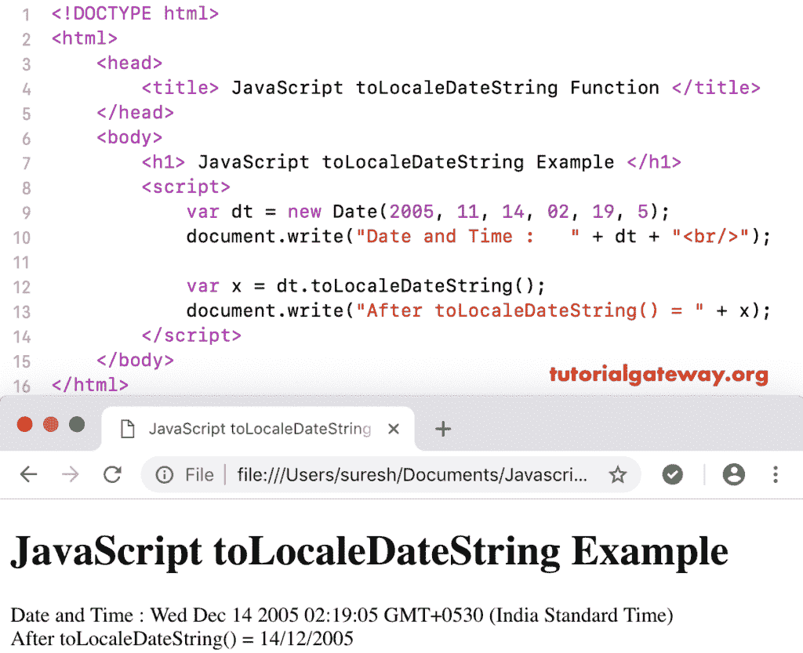

# JavaScript `toLocaleDateString()`

> 原文：<https://www.tutorialgateway.org/javascript-tolocaledatestring/>

函数的作用是:使用系统区域对话，将给定日期的日期部分转换成字符串。JavaScript `toLocaleDateString()`函数的语法是:

```
 Date.toLocaleDateString()
```

## 函数示例

我们使用 JavaScript to locale Date`String()`函数，使用系统区域设置将今天日期的数据部分转换为字符串。

```
<!DOCTYPE html>
<html>
<head>
    <title> JavaScript to Locale Date String Function  </title>
</head>
<body>
    <h1> Example </h1>
<script>
  var dt = Date();  
  document.write("DateTime : " + dt + "<br/>");

  var x = dt.toLocaleDateString();
  document.write("After = " + x);
</script>
</body>
</html>
```

```
Example

DateTime: Fri Nov 09 2018 12:02:43 GMT+0530 (Indian Standard Time)
After = 09/11/2018
```

这个 [JavaScript](https://www.tutorialgateway.org/javascript/) 到区域日期字符串示例以字符串格式返回给定日期的自定义日期。

```
<!DOCTYPE html>
<html>
<head>
    <title> JavaScript Date toLocaleDateString Function  </title>
</head>
<body>
    <h1> JavaScript toLocaleDateString Example </h1>
<script>
  var dt = Date(2005, 11, 14, 02, 19, 5);
  document.write("Date and Time : " + dt + "<br/>");

  var x = dt.toLocaleDateString();
  document.write("After toLocaleDateString() = " + x);
</script>
</body>
</html>
```

