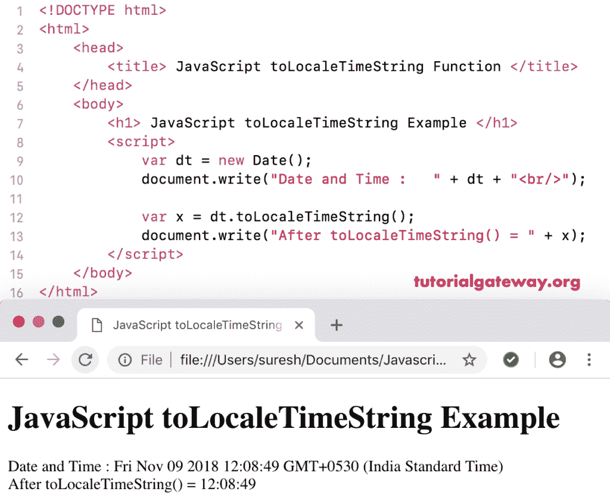

# JavaScript `toLocaleTimeString()`

> 原文：<https://www.tutorialgateway.org/javascript-tolocaletimestring/>

函数的作用是:使用系统区域设置对话，将给定日期和时间的时间部分转换为字符串。函数的语法是:

```js
 Date.toLocaleTimeString()
```

## 函数示例

这里，我们使用 JavaScript to locale Time`String()`函数，使用系统区域设置将今天的日期和时间的时间部分转换为字符串。

```js
<!DOCTYPE html>
<html>
<head>
    <title> JavaScript Date to Locale Time String Function  </title>
</head>
<body>
    <h1> Example </h1>
<script>
  var dt = Date();  
  document.write("Date and Time : " + dt + "<br/>");

  var x = dt.toLocaleTimeString();
  document.write("After = " + x);
</script>
</body>
</html>
```

```js
Example

Date and Time: Mon Dec 31 2012 22:45:32 GMT+0530 (Indian Standard Time)
After = 22:45:32
```

## JavaScript 到区域时间字符串函数示例 2

这个[JavaScript](https://www.tutorialgateway.org/javascript/)to localetimestring 示例以字符串格式返回自定义日期和时间的时间部分。

```js
<!DOCTYPE html>
<html>
<head>
    <title> JavaScript to Locale Time String Function  </title>
</head>
<body>
    <h1> JavaScript to Locale Time String Example </h1>
<script>
  var dt = Date(2012, 11, 31, 22, 45, 32);
  document.write("Date and Time : " + dt + "<br/>");

  var x = dt.toLocaleTimeString();
  document.write("After toLocaleTimeString() = " + x);
</script>
</body>
</html>
```

