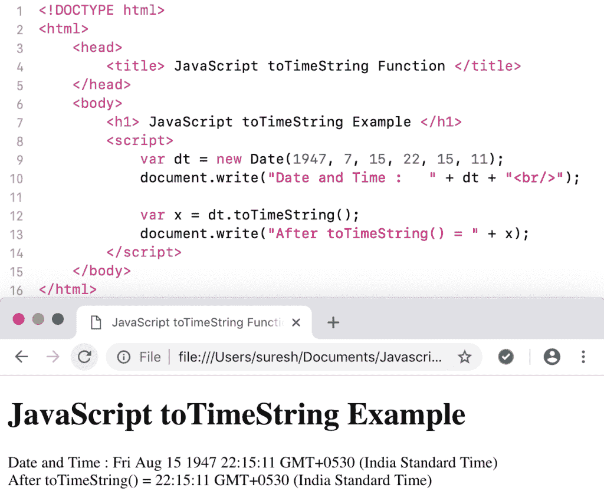

# JavaScript toTimeString

> 原文：<https://www.tutorialgateway.org/javascript-totimestring/>

函数以人类可读的格式返回给定日期的时间部分。JavaScript toTimeString 日期函数的语法是:

```
 Date.toTimeString()
```

## 函数示例

我们使用 toTimeString 函数返回今天日期和时间的时间部分。

```
<!DOCTYPE html>
<html>
<head>
    <title> JavaScript to Time String Function  </title>
</head>
<body>
    <h1> Example </h1>
<script>
  var dt = Date();  
  document.write("Date and Time : " + dt + "<br/>");

  var x = dt.toTimeString();
  document.write("After = " + x);
</script>
</body>
</html>
```

```
Example

Date and Time: Fri Nov 09 2018 12:28:14 GMT+0530 (Indian Standard Time)
After = 12:28:14 GMT+0530 (Indian Standard Time)
```

这个 [JavaScript](https://www.tutorialgateway.org/javascript/) 到时间字符串的例子以人类可读的格式返回自定义日期和时间的字符串时间。

```
<!DOCTYPE html>
<html>
<head>
    <title> JavaScript to Time String Function  </title>
</head>
<body>
    <h1> JavaScript to Time String Example </h1>
<script>
  var dt = Date(1947, 7, 15, 22, 15, 11);
  document.write("Date and Time : " + dt + "<br/>");

  var x = dt.toTimeString();
  document.write("After toTimeString() = " + x);
</script>
</body>
</html>
```

