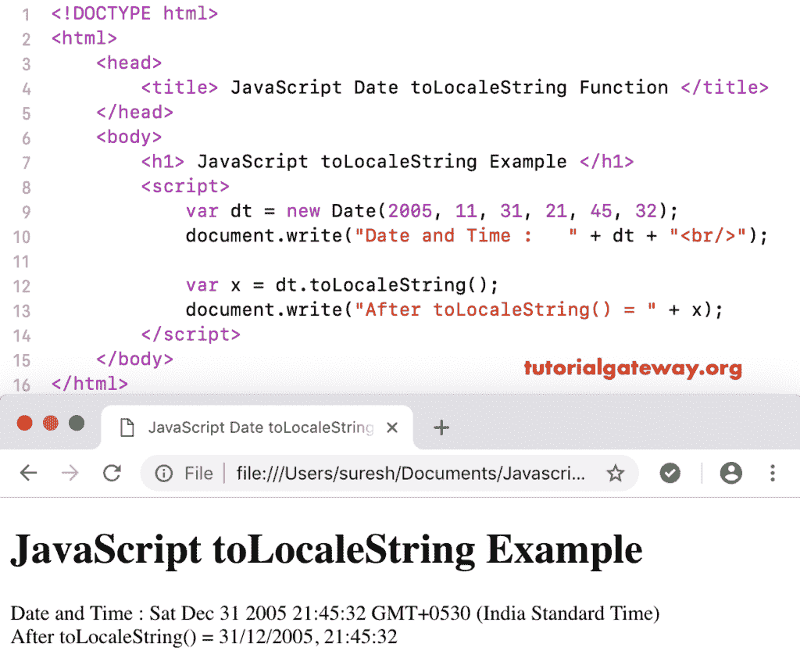

# javascript tolocalestring

> 原文:[https://www.tutorialgateway.org/javascript-tolocalestring/](https://www.tutorialgateway.org/javascript-tolocalestring/)

JavaScript toLocaleString 函数是 Date 函数的一种，它使用系统区域设置对话将给定的日期和时间转换为字符串。JavaScript toLocaleString 函数的基本语法是:

```
 Date.toLocaleString()
```

## JavaScript toLocaleString 函数示例

以下示例有助于您理解 JavaScript 语言环境字符串函数。这里，我们使用这个函数使用系统区域设置将今天的日期和时间转换为字符串。

```
<!DOCTYPE html>
<html>
<head>
    <title> JavaScript to Locale String Function  </title>
</head>
<body>
    <h1> Example </h1>
<script>
  var dt = Date();  
  document.write("Date and Time : " + dt + "<br/>");

  var x = dt.toLocaleString();
  document.write("After = " + x);
</script>
</body>
</html>
```

```
Example

Date and Time: Fri Nov 09 2018 12:04:18 GMT+0530 (Indian Standard Time)
After = 09/11/2018 12:04:18
```

### JavaScript 到区域字符串函数示例 2

这个[JavaScript](https://www.tutorialgateway.org/javascript/)to localestring 示例使用系统区域设置返回自定义日期和时间中的字符串表示日期和时间。

```
<!DOCTYPE html>
<html>
<head>
    <title> JavaScript Date to Locale String Function  </title>
</head>
<body>
    <h1> JavaScript to Locale String Example </h1>
<script>
  var dt = Date(2005, 11, 31, 21, 45, 32);
  document.write("Date and Time : " + dt + "<br/>");

  var x = dt.toLocaleString();
  document.write("After toLocaleString() = " + x);
</script>
</body>
</html>
```

