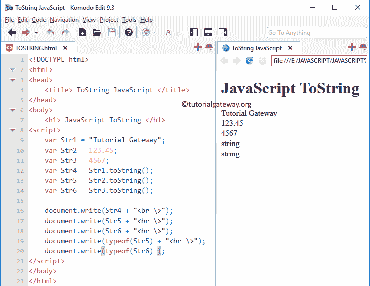

# JavaScript toString

> 原文：<https://www.tutorialgateway.org/javascript-tostring-2/>

JavaScript`toString()`函数是一个字符串函数，它将指定的表达式转换为字符串对象。字符串`toString()`函数的基本语法是

```
String_Object.toString()
```

## JavaScript`toString()`函数示例

`ToString()`函数不接受任何参数。下面的例子将帮助你理解 JavaScript 的`ToString()`函数。

首先，我们声明了三个变量 Str1、Str2 和 Str3，并使用。前三种说法。

以下三个 [JavaScript](https://www.tutorialgateway.org/javascript/) 语句将十进制和整数值转换为字符串值

接下来，我们使用[函数的类型](https://www.tutorialgateway.org/javascript-string-functions/)，向您展示变量的数据类型。从上面的截图可以观察到，Str2(十进制)和 Str3(整数)的数据类型转换为字符串类型。

```
<!DOCTYPE html>
<html>
<head>
    <title> ToStringJavaScript </title>
</head>
<body>
    <h1> JavaScriptToString </h1>
<script>
    var Str1 = "Tutorial Gateway";
    var Str2 = 123.45;
    var Str3 = 4567;
    var Str4 = Str1.toString();
    var Str5 = Str2.toString();
    var Str6 = Str3.toString();

    document.write(Str4 + "<br \>");
    document.write(Str5 + "<br \>");
    document.write(Str6 + "<br \>");
    document.write(typeof(Str5) + "<br \>");
    document.write(typeof(Str6) );
</script>
</body>
</html>
```



### JS`toString()`函数示例 2

在这里，我们使用这个 JavaScript`tostring()`函数将今天的日期和时间转换成一个字符串对象。

```
<!DOCTYPE html>
<html>
<head>
    <title> Example  </title>
</head>
<body>
    <h1> Js Example </h1>
<script>
  var dt = Date();  
  document.write("Date and Time : " + dt + "<br/>");

  var x = dt.toString();
  document.write("After toString() = " + x);
</script>
</body>
</html>
```

```
Js Example

Date and Time : Fri Nov 09 2018 12:16:42 GMT+0530 (Indian Standard Time)
After toString() = Fri Nov 09 2018 12:16:42 GMT+0530 (Indian Standard Time)
```

本示例以字符串格式返回自定义日期和时间的日期和时间。

```
<!DOCTYPE html>
<html>
<head>
    <title> Example  </title>
</head>
<body>
    <h1> JExample </h1>
<script>
  var dt = Date(1947, 7, 15, 10, 15, 11);
  document.write("Date and Time : " + dt + "<br/>");

  var x = dt.toString();
  document.write("After toString() = " + x);
</script>
</body>
</html>
```

```
JExample

Date and Time : Fri Aug 15 1947 10:15:11 GMT+0530 (Indian Standard Time)
After toString() = Fri Aug 15 1947 10:15:11 GMT+0530 (Indian Standard Time)
```