# 如何下载 MySQL

> 原文：<https://www.tutorialgateway.org/how-to-download-mysql/>

在这篇文章中，我们将向您展示，从哪里或如何下载带有截图的 MySQL 服务器。以下是 MySQL 下载中涉及的步骤。

## 为 Windows 下载 MySQL

下载 MySQL Server，首先点击此链接[页面](https://www.mysql.com/downloads/)进入官网。接下来，如果您或您的组织拥有企业版许可证，则下载企业版。它会向你索要国书中的神谕叹息，然后你必须下载它。

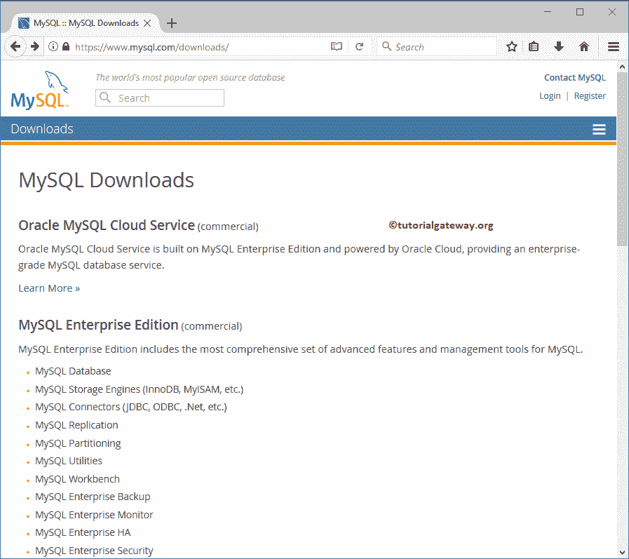

在这种情况下，我们正在为 windows 下载 MySQL 社区版，因为它是免费的。请点击社区下载超链接。

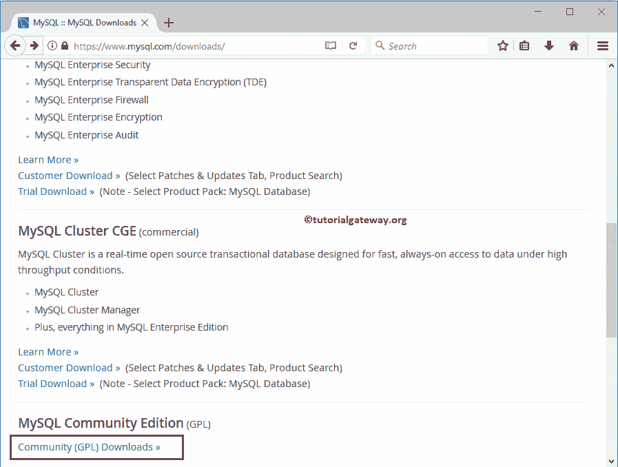

下一页请选择 [MySQL](https://www.tutorialgateway.org/mysql-tutorial/) 社区服务器。

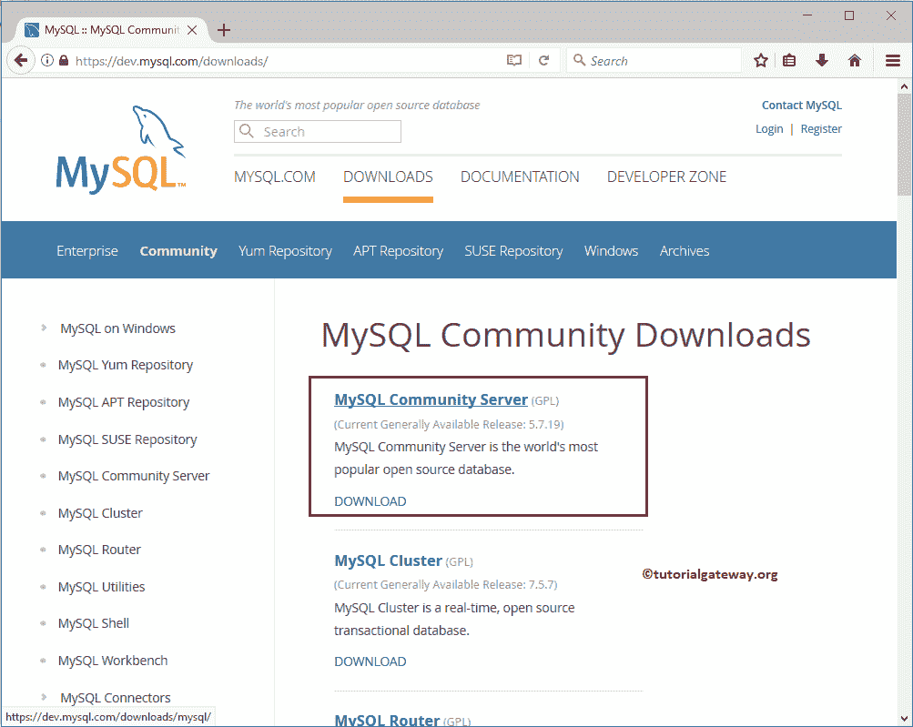

选择社区服务器将引导您进入以下页面

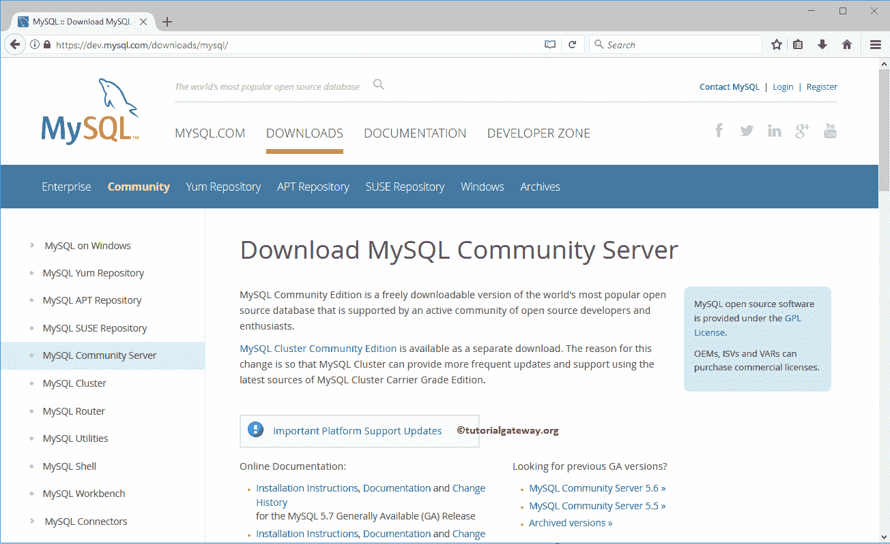

向下滚动一点，看到下面的截图。您可以使用下拉框选择操作系统。

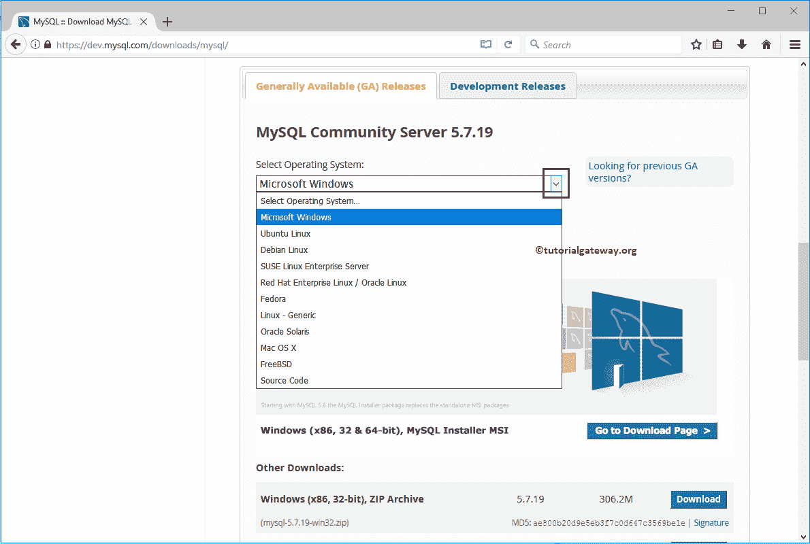

使用选择操作系统版本下拉框选择版本(32 位或 62 位)

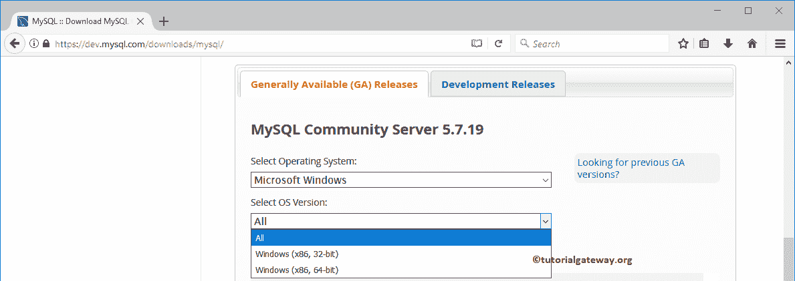

现在，我们选择全部(32 位或 62 位)。接下来，点击“转到下载页面”按钮，如下所示。

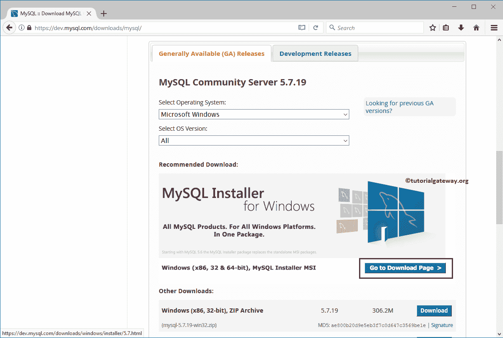

下面截图是【下载 MySQL 安装程序】页面

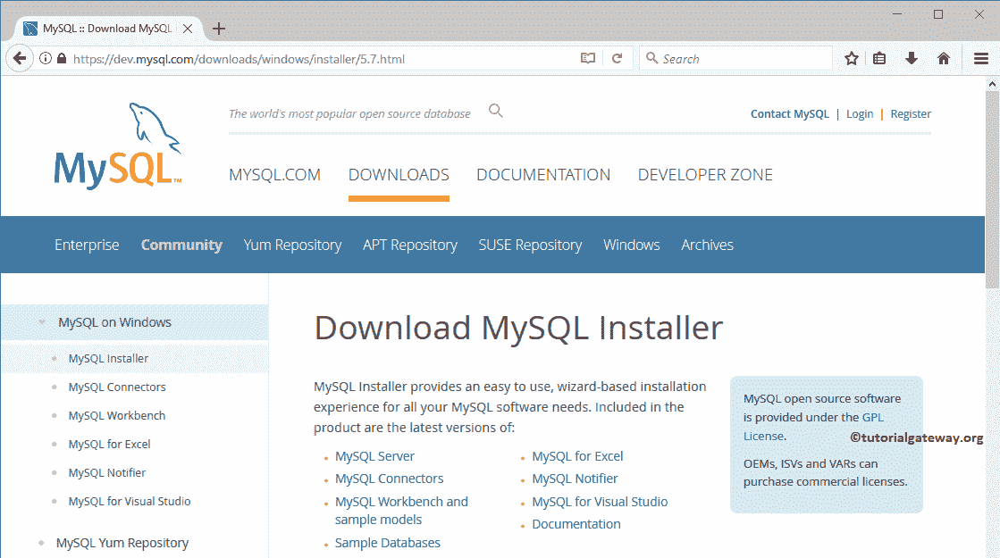

请向下滚动一点，查看下面的截图。在这里，您有两个选择:

*   它将下载 MySQL 基本安装程序，然后在您开始安装软件时使用互联网复制所需的文件。
*   第二个选项将在开始时保存所有需要的文件。安装服务器不需要互联网连接。这是最好的选择

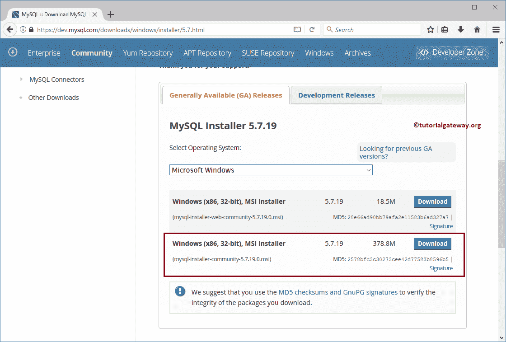

对于社区软件，它会要求您登录或注册甲骨文网站。你可以通过点击【不谢谢，只需启动

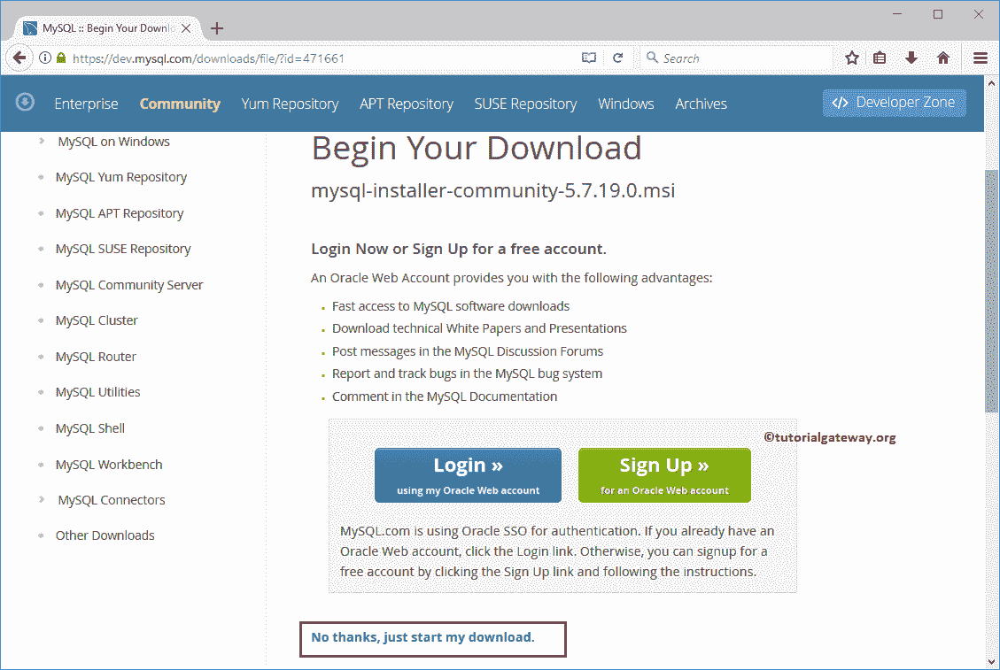

来避免这种情况

它会问你是否要保存 MSI 文件。点击保存文件按钮，为窗口下载 MySQL。

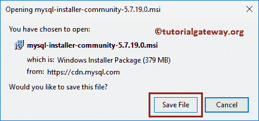