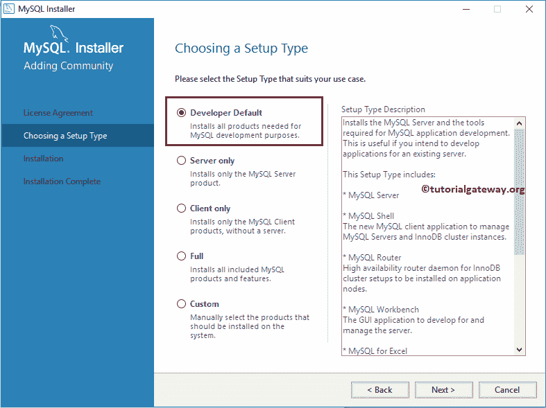
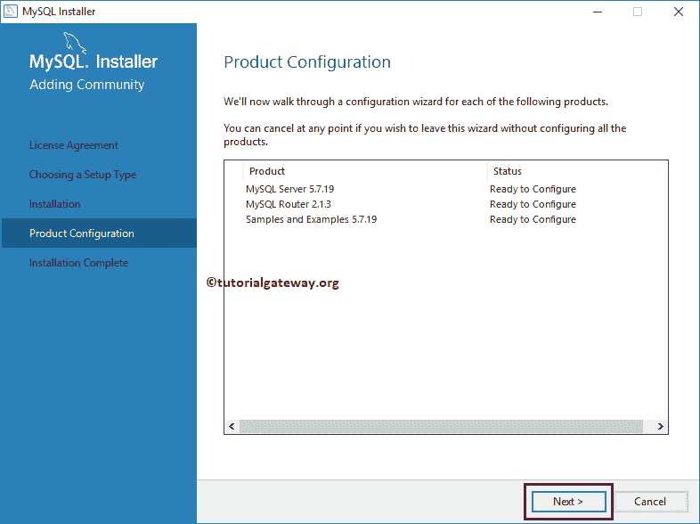
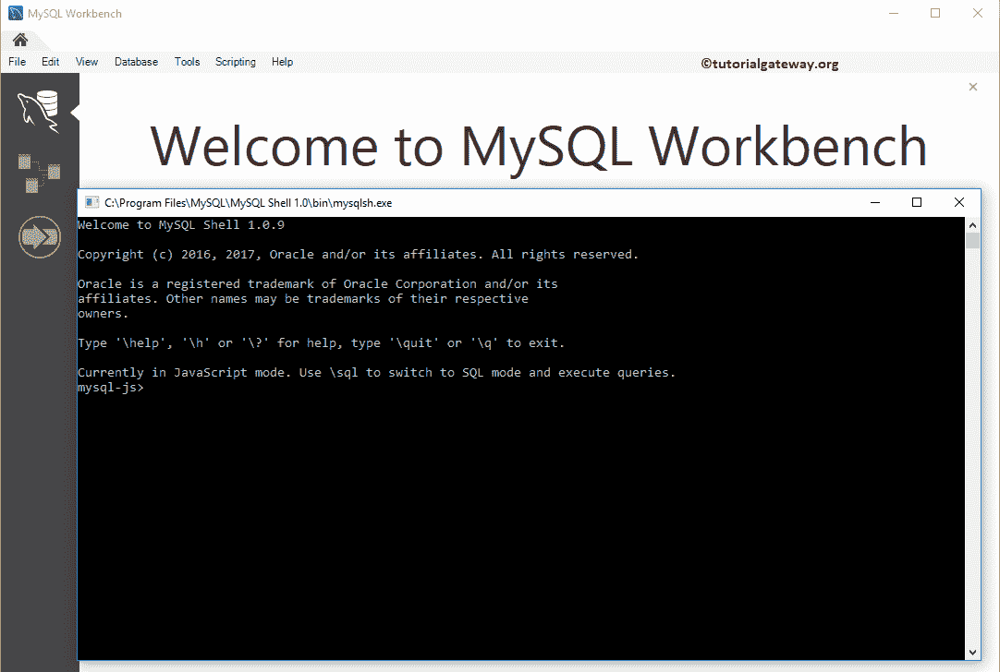

# 在 Windows 上安装 MySQL

> 原文：<https://www.tutorialgateway.org/install-mysql-on-windows/>

本文向您展示了在 Windows 上安装 MySQL 的分步过程。苹果电脑也是如此。要在 Windows 上安装 MySQL，双击我们在[下载 MySQL](https://www.tutorialgateway.org/how-to-download-mysql/) 文章中下载的 MSI 文件。

根据安全配置，它可能会向您请求运行权限。请单击“运行”按钮，从下面显示的弹出消息中在窗口上安装 MySQL。

## 在 Windows 上安装 MySQL

一旦你点击运行，一个名为 [MySQL](https://www.tutorialgateway.org/mysql-tutorial/) 安装中心的新安装向导将会打开。在 windows 平台上开始安装 MySQL 之前，请阅读许可协议，并勾选我接受许可条款选项。

选择设置类型:请选择设置类型

如果你只使用 MySQL 或者想学习 MySQL，那么你可以选择自定义选项。通过选择自定义选项，您可以安装 MySQL 所需的组件，并节省磁盘空间。

选择自定义选项后，请从可用产品中选择 MySQLServer、工作台。然后将它们添加到要安装的产品/功能中。它添加了服务器和工作台来编写查询。

我们需要 MySQL 中所有可用的产品。因此，我们选择了开发人员默认选项。如果您有更多的硬盘空间，请选择此选项。

在 windows 上安装 MySQL 时，它也会泄露你安装 Python 的权限。如您所见，我们没有在这个系统上安装 python。为了演示这条消息，我们刚刚从系统中卸载了 [Python](https://www.tutorialgateway.org/python-tutorial/) 。

当我们单击“下一步”按钮时，MySQL 安装会抛出一个确认消息框。单击是。请记住，即使您没有 Visual Studio 或任何其他支持软件，您也会收到此消息。

点击执行按钮，在 windows 10 上安装 MySQL。它包括您之前选择的所有产品。

可以看到，MySQL 在 windows 10 上安装成功。单击“下一步”按钮。

产品配置:到目前为止，我们在我们的窗口上安装了 MySQLServer、工作台和其余产品。现在我们必须配置服务器、路由器，并向其中添加示例。

类型和网络:请选择第一个选项，然后单击下一步。

服务器配置类型:使用此页面配置服务器类型、端口号。从下面的截图可以看出，配置类型有三种:

*   开发机器:如果你选择这个选项，你可以像其他软件一样使用这个软件，并且消耗更少的内存。标准选项。
*   服务器机器:如果您正在配置服务器-客户端，则可以使用此选项。因此，唯一的服务器应用程序将在该系统中运行。
*   专用机器:如果您想将此机器专用于服务器，请使用此选项。它不允许这台机器上有任何服务器，如 web 服务器。

我们选择默认开发机器作为配置类型，默认端口号为 3306。你可以根据自己的要求改变。

请提供根帐户的密码。这是您将用于从命令提示符或工作台登录的密码。

除了默认的根帐户之外，您可以通过点击【添加用户】按钮

来添加您自己的用户进行访问

在这里，我们添加了具有数据库管理权限的 tutorialgateway 用户。我们将写一篇关于角色和访问级别的文章。

可以看到，我们为用户

提供了随机密码

现在，你可以看到一个新用户

Windows 服务:这将把 MySQL 服务添加到 windows 服务中，并且该服务将在 windows 加载时启动。

目前，我们还没有启用该协议。所以，我们就这样离开了，点击【下一步】按钮

单击执行按钮应用配置。

单击“完成”按钮完成配置。

让我配置路由器

我们将在后期进行路由器配置。目前，我们将保留默认值。请随意根据您的要求进行更改。

现在，让我配置样本和示例

请提供连接到服务器

的密码

单击执行按钮运行添加示例和示例所需的脚本。

从下面的“在 windows 上安装 MySQL”屏幕截图中，您可以看到配置步骤执行时没有任何错误。

单击“完成”按钮关闭安装程序向导。它完成了在 windows 10 上安装 MySQL。

我希望您理解在 windows 10 上安装 MySQL 以及工作台和连接所需的步骤。下面的截图将显示命令提示符和工作台。

