# 创建数据库

> 原文：<https://www.tutorialgateway.org/mysql-create-database/>

如何用实例在 MySQLServer 中创建数据库？。在这里，我们将同时使用命令提示符和工作台。

MySQL 数据库是一个可以存储业务数据的存储位置。每个数据库都使用表以标准化的方式存储信息。因此，我们可以轻松地插入、选择、更新和删除业务数据。创建新数据库的 MySQL 命令是。

## MySQL 创建数据库示例

在我们开始在 MySQL 中创建数据库之前，让我们看看可用数据库的列表。要获取这些信息，您必须使用以下命令。

```
SHOW DATABASES;
```

下面的截图将向您展示可用的数据库。

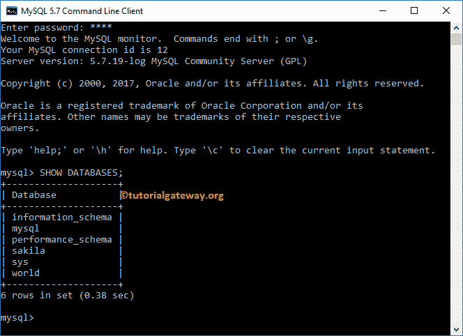

MySQL 创建数据库的基本语法是:

```
CREATE DATABASE Database_Name
```

出于演示的目的，我们将在 MySQL 中创建一个名为 First_Database 的数据库。因此，将数据库名替换为第一个数据库，如下所示

```
CREATE DATABASE First_Database;
```

从下面的截图可以观察到 [MySQL](https://www.tutorialgateway.org/mysql-tutorial/) 命令执行成功。

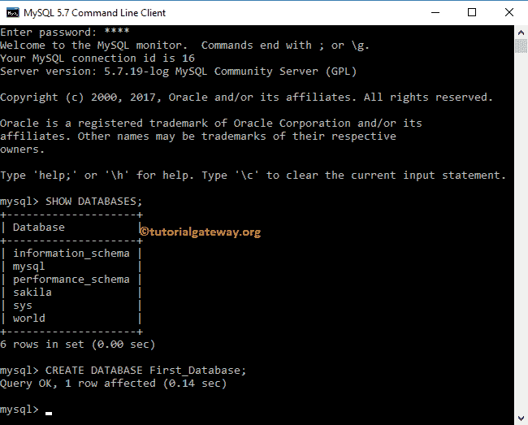

现在，让我向您展示可用的数据库。并且你可以看到第一个 _ 数据库列表

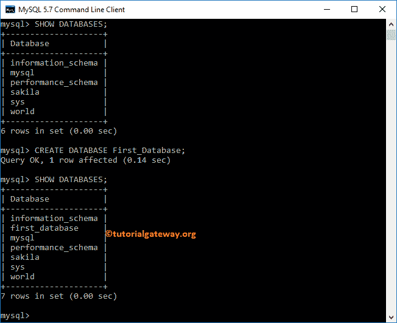

## 使用工作台创建数据库

在我们开始之前，让我打开工作台。从下面的截图中，您可以在模式窗格下看到可用模式的列表。

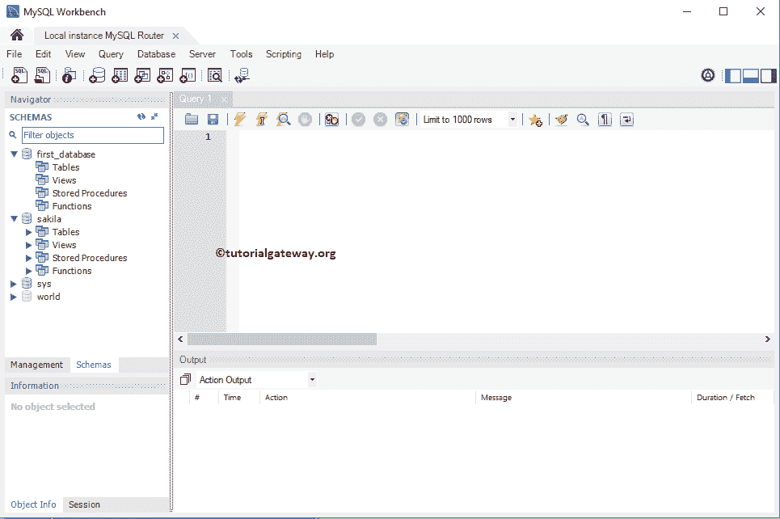

### 在工作台中使用查询创建数据库

在本例中，我们创建了一个名为 second_database 的新数据库。

```
CREATE DATABASE second_database;
```

点击执行按钮执行

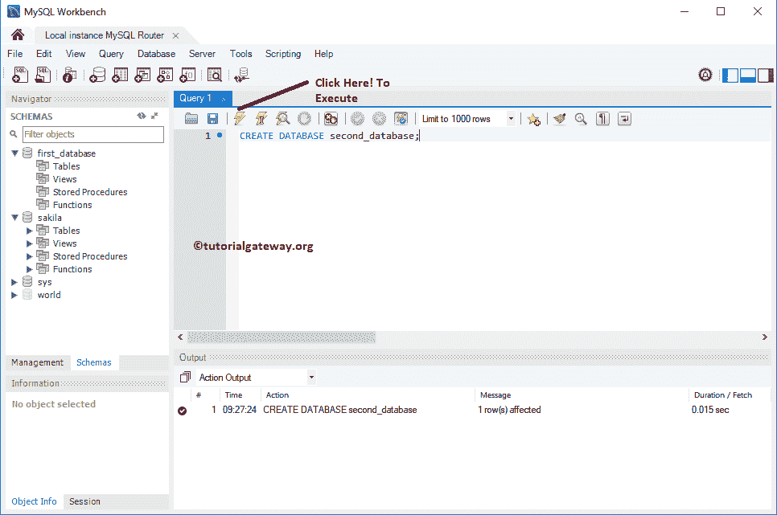

命令

从下面的截图可以看到命令执行成功，可以看到 schemas

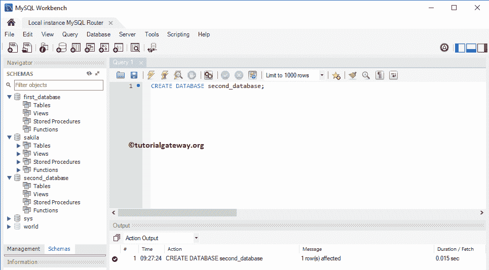

下的 second_database

### 在工作台中使用向导创建数据库

如果您不知道或不熟悉查询，请使用工作台。为此，在菜单中，单击“连接的服务器”按钮中的“创建新模式”。

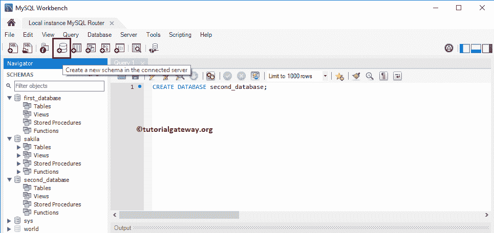

选择该选项后，将打开以下选项卡窗口。请将模式名称从新 _ 模式更改为第三 _ 数据库

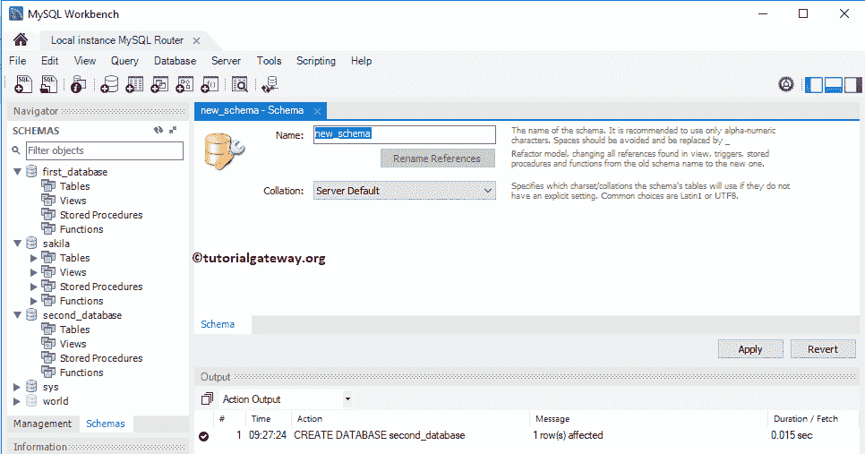

您可以使用排序规则下拉框来更改服务器默认排序规则。

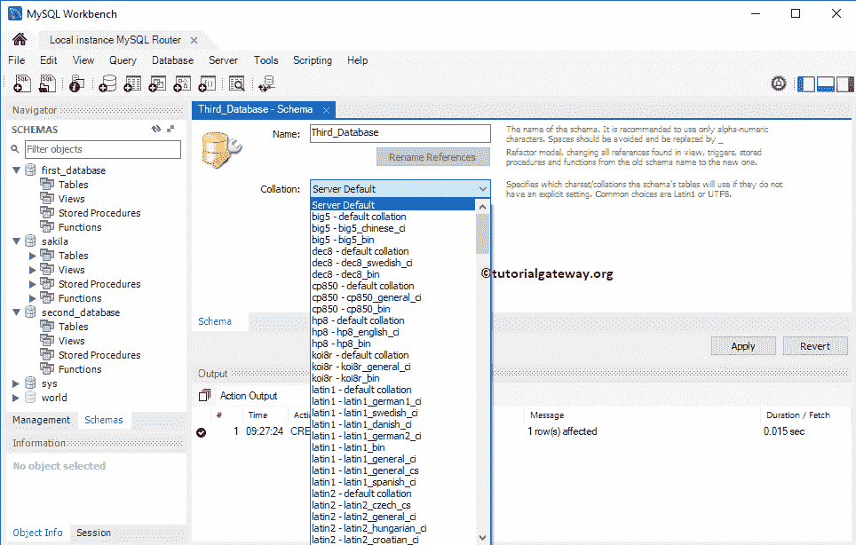

单击应用按钮创建新的模式或数据库。

提示:我们配置了 MySQL，默认情况下将模式名和表名转换为小写。因为我们使用了 Third_Database 作为模式，所以据说它会将名称转换为小写。

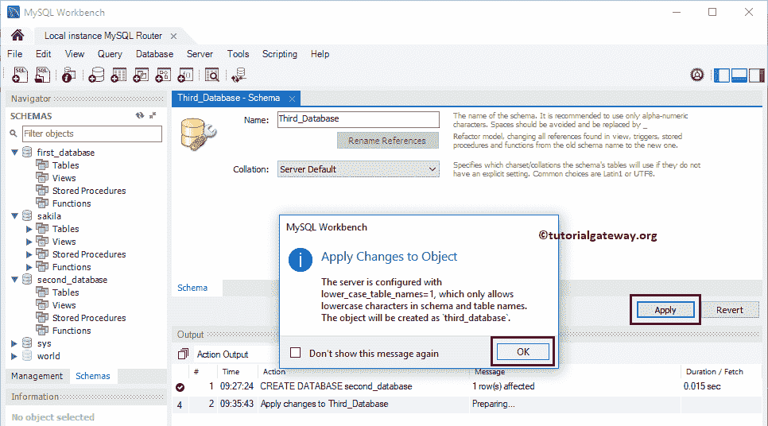

点击【应用】按钮

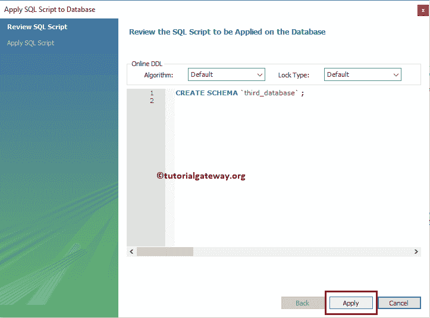

接下来，点击【完成】按钮

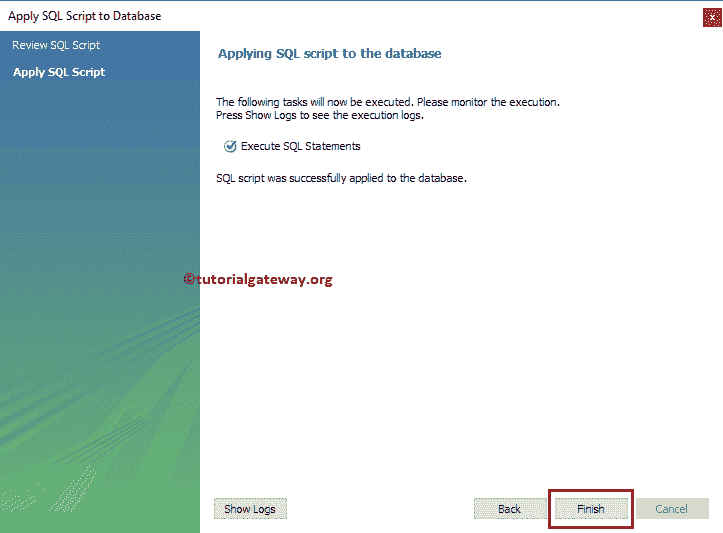

现在，您可以在模式下看到第三个 _database。

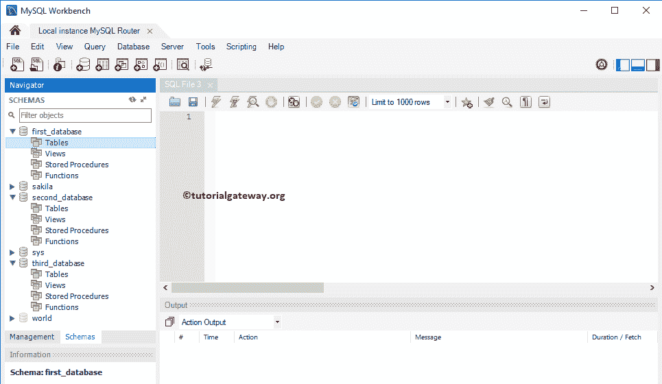

提示:如果您在工作台中没有找到新创建的数据库，请单击模式旁边的刷新按钮

## 如何检查数据库名称是否存在？

让我们看看当我们用一个现有的名字在 MySQL 中创建数据库时会发生什么。从下面的截图中，可以看到它抛出了一个错误:无法创建第三个 _database。

```
CREATE DATABASE third_database;
```

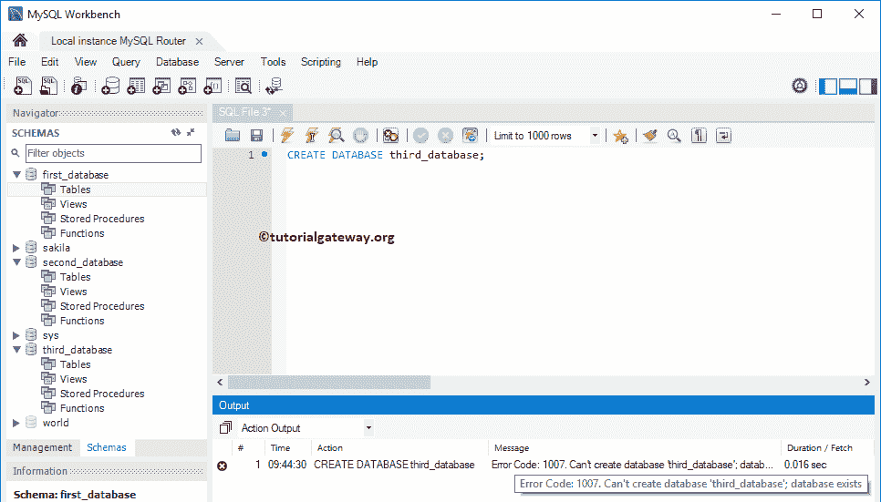

注意:在一个组织中，我们可能有也可能没有了解可用数据库的特权。因此，检查名称是否已经存在总是明智的

如果您有查看可用数据库的权限，那么您可以使用 SHOW DATABASES 命令来查看列表。如果没有，请使用下面的选项。

只有当第三个数据库在系统中不可用时，以下语句才会执行语句。

```
CREATE DATABASE IF NOT EXISTS third_database;
```

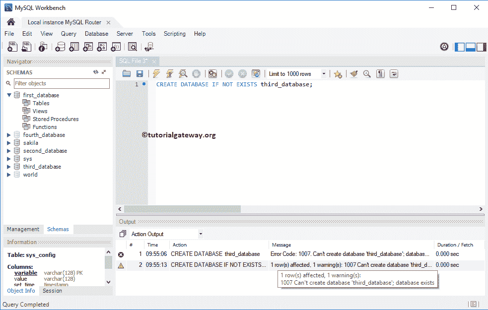

让我在这个命令中尝试一个不同的名称

```
CREATE DATABASE IF NOT EXISTS fourth_database;
```

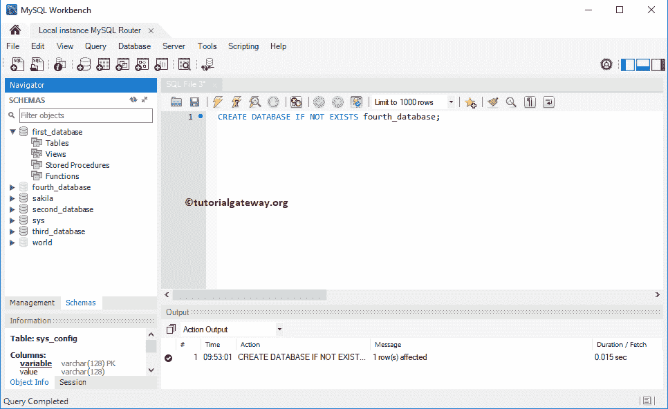