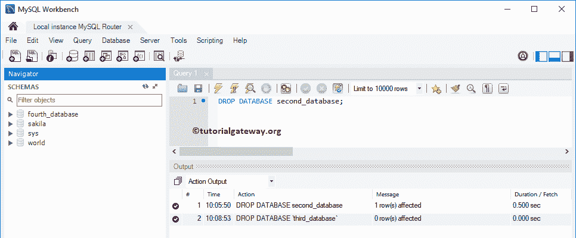
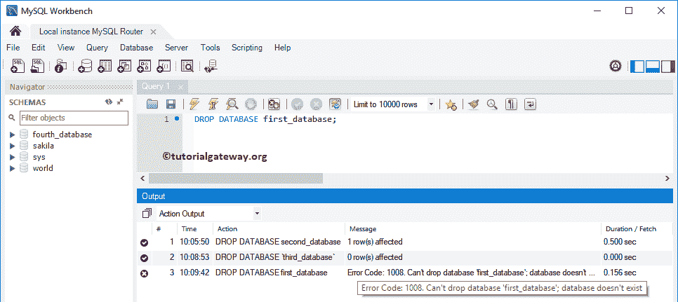

# MySQL 删除数据库

> 原文：<https://www.tutorialgateway.org/mysql-delete-database/>

MySQL 删除数据库用于删除数据库中的所有表，也删除数据库本身。让我们通过例子来看看如何在 MySQL 中删除数据库。在这里，我们将使用命令提示符和工作台来删除数据库

## MySQL 删除数据库示例

在本例中，我们将向您展示如何使用命令提示符删除 MySQL 中的数据库。在我们开始删除数据库之前，让我向您展示一下 MySQL 服务器中可用数据库的列表。要获得这些信息，您必须使用 SHOW DATABASES 命令。

```
SHOW DATABASES;
```

下面的截图将向您显示可用数据库的列表。


在 MySQL 中删除数据库或删除数据库的基本语法是:

```
DROP DATABASE Database_Name
```

为了演示删除数据库的目的，我们将删除第一个数据库。因此，将数据库名替换为第一个数据库，如下所示。

```
DROP DATABASE First_Database;
```

从下面的截图中，可以看到命令执行成功。据说 1 排受到影响。意思是 [MySQL](https://www.tutorialgateway.org/mysql-tutorial/) 数据库中有一个表，该表被删除(连同[数据库](https://www.tutorialgateway.org/mysql-create-database/))。


现在，让我给你看看可用的数据库。您可以看到 first_database 不在列表中。


## 在工作台中删除数据库

要删除数据库，让我打开工作台。从下面的截图中，您可以在模式窗格下看到可用数据库的列表。在这里，有多种方法可以删除工作台中的数据库。您可以编写 MySQL drop 数据库语句，也可以使用上下文菜单。


### 在工作台中使用查询删除数据库

在这个例子中，我们使用删除数据库命令删除 second_database 数据库

```
DROP DATABASE second_database;
```

在这里，命令成功执行。现在，您可以看到模式


下没有第二个 _ 数据库

### 使用工作台图形用户界面删除数据库

要删除或删除数据库，请在“模式”部分下，自己导航到要删除的数据库。右键单击它将打开上下文菜单。请选择删除方案。选项。


请选择立即删除选项。


现在您可以看到，模式下没有第三个数据库。



提示:请单击模式旁边的刷新按钮来查看更新的模式。

## 删除数据库的最佳方法

让我们看看如果我们使用 MySQL drop database 语句删除一个不存在的数据库会发生什么。从下面的截图可以观察到它抛出了一个错误，说:不能先掉数据库 _database。数据库不存在。

```
DROP DATABASE first_database;
```



只有当系统数据库中的第一个数据库可用时，以下语句才会执行删除数据库语句

```
DROP DATABASE IF EXISTS first_database;
```


让我用 MySQL drop database 命令尝试一个不同的数据库名称

```
DROP DATABASE IF EXISTS fourth_database;
```

