# MySQL 创建表

> 原文:[https://www.tutorialgateway.org/mysql-create-table/](https://www.tutorialgateway.org/mysql-create-table/)

如何用例子在 MySQL 中创建表？。在这里，我们将对 MySQL 的 Create Table 语句同时使用命令提示符和工作台。MySQL 使用表来存储和管理数据。

该表是行和列的组合。我们必须使用 MySQL 创建表语句来创建一个新的表。

## MySQL 创建表语法

在 MySQL 中创建表的基本语法如下所示:

```
CREATE TABLE 'TableName'
(
    Column_Name1 Data_Type(Size) [NULL | NOT NULL],
    Column_Name2 Data_Type(Size) [NULL | NOT NULL],
     …
    Column_NameN Data_Type(Size) [NULL | NOT NULL]
);
```

让我们看看 MySQL 创建表语法中的各个项目:

*   表名:请提供一个唯一的名称。如果名称已经存在，它将引发错误。
*   列名:需要唯一或不同的列名。
*   数据类型:每个单独列的有效数据类型。例如，Int、Varchar、float
*   大小:请在此提供一个有效的整数
*   空值或非空值:如果选择了空值选项，则该列同时接受正常值和空值。否则，它会抛出一个错误，指出列不应为空。

## 如何使用命令提示符在 MySQL 中创建表

在我们开始在 MySQL 公司的数据库中创建一个表之前，让我们看看数据库中现有表的列表。要获取此信息，请使用以下命令。

```
SHOW TABLES;
```

下面截图显示的是 [MySQL](https://www.tutorialgateway.org/mysql-tutorial/) 数据库中可用的。

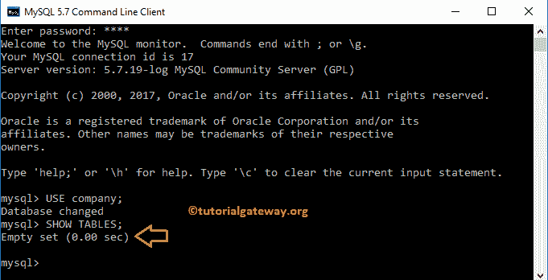

如您所见，公司[数据库](https://www.tutorialgateway.org/mysql-create-database/)没有现有的数据库。出于演示目的，我们使用 MySQL create table 语句创建了一个名为 sales 的新表。

```
CREATE TABLE sales
(
   SaleID INT NOT NULL AUTO_INCREMENT,
   Product_Name VARCHAR(100) NULL,
   Product_Description TEXT
);
```

从下面的截图中，可以看到命令成功执行。

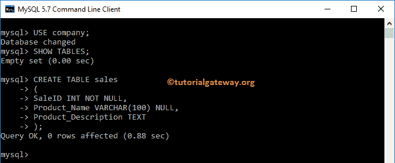

现在，让我们看看公司数据库中的可用列表。注意列表中的销售名称。

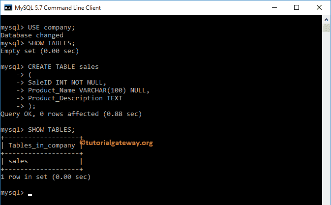

## MySQL 创建表工作台示例

这一次，我们使用下面显示的代码在公司数据库中创建客户表

```
USE company;
CREATE TABLE customers (
    CustID INT NOT NULL AUTO_INCREMENT,
    First_Name VARCHAR(50) NULL,
    Last_Name VARCHAR(50) NULL,
    Education VARCHAR(50) NULL,
    Profession VARCHAR(50) NULL,
    Yearly_Income INT NULL,
    Sales FLOAT(10, 2) NULL,
  PRIMARY KEY (CustID)
)
```

注意:在您开始创建一个新的之前，最好检查它是否存在。

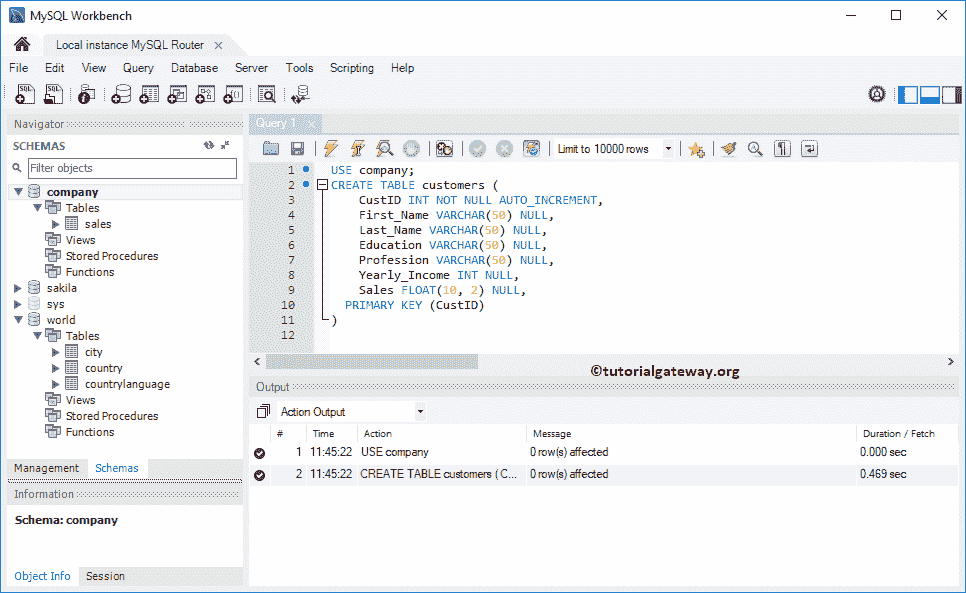

在上面的代码中，我们在 MySQL 中新创建的表中声明了 7 列:

*   我们的第一列是整数数据类型的 CustID，它不允许空值。我们还将此列定义为自动增量。(如果需要，这是可选的您可以删除自动增量部分)
*   名字、姓氏、学历、职业列属于 Varchar 数据类型，不允许空值。我们还将尺寸指定为 50。这意味着这些列最多可以接受 50 个字符
*   第六列是 INT 数据类型的年收入，允许空值。
*   销售列属于浮动数据类型，它允许空值。

从下面的截图中，可以看到命令执行成功。现在，您可以在“表格”文件夹下看到新创建的表格。

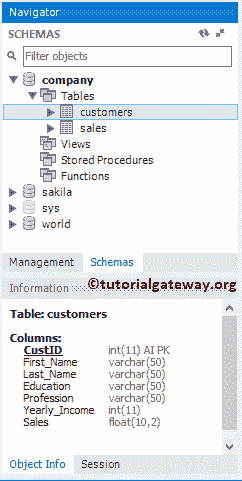

提示:如果在 MySQL 中没有找到新创建的表，请点击 SCHEMAS 旁边的刷新按钮

### 如何找到 MySQL 表定义

如果您想找到现有的 MySQL 表定义，请右键单击该名称，然后从上下文菜单中选择“表检查器”选项。

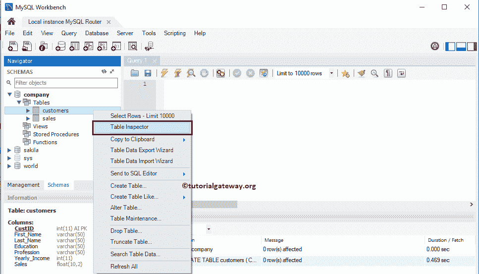

选择该选项后，将打开一个包含所有信息的新选项卡。请转到 DDL 选项卡查看定义。

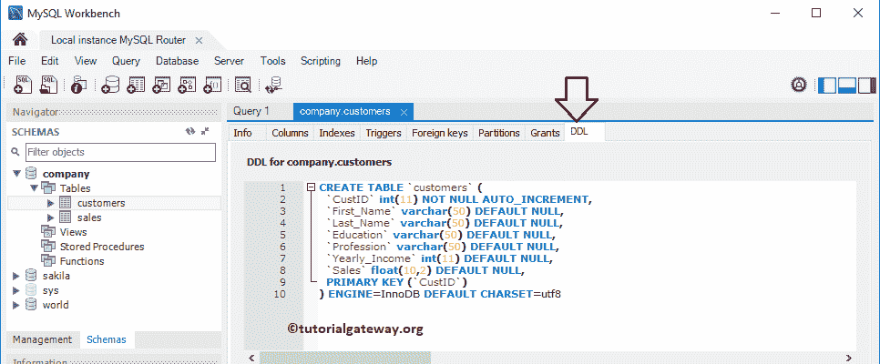

### 检查 MySQL 表名是否存在？

让我们看看如果我们在 MySQL 中用现有的名称创建一个表会发生什么。从下面的截图中，你可以看到它抛出了一个错误:表销售已经存在。

```
USE company;
CREATE TABLE sales
(
    Id INT NOT NULL,
    Name VARCHAR(50) NULL,
    Country VARCHAR(50)    
)
```

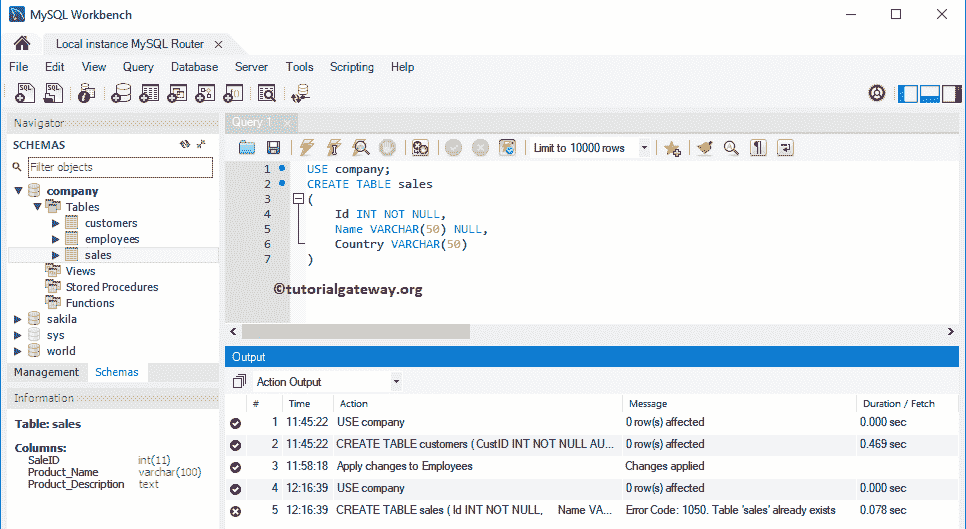

注意:最好检查一下 MySQL 表名是否已经存在

如果您有权限查看数据库中可用表的列表，请使用 SHOW TABLES 命令。如果不是这样，请使用下面的选项。

以下语句仅在公司数据库中没有销售额的情况下执行 MySQL 创建表语句。

```
USE company;
CREATE TABLE IF NOT EXISTS sales
(
    Id INT NOT NULL,
    Name VARCHAR(50) NULL,
    Country VARCHAR(50)    
);
```

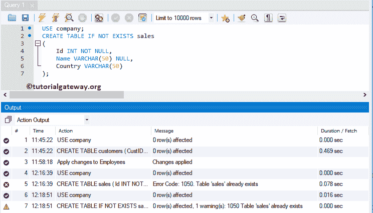

使用 MySQL 创建表命令尝试不同的名称

```
USE company;
CREATE TABLE IF NOT EXISTS salesDetails
(
	Id INT NOT NULL,
    Name VARCHAR(50) NULL,
    Country VARCHAR(50)    
);
```

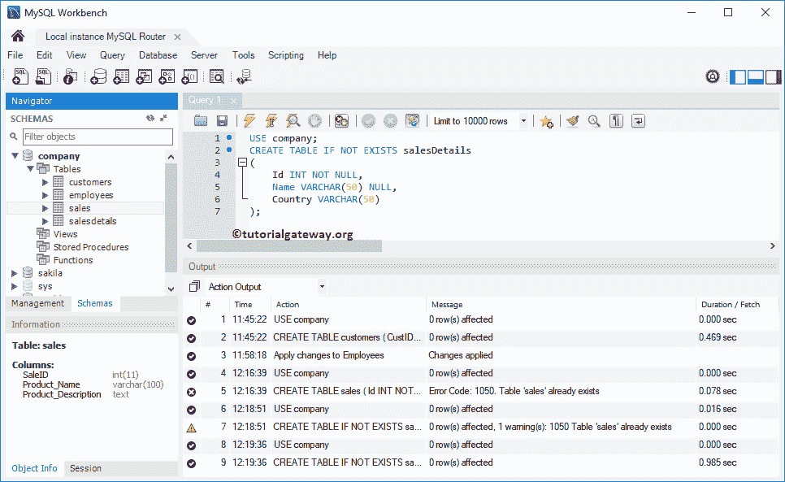

## 使用工作台图形用户界面创建表格

要在 MySQL 中创建一个表，在模式中，展开要使用的数据库文件夹。右键单击文件夹打开上下文菜单。请选择创建表格…选项。

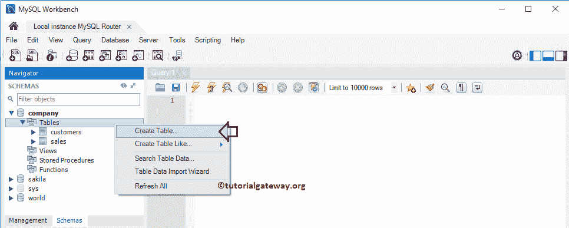

它将打开以下窗口来设计 tbl。请将表名从新 _ 表更改为

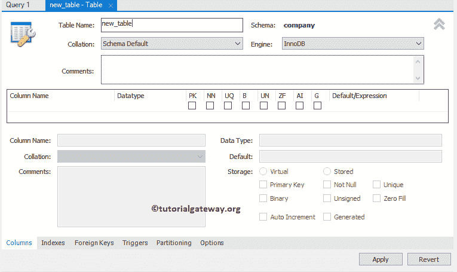

员工

您可以使用“排序规则”下拉框来更改架构默认排序规则。

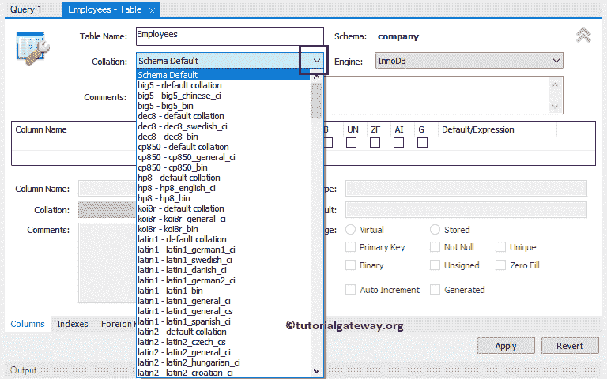

您可以使用引擎下拉列表

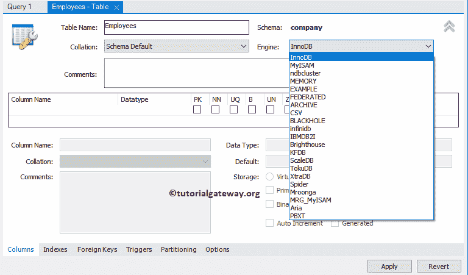

更改默认服务器引擎

目前，我们保留所有默认配置。接下来，点击箭头以获得更多的设计空间。

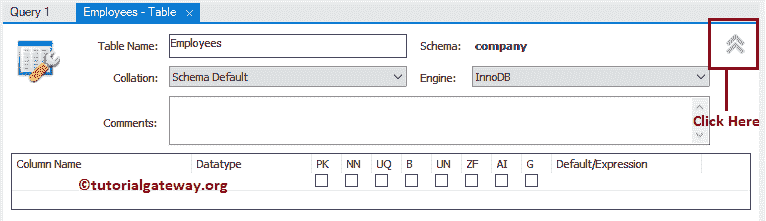

单击公司名称下方的空行，将自动为您创建一个新列。让我把它改名为 Empid。

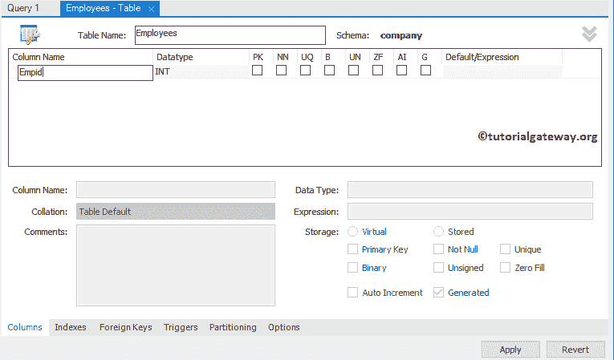

请根据您的要求更改数据类型。也可以使用复选框。

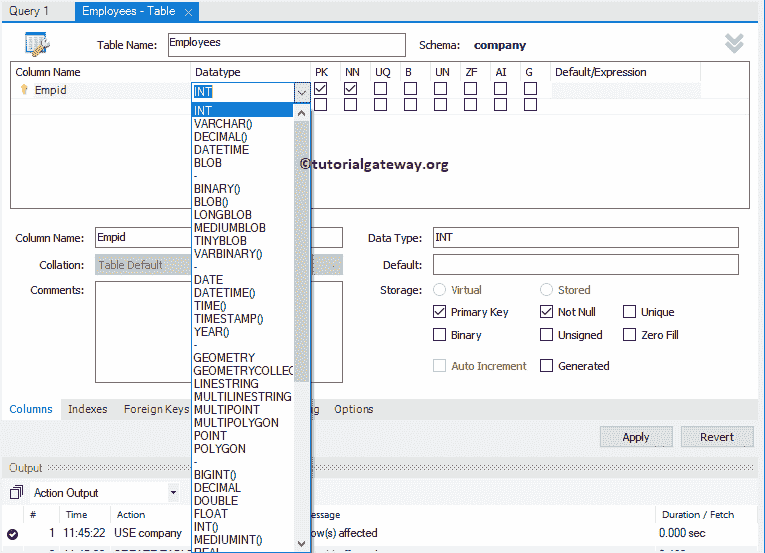

从下面的截图中，可以看到，有四列。单击应用按钮创建员工。

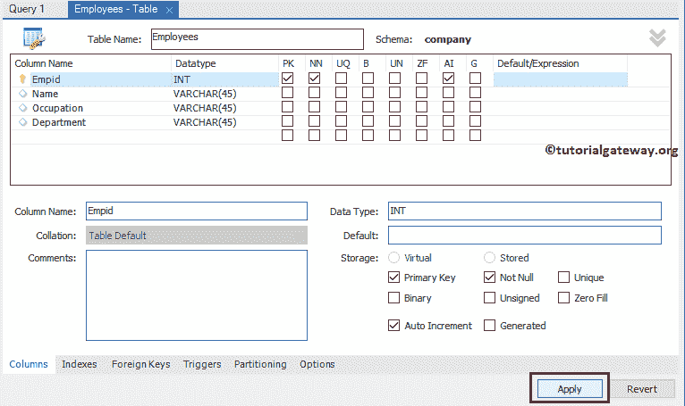

提示:请使用列名旁边或存储部分下的复选框，将列设置为主要、唯一、非空、二进制、无符号、自动增量、零填充和已生成。

点击【应用】按钮

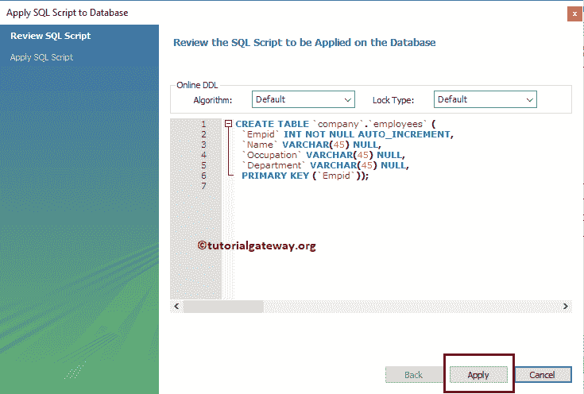

接下来，单击“完成”按钮。

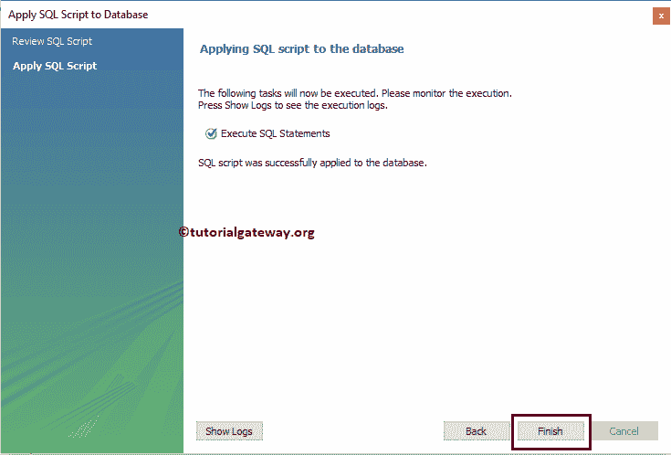

从下面的截图，可以看到员工。

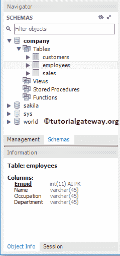

提示:可以使用 [INSERT 语句](https://www.tutorialgateway.org/mysql-insert-statement/)将数据插入其中。