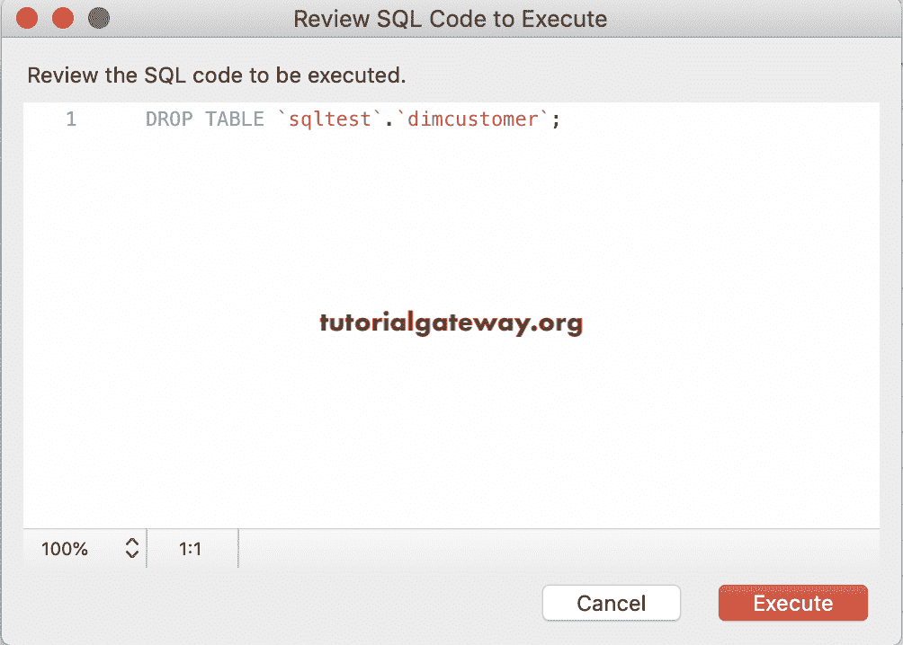

# MySQL 删除表

> 原文：<https://www.tutorialgateway.org/mysql-drop-table/>

MySQL 删除表语句从数据库中删除现有的表。我的意思是，MySQL drop table 删除了给定记录中的所有记录以及结构或定义。

## MySQL 删除表语法

这个 MySQL 删除表语句背后的基本语法是

```
DROP TABLE TableName;
Or 
DROP TABLE Schema_name.TableName;
```

对于这个 MySQL Drop Table 的演示，我们使用的是下面的


## MySQL 删除表示例

在这个例子中，我们将删除上面显示的 empdetails。

注意:使用此语句时应小心。您可能会丢失数据，您必须自己重新创建相同的 [MySQL](https://www.tutorialgateway.org/mysql-tutorial/) 表。

```
DROP TABLE sqltest.empdetails;
```


让我尝试对我们之前删除的表运行`SELECT`语句。可以看到回复，错误代码:1146


如果您试图删除不存在的表，MySQL 会抛出一个错误。例如，让我删除已经删除的一个，即 empdetails。


从上面的截图可以看到错误。为了避免这种情况，我们可以使用 IF EXISTS 参数。

```
DROP TABLE IF EXISTS sqltest.empdetails;
```


如您所见，上面的代码通过一条有意义的消息向您发出了警告。

## 使用命令提示符

您可以从命令提示符或终端中删除。这里，我们正在删除员工详细信息，然后尝试从中选择记录。如您所见，它抛出了一个错误。

```
DROP TABLE sqltest.employeedetails;

SELECT * FROM sqltest.employeedetails;
```


### 使用工作台

如果您可以访问 MySQL 工作台，删除任何表都很容易。首先，右键单击要删除的文件。即昏暗的顾客。接下来，选择拖放表..选项


它打开如下弹出窗口


如果需要，您可以通过选择“查看 SQL”来查看生成的查询，或者单击“立即删除”按钮。



让我们在 sqltest 模式下查看它们的列表。


## MySQL 删除多个表

要删除多个，您必须用逗号分隔这些名称。本示例删除多个表，如 dim currency 和 department3。

```
DROP TABLE IF EXISTS sqltest.dimcurrency, sqltest.department3;
```

我们成功删除了这两个。

