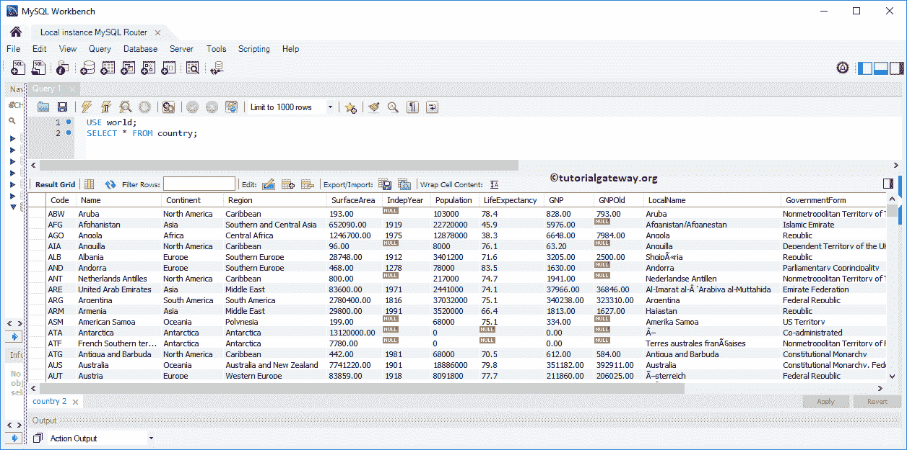
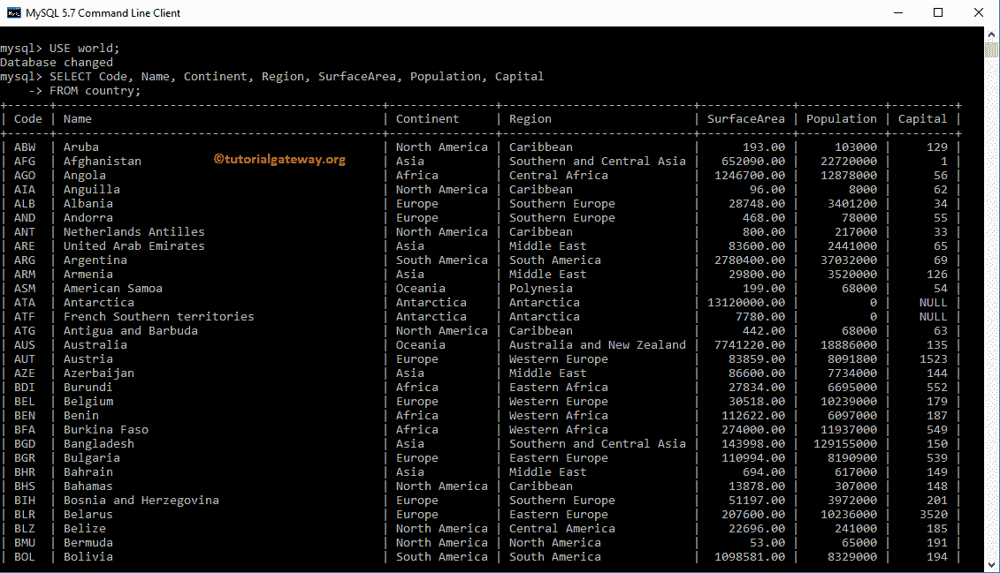

# MySQL `SELECT`语句

> 原文：<https://www.tutorialgateway.org/mysql-select-statement/>

如何用例子写一个 MySQL `SELECT`语句？。`SELECT`语句用于从数据库中的一个或多个表中检索数据。为了解释 MySQL `SELECT`语句，我们将使用 MySQL 安装时附带的世界数据库。

## MySQL `SELECT`语句语法

MySQL `SELECT`语句可以写成:

```sql
-- Syntax
SELECT [ColumnName1], [ColumnName2]....,[ColumnNameN]
FROM Source;
```

*   列名:根据需要，从表中选择列。它可能是一个或多个。
*   来源:从数据库中选择一个或多个表。MySQL 连接用于连接多个表。

## MySQL `SELECT`语句示例

您可以使用 MySQL `SELECT`语句在不引用的情况下检索行。例如，下面的语句将返回 2 作为输出。

```sql
SELECT 1+1;
```


在上述情况下， [MySQL](https://www.tutorialgateway.org/mysql-tutorial/) 允许使用 DUAL 作为伪表名。同样，这只是一种选择。

```sql
SELECT  1+1 FROM DUAL;
```


## MySQL 选择所有列

在本例中，我们将使用星号(*)选择国家/地区表中的所有现有列。在 MySQL `SELECT`语句中，*是表示源表中所有可用列的快捷方式。请记住，使用世界会将默认数据库更改为世界。

```sql
USE world;
SELECT * 
  FROM country;
```

或者，您也可以尝试在表名之前使用模式名。

```sql
SELECT * FROM world.country;
```



MySQL SELECT *语句的问题

*   它从指定的表中检索所有列。大多数时候，我们并不要求所有的。
*   它按默认顺序检索列。有时，我们可能需要在显示列时更改它们的顺序。
*   如果基础表中有任何更改(重新排序列、添加或删除列)，将不会反映使用 SELECT *创建的视图。

注意:请不要实时使用 MySQL SELECT * FROM 语句，即使您想要检索表中的所有列。

理想的方法是将所有(或必需的)列名放在 SELECT 关键字之后。例如，上面的语句写为:

```sql
USE world;
SELECT Code, Name, Continent, Region, 
       SurfaceArea, IndepYear, Population, LifeExpectancy, 
       GNP, GNPOld, LocalName, GovernmentForm, 
       HeadOfState, Capital, Code2       
FROM country;
```


## MySQL `SELECT`语句选择几列

实时情况下，选择表中所有当前的列并不是这样。因为会有一些栏目，比如身份证、条形码、修改日期、Rowguid、照片等。，这可能不需要。

为此，MySQL `SELECT`语句允许我们从一个或多个表中 pcik 一些或任何特定的列。我们可以这样做:放置所需的列名，后跟 SELECT 关键字。

```sql
USE world;
SELECT Name,
       Continent,
       Region,
       SurfaceArea,
       Population        
FROM country;
```


注意:如果您忘记在列之间放置逗号，MySQL 会将第二列作为第一列的别名。所以，请小心

## 使用工作台图形用户界面的 MySQL `SELECT`语句

如果不知道语法或者不想编写 SELECT 查询，那么可以使用工作台 Intellisense 为您编写`SELECT`语句。

为此，首先，导航到所需的数据库(在模式下)并选择所需的表。右键单击表格将打开带有不同选项的上下文菜单。请选择选择行–限制为 1000。这里，极限值取自查询窗口


该选项将为我们生成 MySQL `SELECT`语句。


注意:如果要查看所有记录，请将查询窗口中的“限制为 1000 行”更改为“不限制”选项。

## 命令提示符示例

在本例中，我们将在命令提示符下编写一个 MySQL `SELECT`语句，从国家表中选择几列。

```sql
SELECT Code, Name, Continent, Region, 
       SurfaceArea, Population, Capital
FROM country;
```



### 要记住的要点

*   它返回表中存在的所有记录。如果要限制行，请使用`WHERE`子句。
*   请避免使用 SELECT *来选择所有列的名称。
*   使用连接处理多个表。