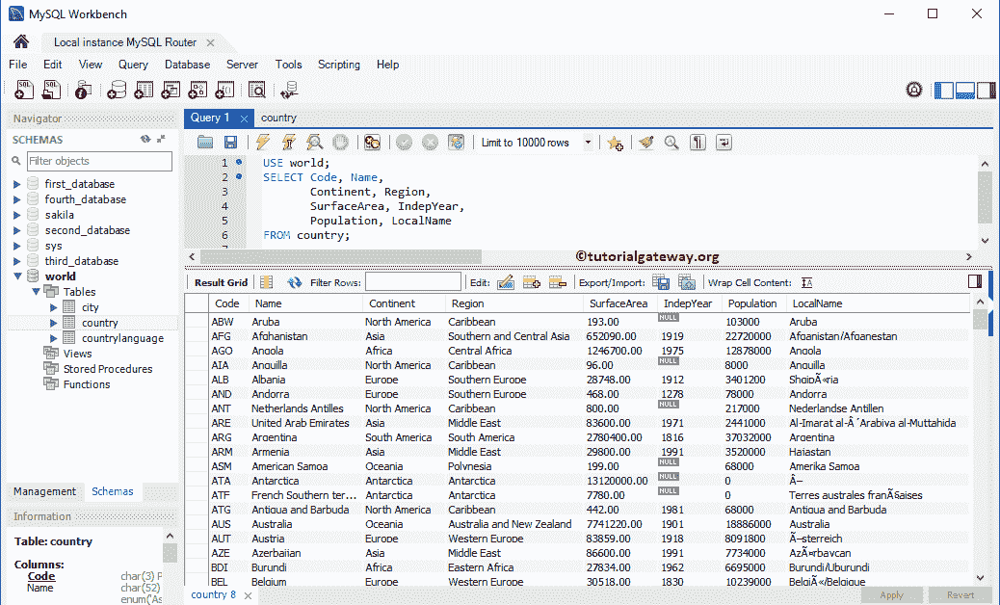
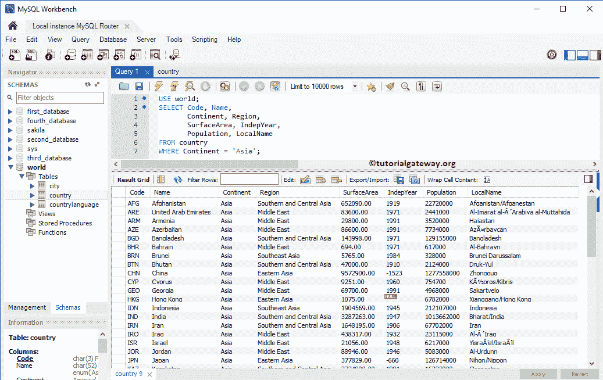
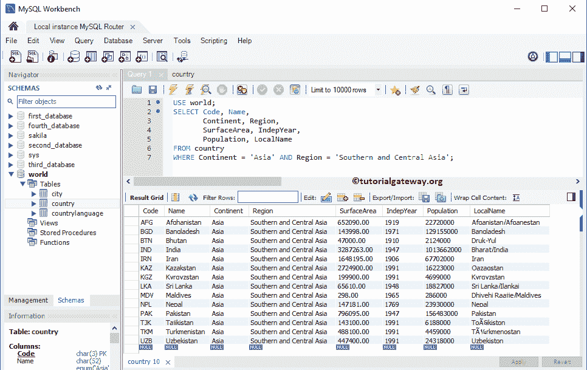
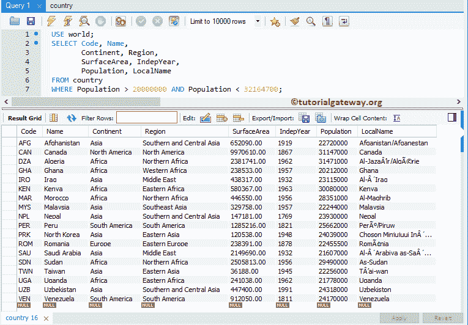
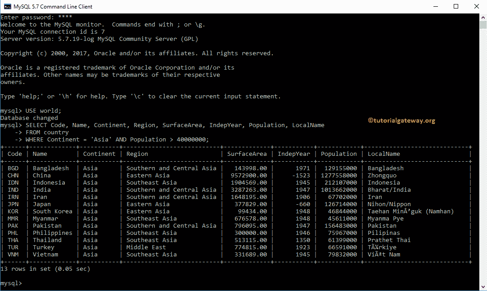

# MySQL`WHERE`子句

> 原文：<https://www.tutorialgateway.org/mysql-where-clause/>

MySQL`WHERE`子句限制`SELECT`语句返回的记录或行数。这意味着只有在 WHERE 关键字后指定的条件为真时，`SELECT`语句才会返回记录。

让我举个例子来实时演示 MySQL`WHERE`子句的功能。例如，我们想从亚马逊商店订购一件衬衫。当我们在搜索栏中键入一件衬衫时，它会显示成千上万件衬衫。而要定制搜索结果，我们必须使用性别、价格范围在 50 美元到 100 美元之间、品牌= Levis、或 River Island 等过滤器。一旦应用了上述过滤器，它将只显示符合上述要求的衬衫。

让我向您展示一下内部发生的事情(指针对亚马逊的查询)。会是这样的:

```
SELECT Product_Name, Size, Brand, Price, Discount
FROM Products_table
WHERE Product_Name = 'Shirts' AND
      Gender = 'Male' AND
      Brand = 'Levis' OR 'River Island' AND 
      Price BETWEEN 50 AND 100
```

## MySQL`WHERE`子句语法

带有 MySQL`WHERE`子句的`SELECT`语句是

```
SELECT [Column Name 1], [Column Name 2], ...., [Column Name N]
FROM Source_Table
WHERE Conditions
```

*   列名:表中的列数。它可能是一个或多个。
*   源表:数据库中存在的表。使用 MySQL 连接来连接多个表。
*   条件:在这里，我们必须提供过滤器或条件。如果条件为真，则只有`SELECT`语句将返回记录。

## MySQL`WHERE`子句示例

让我们看看如何使用 MySQL`WHERE`子句来过滤提取的数据。为此，我们将使用下图所示的数据



### MySQL`WHERE`子句单一条件

在这个例子中，我们将在 MySQL`WHERE`子句中使用一个条件。

```
USE world;
SELECT Code, Name,
       Continent, Region,
       SurfaceArea, IndepYear,
       Population, LocalName        
FROM country
WHERE Continent = 'Asia';
```

上述 [MySQL](https://www.tutorialgateway.org/mysql-tutorial/) 语句将检索如上所述的记录，其中大陆与亚洲完全相等



### MySQL`WHERE`子句多重条件

在这个例子中，我们将使用 MySQL`WHERE`子句中的多个条件。

```
USE world;
SELECT Code, Name,
       Continent, Region,
       SurfaceArea, IndepYear,
       Population, LocalName        
FROM country
WHERE Continent = 'Asia' AND Region = 'Southern and Central Asia';
```

以上 [SELECT](https://www.tutorialgateway.org/mysql-select-statement/) 语句检索上述指定记录，其中大陆等于亚洲，区域等于南亚和中亚。



让我给你看另一个解释来解释多重条件。在这种情况下，我们将在 MySQL`WHERE`子句中使用小于和大于运算符。

```
USE world;
SELECT Code, Name,
       Continent, Region,
       SurfaceArea, IndepYear,
       Population, LocalName        
FROM country
WHERE Population > 20000000 AND Population < 32164700;
```



###`WHERE`子句命令提示符示例

在本例中，我们在命令提示符下编写了一个查询来演示 MySQL`WHERE`子句和多个条件。

```
USE world;
SELECT Code, Name,
       Continent, Region,
       SurfaceArea, IndepYear,
       Population, LocalName        
FROM country
WHERE Continent = 'Asia' AND Population > 40000000;
```

上面的查询检索到上面提到的记录，其中大陆是亚洲，人口大于 40000000。



不要在 WHERE 条件中使用别名列名。因为`WHERE`子句将首先执行，然后`SELECT`语句将选择列。所以，MySQL`WHERE`子句不理解`SELECT`语句中声明的别名列名