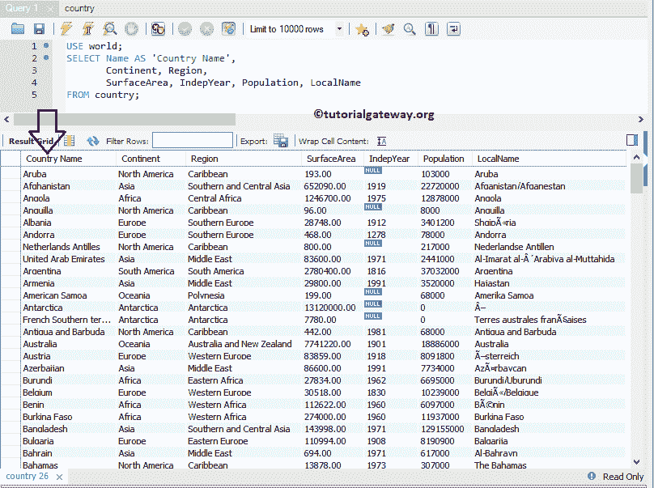

# MySQL 别名

> 原文:[https://www.tutorialgateway.org/mysql-alias/](https://www.tutorialgateway.org/mysql-alias/)

MySQL Alias 关键字用于临时重命名数据库中的列名或表名。有时，列名可能不便于实时使用。

例如，我们将名字存储为名字或名字。当用户读取数据时，看到这样的列标题并不令人愉快。因此，当我们选择数据时，我们使用这个别名将它们重命名为“名字”或“名字”。

## MySQL 别名语法

编写 MySQL 表别名的基本语法如下所示:

```
SELECT tab1.[Column Name 1], 
       tab1.[Column Name 2],..., 
       tab1.[Column Name N]
FROM [Table_Name] AS tab1
```

编写 MySQL 列别名的语法如下所示:

```
SELECT [Column Name 1] AS Name, 
       [Column Name 2] AS Country, 
       [Column Name N] AS Continent
FROM [Table_Name]

--OR You can Simply Write without using AS Keyword
SELECT [Column Name 1] Name, 
       [Column Name 2] Country, 
       [Column Name N] Continent
FROM [Table_Name]

```

在 [MySQL](https://www.tutorialgateway.org/mysql-tutorial/) 中，AS 关键字是可选的。这取决于你是否包括它。我们将使用下图所示的[数据库](https://www.tutorialgateway.org/mysql-create-database/)数据来举例解释别名。


## MySQL 别名示例 1

在这个 MySQL 示例中，我们将重命名一个列名，使其更有意义。为此，我们将把名称重命名为“国家/地区名称”

```
USE world;
SELECT Name AS 'Country Name', 
       Continent, Region,
       SurfaceArea, IndepYear, Population, LocalName
FROM country;
```



## MySQL 别名示例 2

在这个例子中，我们使用 [MySQL CONCAT 字符串](https://www.tutorialgateway.org/mysql-concat-string/)函数来连接或组合名称和区域。接下来，我们使用别名列概念将名称指定为国家/地区名称。

```
USE world;
SELECT CONCAT(Name, ' in ', Region) AS 'Country Name', 
       Continent,
       IndepYear, Population,
       SurfaceArea, LocalName 
FROM country;
```


## 别名列示例 3

我们还可以将别名应用或分配给计算列。在本例中，我们将向您展示如何将别名附加到计算列。

```
USE world;
SELECT Name AS 'Country Name', 
       Continent, Region,
       IndepYear,
       2017 - IndepYear AS 'No Of Years', 
       Population,
       Population + 15000 AS 'New Population'
FROM country;
```

我们从 2017 年减去了独立年份，还在人口栏的每条记录上增加了 15000。接下来，我们使用此别名将其重命名为年数和新人口。


## MySQL 别名命令提示符示例

在本例中，我们将在命令提示符下编写一个 [SELECT](https://www.tutorialgateway.org/mysql-select-statement/) 查询来演示别名列以及 [Where 子句](https://www.tutorialgateway.org/mysql-where-clause/)。

```
USE world;
SELECT Name AS 'Country Name', 
       LocalName AS 'Local Name'
FROM country
WHERE Continent = 'Asia'
```

