# MySQL 分组依据

> 原文：<https://www.tutorialgateway.org/mysql-group-by/>

MySQL GROUP BY 子句通过对一列或多列进行分组来返回聚合数据(值)。它首先对列进行分组，然后对剩余的列应用聚合函数。要显示高级或聚合信息，您必须使用这个 MySQL Group by 子句

例如，要按洲或地区查找总销售额，请使用 MySQL Group By 子句将洲或地区中的国家/地区名称分组。接下来，使用聚合`SUM()`函数计算总数。

## MySQL 分组依据子句语法

MySQL Group By 子句的语法可以写成:

```
SELECT [Column1],...[ColumnN],        
       Aggregate_Function(Column_Name)  
FROM [Source] 
WHERE [Conditions] -- Optional 
GROUP BY [Column1],...[ColumnN]
ORDER BY Columns 
```

*   列 1…N:从表中选择列。
*   聚合函数:使用任何聚合函数。计数、求和、AVG、AVG、最小值、最大值、标准值和方差是我们可以使用的函数。
*   分组依据:不属于聚合函数的列必须放在此之后。

对于这个 MySQL Group By 子句来总结行数据演示，我们将使用下面显示的数据。

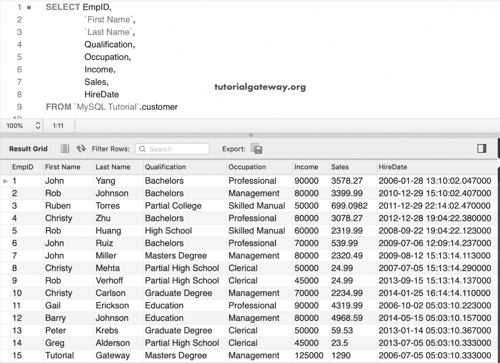

### 按计数单列分组

在这个例子中，我们在 MySQL Group By 子句和`Count()`函数中使用了一个单独的列。以下 [MySQL](https://www.tutorialgateway.org/mysql-tutorial/) 查询统计了各职业板块的员工 id。

```
SELECT Occupation,
       COUNT(EmpID)
 FROM customer
 GROUP BY Occupation;
```

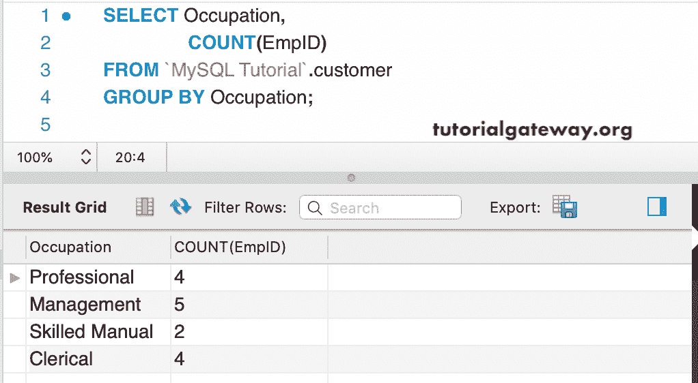

### 按总和分组的 MySQL 示例

在这个例子中，我们使用 [`Sum()`函数](https://www.tutorialgateway.org/mysql-sum-function/)来计算每个职业的总收入和总销售额。请参考[聚合函数](https://www.tutorialgateway.org/mysql-aggregate-functions/)一文。

```
SELECT Occupation,
       SUM(Income),
       SUM(Sales)
 FROM customer
 GROUP BY Occupation;
```

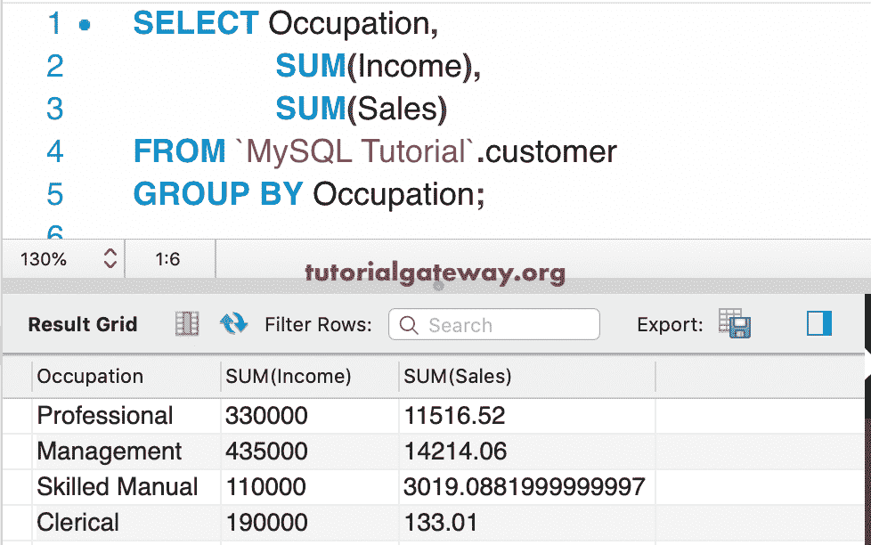

### 按不同和分组的 MySQL 示例

这次，我们使用了 [Distinct 关键字](https://www.tutorialgateway.org/mysql-distinct/)和`Sum()`函数。以下“按不同类别分组”查询查找每个职业类别中不同收入的总和和不同销售额的总和。

```
SELECT Occupation,
       SUM(DISTINCT Income),
       SUM(DISTINCT Sales)
 FROM customer
 GROUP BY Occupation;
```

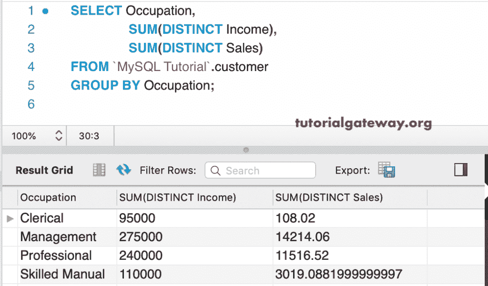

### 按平均值分组示例

在这里，我们使用 MySQL [`AVG()`函数](https://www.tutorialgateway.org/mysql-avg-function/)来查找每个职业的收入平均值和销售平均值。

```
SELECT Occupation,
       AVG(Income),
       AVG(Sales)
 FROM customer
 GROUP BY Occupation;
```

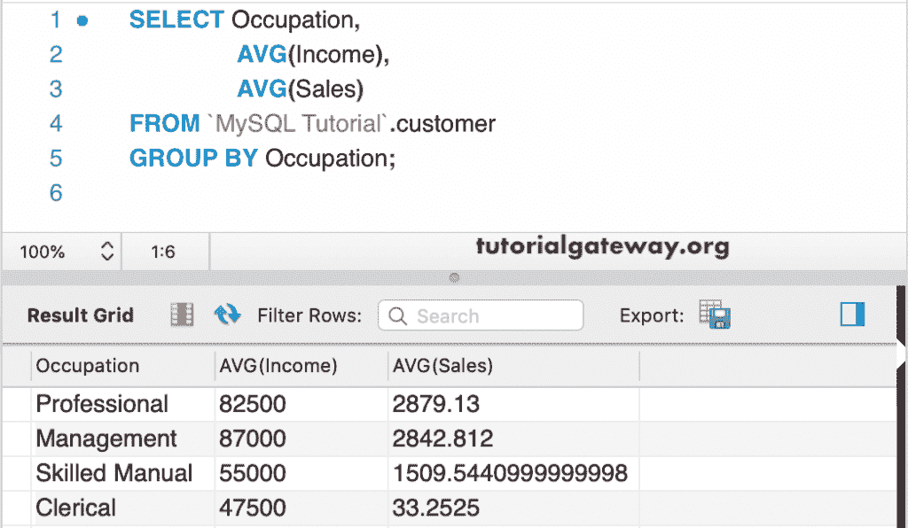

### 按最小和最大实例划分的 MySQL 组

在这个分组示例中，我们使用 [`Min()`函数](https://www.tutorialgateway.org/mysql-min-function/)来查找每个职业类别中的最低收入和最低销售额。

```
SELECT Occupation,
       MIN(Income),
       MIN(Sales)
 FROM customer
 GROUP BY Occupation; 
```

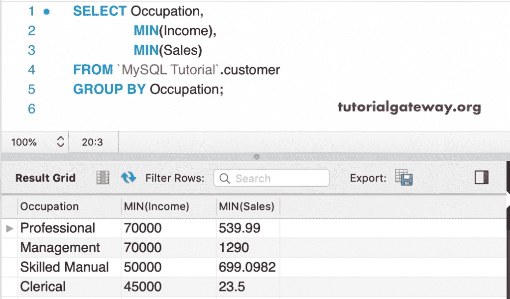

在这里，我们使用 MySQL [`Max()`函数](https://www.tutorialgateway.org/mysql-max-function/)来查找每个职业部分的最大收入和最大销售额。

```
SELECT Occupation,
       MAX(Income),
       MAX(Sales)
 FROM customer
 GROUP BY Occupation; 
```

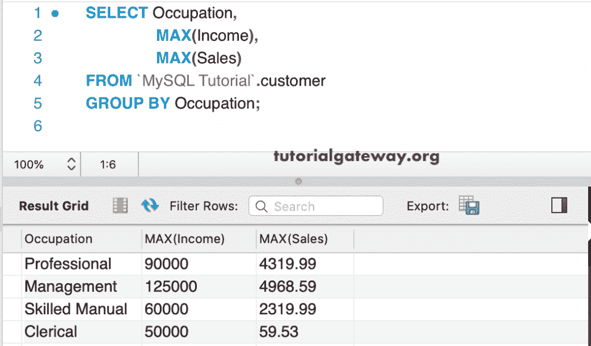

在这个例子中，我们将使用 [STD](https://www.tutorialgateway.org/mysql-stddev_pop-function/) 、STDDEV、STDDEV_POP 和`STDDEV_SAMP()`函数以及 Group By 来计算每个职业的标准差。

```
SELECT Occupation,
       STD(Income),
       STDDEV(Income),
       STDDEV_POP(Income),
       STDDEV_SAMP(Income)
 FROM customer
 GROUP BY Occupation;
```

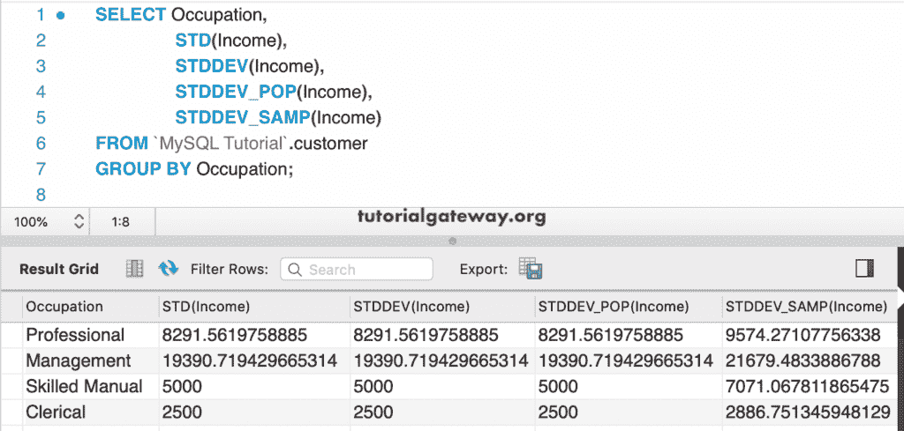

### 差异示例

这里，我们使用带有[方差](https://www.tutorialgateway.org/mysql-var_pop-function/)、VAR_POP 和`VAR_SAMP()`函数的分组来计算每个职业集中的方差。

```
SELECT Occupation,
       VARIANCE(Income),
       VAR_POP(Income),
       VAR_SAMP(Income)
 FROM customer
 GROUP BY Occupation;
```

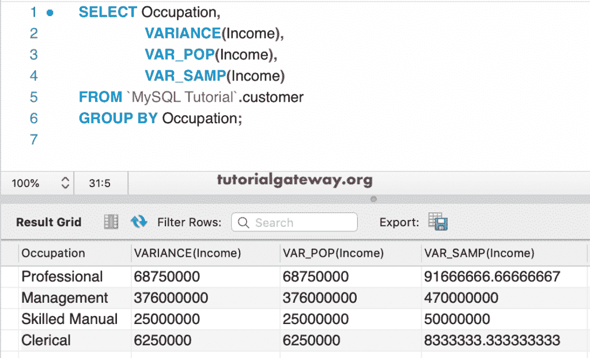

在本例中，我们将使用多列。首先，它按每个职业和资格排列。接下来，该查询查找每个集合中收入和总销售额的总和。

```
SELECT Occupation,
       Qualification,
       SUM(Income),
       SUM(Sales)
 FROM customer
 GROUP BY Occupation, Qualification;
```

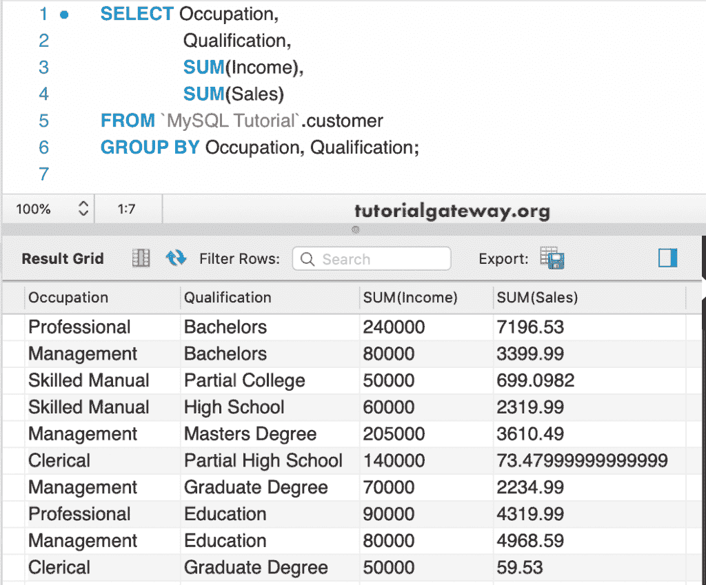

但是，从上面我们按照职业对结果进行了分类，列值是重复的。这是因为我们使用了职业和资格列。

## 按 Where 子句分组

除此之外，还可以使用 [Where 子句](https://www.tutorialgateway.org/mysql-where-clause/)来限制查询选择的记录。

```
SELECT Occupation,
       Qualification,
       SUM(Income),
       SUM(Sales)
 FROM customer
 WHERE Occupation <> 'Clerical'
 GROUP BY Occupation, Qualification;
```

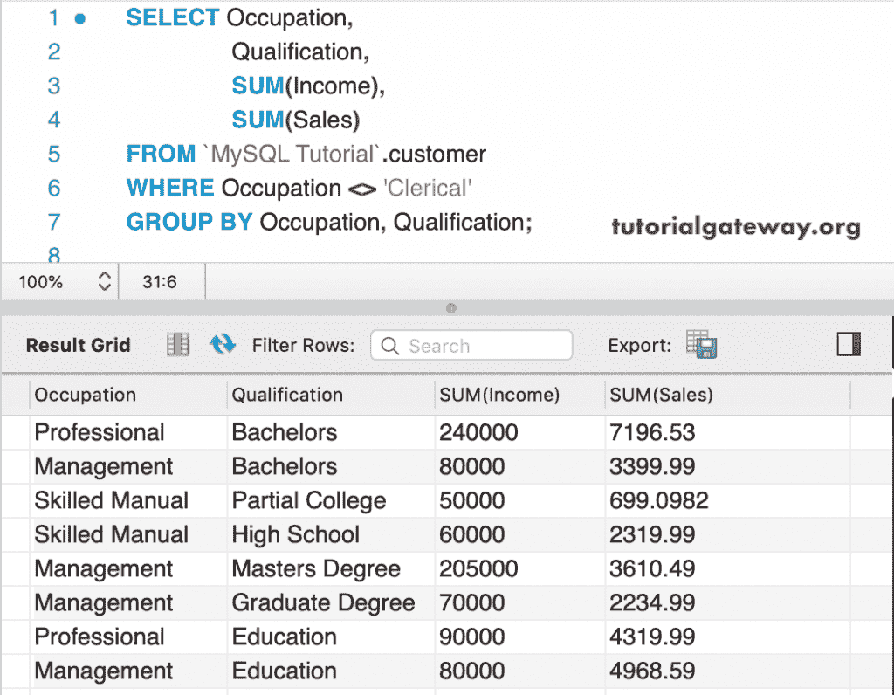

## MySQL 按顺序分组示例

我们也可以将[按](https://www.tutorialgateway.org/mysql-order-by/)排序和这个一起使用。这里，结果集按每个类别的总收入降序排序。

```
SELECT Occupation,
       Qualification,
       SUM(Income),
       SUM(Sales)
 FROM customer
 GROUP BY Occupation, Qualification
 ORDER BY SUM(Income) DESC;
```

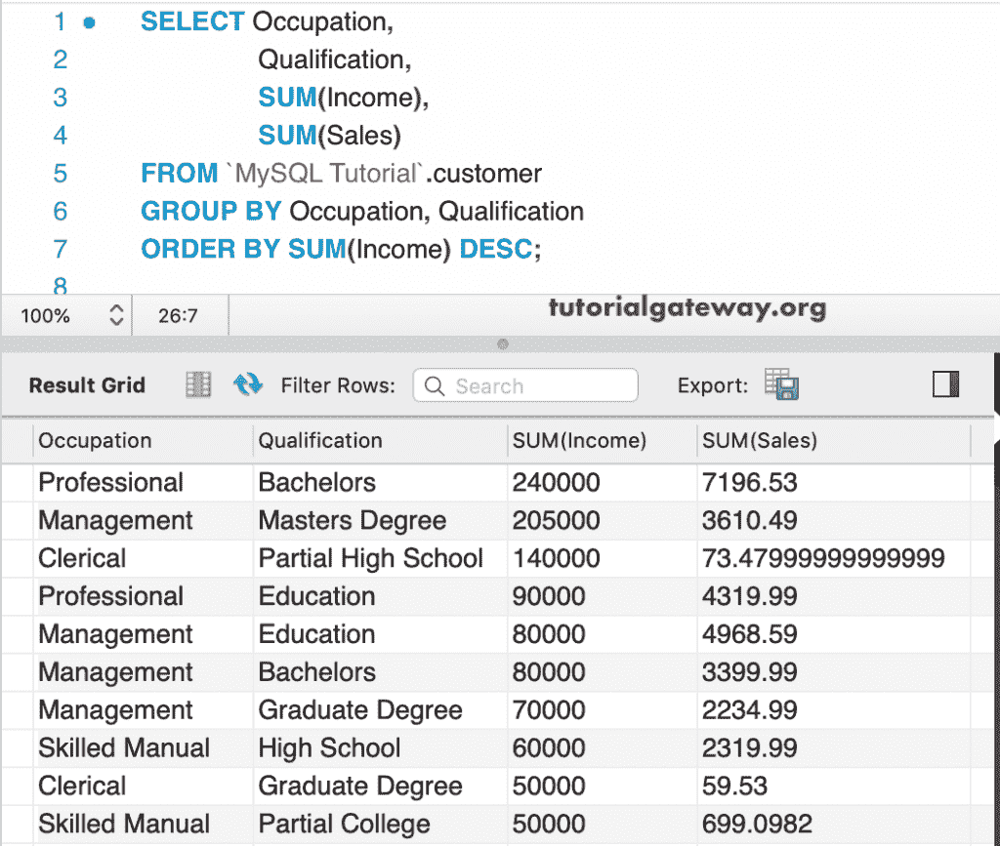

在这个例子中，我们使用了这个命令提示符中的所有函数。

```
SELECT Qualification, Occupation, 
       SUM(Income),
       AVG(Income),
       MIN(Income),
       MAX(Income),
       STD(Income),
       VARIANCE(Income)
FROM customer
GROUP BY Qualification, Occupation;
```

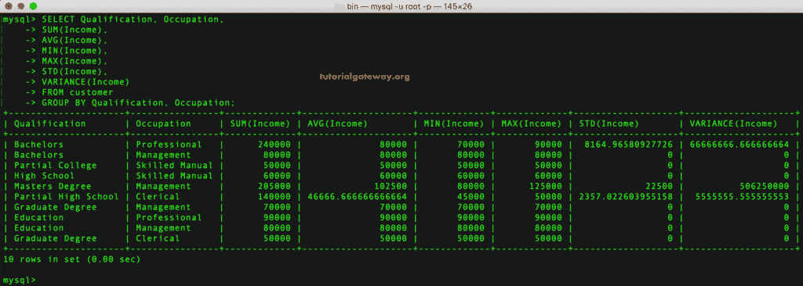