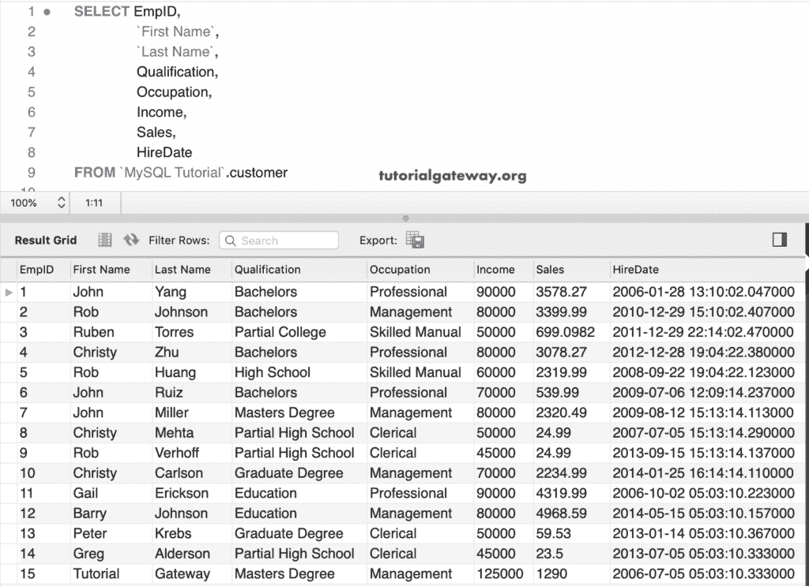
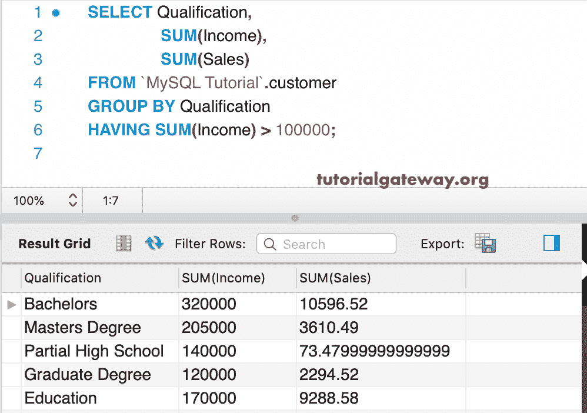
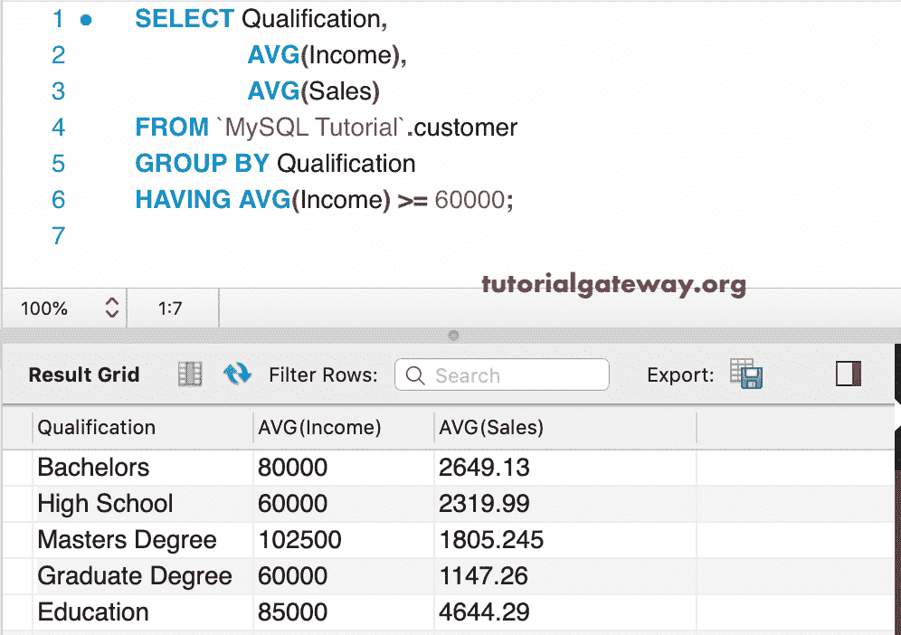
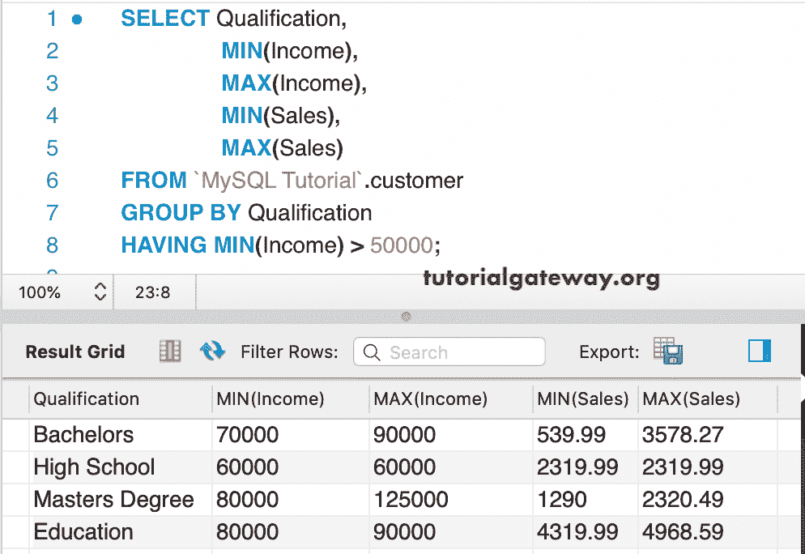
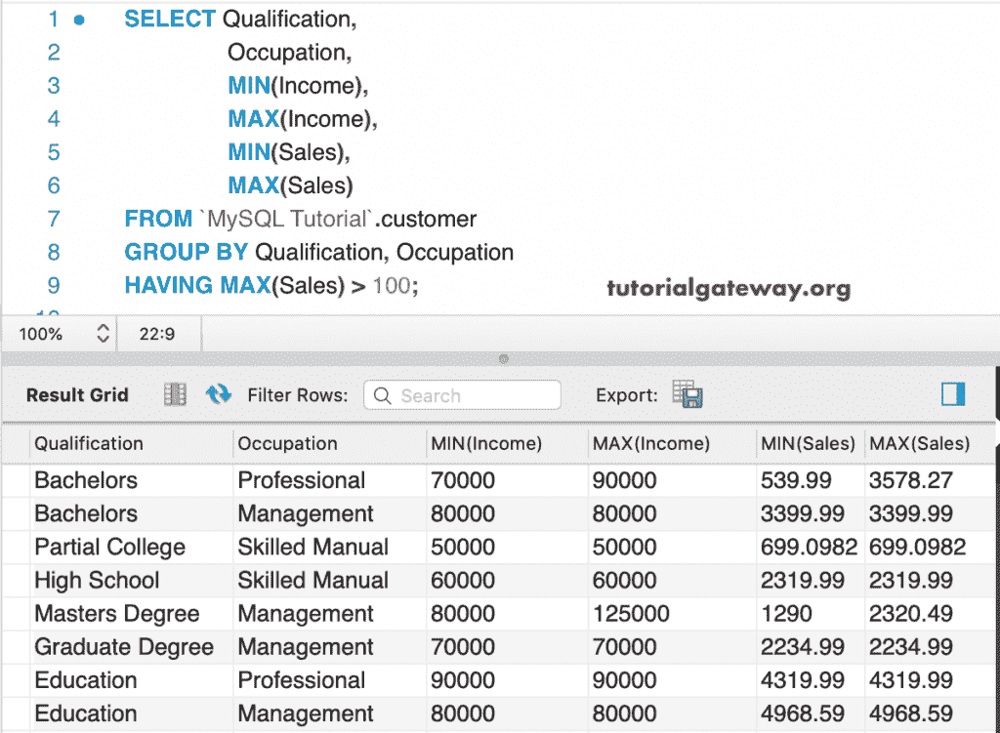
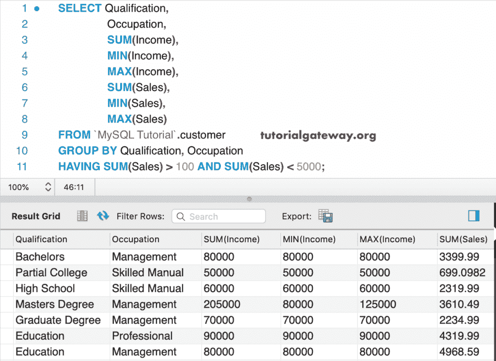
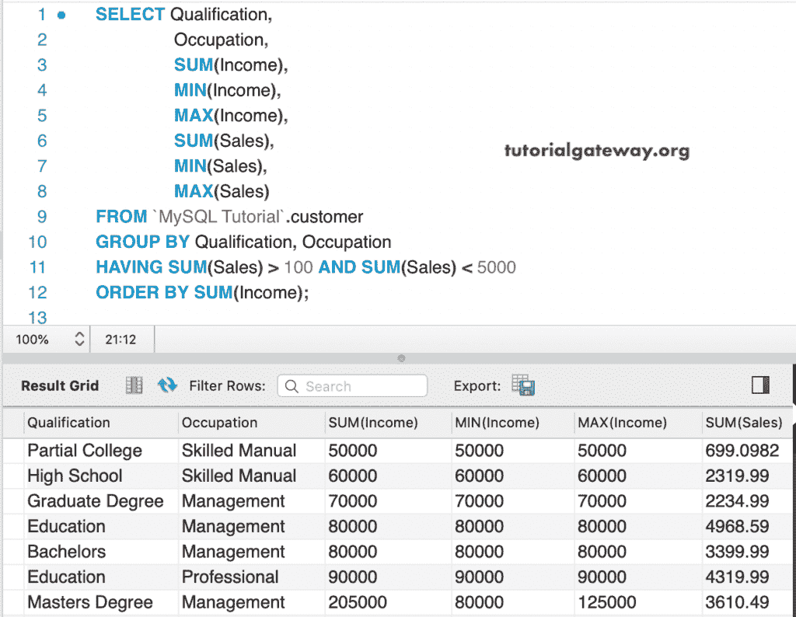
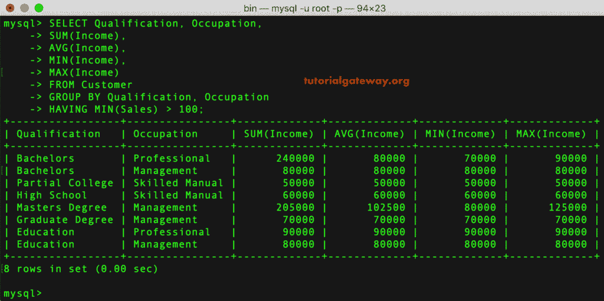

# MySQL 拥有条款

> 原文：<https://www.tutorialgateway.org/mysql-having-clause/>

MySQL `Having`子句限制了 `GROUP BY`子句返回的记录或行数。要使用 MySQL `Having`子句，我们必须使用 `GROUP BY`子句。这是因为 MySQL `Having`子句应用在 `GROUP BY`子句之后。

不能使用`WHERE`子句根据聚合数据检查条件。为此，我们必须使用 MySQL `Having`子句。请参考`GROUP BY`以了解分组。

## MySQL 有子句语法

MySQL `Having`子句的语法可以写成:

```
SELECT [Column1],...[ColumnN],        
Aggregate_Function(Column_Name)  
FROM [Source] 
WHERE [Conditions] -- Optional 
GROUP BY [Column1],...[ColumnN] 
HAVING [Conditions] -- Condition is on Aggregate Function(Column_Name)
```

*   列 1…N:从表中选择列。
*   聚合函数:使用任何一个[聚合函数](https://www.tutorialgateway.org/mysql-aggregate-functions/)。MySQL COUNT、SUM、AVG、AVG、MIN、MAX、STD 和 variation 是我们可以使用的函数。
*   `GROUP BY`:不属于聚合函数的列必须放在此`GROUP BY`之后。
*   拥有:我们可以对从[组](https://www.tutorialgateway.org/mysql-group-by/)获得的聚合数据提供过滤器或应用条件。

## 具有单一条件的 MySQL 示例

对于这个过滤聚合数据的 MySQL `Having`子句的演示，我们将使用下面显示的数据。



### 有求和示例的 MySQL

在本例中，我们使用单个列作为组列，聚合值使用 [`Sum()`函数](https://www.tutorialgateway.org/mysql-sum-function/)。接下来，我们使用 `Having`子句来限制结果。在这里， [MySQL](https://www.tutorialgateway.org/mysql-tutorial/) `GROUP BY`条款按照资质对客户进行分组。接下来，它检查收入总和是否大于 100000。

```
SELECT Qualification,
       SUM(Income),
       SUM(Sales)
 FROM customer
 GROUP BY Qualification
 HAVING SUM(Income) > 100000;
```



### MySQL 拥有平均示例

在这个例子中，我们使用了 [`AVG()`函数](https://www.tutorialgateway.org/mysql-avg-function/)。这里，它检查平均收入是否大于或等于 60000。

```
SELECT Qualification,
       AVG(Income),
       AVG(Sales)
 FROM customer
 GROUP BY Qualification
 HAVING AVG(Income) >= 60000;
```



### 有最小例子的 MySQL

在这个例子中，我们在 `Having`子句中使用了[最小函数](https://www.tutorialgateway.org/mysql-min-function/)。以下查询返回最低收入大于 50000 的每个资格中的最低收入、最高收入、最低销售额和最高销售额。

```
SELECT Qualification,
       MIN(Income),
       MAX(Income),
       MIN(Sales),
       MAX(Sales)
 FROM customer
 GROUP BY Qualification
 HAVING MIN(Income) > 50000;
```



### 有最大的例子

这次，我们在 `GROUP BY`子句中使用了多列。接下来，我们在 `Having`子句中使用 [`Max()`函数](https://www.tutorialgateway.org/mysql-max-function/)。在这个例子中，我们在 `Having`子句中使用了[最小函数](https://www.tutorialgateway.org/mysql-min-function/)。以下查询返回最低收入高于 50000 的每个资格中的最低年收入、最高收入、最低销售额和最高销售额。

```
SELECT Qualification,
       Occupation,
       MIN(Income),
       MAX(Income),
       MIN(Sales),
       MAX(Sales)
 FROM customer
 GROUP BY Qualification, Occupation
 HAVING MAX(Sales) > 100;
```



## 具有多种条件的 MySQL

在这个例子中，我们将在 `Having`子句中使用多重条件。第一组按陈述按资格和职业对客户进行分组。接下来，它检查销售额之和是否大于 100，销售额之和是否小于 5000。

```
SELECT Qualification,
       Occupation,
       SUM(Income),
       MIN(Income),
       MAX(Income),
       SUM(Sales),
       MIN(Sales),
       MAX(Sales)
 FROM customer
 GROUP BY Qualification, Occupation
 HAVING SUM(Sales) > 100 AND SUM(Sales) < 5000
 ORDER BY SUM(Income); 
```



## MySQL 有订单依据条款

我们也可以在 MySQL `Having`子句中使用 [Order By](https://www.tutorialgateway.org/mysql-order-by/) 。这里，结果按总收入升序排序。

```
SELECT Qualification,
       Occupation,
       SUM(Income),
       MIN(Income),
       MAX(Income),
       SUM(Sales),
       MIN(Sales),
       MAX(Sales)
 FROM customer
 GROUP BY Qualification, Occupation
 HAVING SUM(Sales) > 100 AND SUM(Sales) < 5000
 ORDER BY SUM(Income); 
```



## 命令提示符示例

在这个 `Having`子句示例中，我们使用了命令提示符。

```
SELECT Qualification, Occupation,
       SUM(Income),
       AVG(Income),
       MIN(Income),
       MAX(Income)
FROM Customer
GROUP BY Qualification, Occupation
HAVING MIN(Sales) > 100;
```

