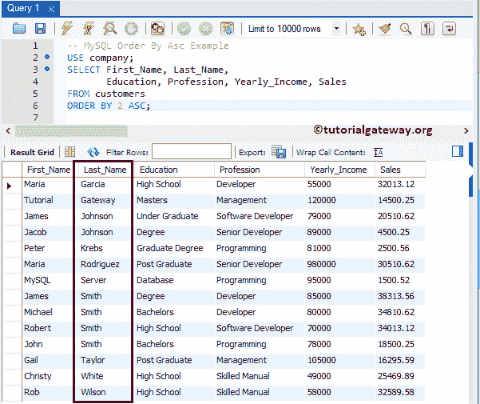

# MySQL `ORDER BY`子句

> 原文：<https://www.tutorialgateway.org/mysql-order-by/>

MySQL `ORDER BY`子句用于以升序或降序对表数据进行排序。默认情况下，数据不会以任何顺序插入到表中，除非您有索引。

因此，如果您想以任何特定的顺序检索数据，您必须使用 MySQL Order By 语句对其进行排序。MySQL `ORDER BY`子句的基本语法如下所示:

```
SELECT Column_Names
FROM Table_Name
ORDER BY {Column, Numerical Position, Alias Columns}[ASC | DESC]
```

从上面的 MySQL 按语法排序，您可以观察到我们可以在 order by 语句中使用列名、列名的数字位置或别名列名。我们将使用下面显示的数据来举例解释 MySQL Order By 语句。


## 按升序排列

为了以升序对数据进行排序，我们必须使用 MySQL Order By 语句，后跟 ASC 关键字。以下是按升序排列数据的方法列表。例如，作为一名销售经理，如果您想确定表现不佳的产品(无销售或销售较少的产品)，则可以使用以下方法:

看到结果，就能明白 x 表现不好，y 根本没有销量。利用这些数据，你可以尝试不同的策略来提高销售额。

### MySQL 升序排序示例

在这个 [MySQL](https://www.tutorialgateway.org/mysql-tutorial/) 的例子中，我们将使用年收入对数据进行升序排序。请在[表](https://www.tutorialgateway.org/mysql-create-table/)中用您需要的任何一栏替换年收入。

```
USE company;
SELECT First_Name, Last_Name, 
       Education, Profession, Yearly_Income, Sales 
FROM customers
ORDER BY Yearly_Income ASC;
```

从下面的截图中，你可以看到数据是按年收入升序排列的。


### MySQL 在不使用 ASC 的情况下按升序排序

ASC 关键字是 MYSQL Order By 语句中的默认关键字，这就是为什么使用 ASC 是可选的。在本例中，我们将按名字升序对客户数据进行排序，而不使用 ASC 关键字。

```
USE company;
SELECT First_Name, Last_Name, 
       Education, Profession, Yearly_Income, Sales 
FROM customers
ORDER BY First_Name;
```


### MySQL 以升序对数字位置进行排序

在这个 MySQL Order By ASC 示例中，我们将使用列名的数字位置对客户表进行升序排序。

```
USE company;
SELECT First_Name, Last_Name, 
       Education, Profession, Yearly_Income, Sales 
FROM customers
ORDER BY 2 ASC;
```

姓氏的数字位置是 2。所以，按此列排序的数据。



### MySQL 按多列升序排序

在这个 MySQL Order By ASC 示例中，我们使用多个列对数据进行排序。

```
USE company;
SELECT First_Name, Last_Name, 
       Education, Profession, Yearly_Income, Sales 
FROM customers
ORDER BY First_Name ASC, Last_Name ASC;

--OR you can Simply Write 
ORDER BY First_Name, Last_Name
```

首先，数据按名字升序排序。姓氏然后按升序排序。


### 使用别名列按 ASC 排序

在这个 MySQL Order by ASC 示例中，我们将使用别名列名对客户的数据进行升序排序。

```
USE company;
SELECT CONCAT(First_Name, ' ', Last_Name) AS 'Name', 
       Education, Profession, Yearly_Income, Sales 
FROM customers
ORDER BY 'Name' ASC;
```

我们使用连接字符串函数连接名字和姓氏列来创建名字(别名)。接下来，我们在其中使用了别名。表示客户数据按名称升序排序。


## MySQL 按降序排列

要按降序对数据进行排序，请使用 MySQL Order By 语句，后跟 DESC 关键字。以下是我们可以按降序显示记录的方法列表。

例如，如果你在亚马逊上搜索鞋子。如果您在搜索栏中键入鞋子，它将按等级显示鞋子。意思是，鞋子按照等级显示。从技术上来说，

```
Select Shoe 
from Product table
order by Product Rating desc
```

### MySQL 降序排序示例

在这个 MySQL Order By Desc 的例子中，我们将使用 Sales 列以降序显示客户的表。

```
USE company;
SELECT First_Name, Last_Name, 
       Education, Profession, 
       Yearly_Income, 
       Sales 
FROM customers
ORDER BY Sales DESC;
```


从上面的截图中，您可以看到行是按销售额降序排列的。

### 使用数字位置降序排序

教育栏的数字位置是 3。因此，数据使用此列以降序显示。

```
USE company;
SELECT First_Name, Last_Name, 
       Education, Profession, 
       Yearly_Income, 
       Sales 
FROM customers
ORDER BY 3 DESC;
```


### MySQL 按多列降序排序

在本例中，我们使用多列来组织行。首先，按教育程度递减，然后按年收入递减。

```
USE company;
SELECT First_Name, Last_Name, 
       Education, Profession, 
       Yearly_Income, 
       Sales 
FROM customers
ORDER BY 3 DESC, Yearly_Income DESC;
```


在本例中，我们将使用别名列名以降序组织表行。

```
USE company;
SELECT First_Name, Last_Name, 
       Education, Profession, 
       Yearly_Income, Yearly_Income + 12500 AS 'New Income',
       Sales 
FROM customers
ORDER BY 'New Income' DESC;
```

我们在每个年收入栏中添加了 12500，并使用[别名](https://www.tutorialgateway.org/mysql-alias/)分配一个新的收入名称。接下来，我们使用别名。意思是，按新收入降序排列的行。


## 将美国汽车协会和 DESC 联合起来

我们还可以将 ASC 和 DESC 关键字组合在一个单独的 MySQL 语句中。在这个例子中，我们组织的是上升教育，然后是下降年收入。

```
USE company;
SELECT First_Name, Last_Name, 
       Education, Profession, 
       Yearly_Income, 
       Sales 
FROM customers
ORDER BY Education ASC, Yearly_Income DESC;
```


让我们首先使用 DESC 关键字，然后使用 ASC 关键字。也就是说，下面的查询按教育程度降序排列记录，按年收入升序排列记录

```
USE company;
SELECT First_Name, Last_Name, 
       Education, Profession, 
       Yearly_Income, 
       Sales 
FROM customers
ORDER BY Education DESC, Yearly_Income ASC;
```


## 命令提示符示例

让我向您展示如何使用 MySQL 命令提示符对记录进行排序。在这个例子中，我们按照升序排列名字和姓氏，然后按照降序排列年收入。

```
USE company;
SELECT First_Name, Last_Name, 
       Education, Profession, 
       Yearly_Income, 
       Sales 
FROM customers
ORDER BY First_Name ASC, Last_Name ASC, Yearly_Income DESC;
```

