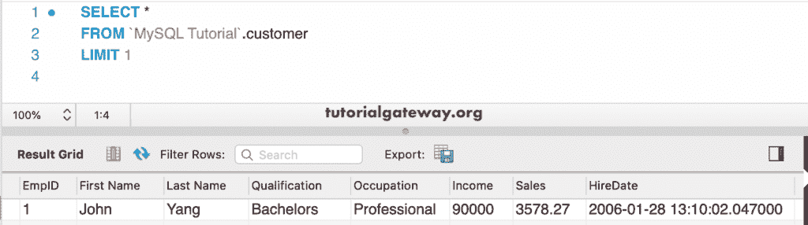

# MySQL LIMIT

> 原文：<https://www.tutorialgateway.org/mysql-limit/>

MySQL LIMIT 对于限制查询返回的行数非常有用。例如，如果你是销售经理，你的工作是识别表现最好的产品，那么你可以使用 MySQL Limit。

如果您希望`SELECT`语句返回一些记录或限制行，我们必须在查询结束时使用它。MySQL LIMIT 子句的基本语法如下所示

```
SELECT Column_Names] 
FROM [Table_Name]
LIMIT Value
```

## MySQL 限制*示例

在这个演示中，我们将使用下面显示的数据。


这里，Select *语句选择来自客户的所有记录。但是，1 将记录限制为 1 行。

```
SELECT *
FROM customer
LIMIT 1;
```



### MySQL 限制 10 示例

该查询将所选记录限制为 10 条。使用此查询从客户表中选择前 10 条记录。

```
SELECT *
FROM customer
LIMIT 10;
```


### MySQL 限制 3 示例

正如我们之前所说，使用 Select *不是一个好的做法。本示例从客户中选择所需的列。该语句选择前三条记录。

```
SELECT EmpID, 
       `First Name`,
        `Last Name`,
        Qualification,
        Occupation,
        Income,
        Sales,
        HireDate
FROM customer
LIMIT 3; 
```


### MySQL 按语句限制订单

默认情况下， [MySQL](https://www.tutorialgateway.org/mysql-tutorial/) 表数据将按照索引值排序。要检索三个收入或销售额最高的客户，您必须使用 [ORDER BY](https://www.tutorialgateway.org/mysql-order-by/) 对数据进行排序。接下来，用它来获得前三名客户

```
SELECT EmpID, 
       `First Name`,
        `Last Name`,
        Qualification,
        Occupation,
        Income,
        Sales,
        HireDate
 FROM customer
 ORDER BY Income
 LIMIT 3;
```


这次我们使用的是 DESC 关键字。意思是按收入降序排序的数据。接下来，它选择前 7 条记录。

```
SELECT EmpID, 
       `First Name`,
        `Last Name`,
        Qualification,
        Occupation,
        Income,
        Sales,
        HireDate
 FROM customer
 ORDER BY Income DESC
 LIMIT 7;
```


## MySQL 限制在哪里示例

您也可以将 [`WHERE`子句](https://www.tutorialgateway.org/mysql-where-clause/)与此一起使用。首先，它根据表检查条件，然后选择所需的行。

以下查询选择销售额大于 2000 的前 5 个客户。这里，我们使用 `ORDER BY`子句使用收入按降序对客户进行排序。

```
SELECT EmpID, 
       `First Name`,
        `Last Name`,
        Qualification,
        Occupation,
        Income,
        Sales,
        HireDate
 FROM customer
 WHERE Sales > 2000
 ORDER BY Income DESC
 LIMIT 5;
```


## MySQL 极限偏移示例

您可以同时使用行偏移。这里，3，1 表示从第 4 个开始，选择 1 条记录。

```
SELECT EmpID, 
       `First Name`,
       `Last Name`,
       Qualification,
       Occupation,
       Income,
       Sales,
       HireDate
 FROM customer
 LIMIT 3, 1;
```


以下查询从第 6 条记录开始，并选择连续的 7 条记录。

```
SELECT EmpID, 
       `First Name`,
       `Last Name`,
       Qualification,
       Occupation,
       Income,
       Sales,
       HireDate
 FROM customer
 LIMIT 5, 7;
```


以下 MySQL 极限查询按照订单收入降序对客户进行排序。接下来，它选择第三条记录。这意味着第三高的薪水客户。

```
SELECT EmpID, 
       `First Name`,
       `Last Name`,
       Qualification,
       Occupation,
       Income,
       Sales,
       HireDate
 FROM customer
 ORDER BY Sales DESC
 LIMIT 2, 1;
```


## 多个示例

在本例中，我们使用命令提示符。首先，0 表示它返回零个记录。第二条语句选择前两条记录。最后一条语句按销售额降序选择前两个客户。意思是两个销量最高的客户。

