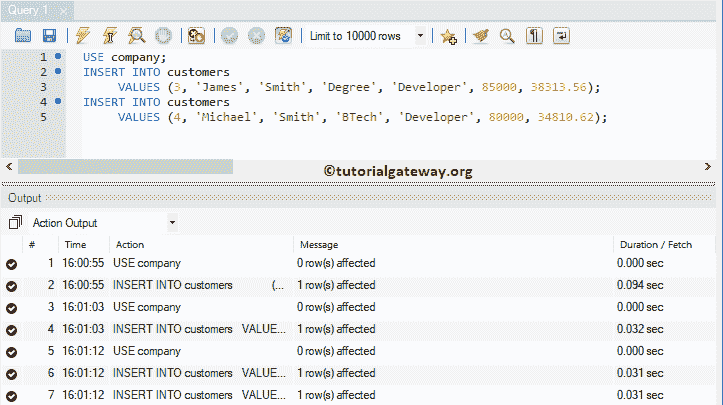
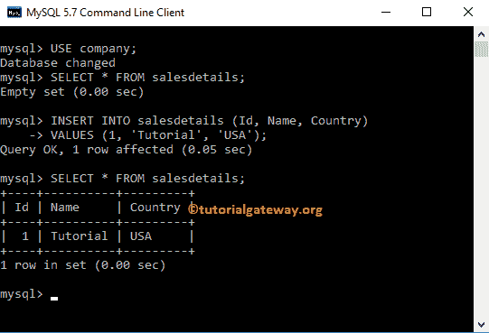

# MySQL `INSERT`语句

> 原文：<https://www.tutorialgateway.org/mysql-insert-statement/>

如何用实例在 MySQL 中编写插入查询？。MySQL `INSERT`语句用于向 MySQL 表中加载或添加新记录。为了演示 MySQL 中的插入查询，我们使用了我们在上一篇文章中创建的表。

## MySQL 插入语法

MySQL `INSERT`语句的基本语法如下所示:

```sql
INSERT INTO Destination Table 
          (Column1, Column2,..., ColumnN)
   VALUES (Column1_Value, Column2_Value,..., ColumnN_Value)
```

*   目标表:提供要加载记录的完全限定名
*   列 1…列 n:它允许我们从表中选择列的数量。它可能是一个或多个。
*   列 1 _ 值…列 n _ 值:请指定要加载的值。例如，要在列 1 中加载的列 1_Value。如果省略字段名，则必须按照目标表结构定义的顺序指定值(即字段值)

如果要为目标中的所有列加载值，请从上面的语法中删除(列 1、列 2、…、列 n)。

## MySQL 插入工作台示例

在这个 MySQL `INSERT`语句示例中，我们将向客户加载一条新记录。

```sql
USE company;
INSERT INTO customers 
           (First_Name, Last_Name, Education, Profession, Yearly_Income, Sales)
    VALUES ('Tutorial', 'Gateway', 'Masters', 'Admin', 120000, 14500.25);
```


注意:这里，我们没有加载客户标识值。因为它是一个自动递增的列，它会自动更新。请参考[创建表格](https://www.tutorialgateway.org/mysql-create-table/)一文。

如上所述，如果您正在加载所有现有列的数据，那么忽略列名(语法 2)。意思是上面的 [MySQL](https://www.tutorialgateway.org/mysql-tutorial/) 语句也可以写成:

```sql
USE company;
INSERT INTO customers 
	 VALUES (2, 'MySQL', 'Server', 'Database', 'Programming', 95000, 1500.52);
```

提示:忽略这些语句中的列名不是一个好习惯。因此，请始终提供列名。


上述查询将数据放入“名字”、“姓氏”、“教育程度”、“职业”、“年收入”和“销售额”列。无论何时省略字段名，都必须按照目标表结构确定的顺序指定 column_values。


### MySQL 插入多行

在本例中，我们以更传统的方式向客户中添加多行。

```sql
USE company;
INSERT INTO customers 
	 VALUES (3, 'James', 'Smith', 'Degree', 'Developer', 85000, 38313.56);
INSERT INTO customers 
	 VALUES (4, 'Michael', 'Smith', 'BTech', 'Developer', 80000, 34810.62);
```



这里，我们使用 UNION ALL(或 UNION)将多个记录加载到公司中。

```sql
USE company;
INSERT INTO customers 
    SELECT 5, 'Maria', 'Garcia', 'Hig School', 'Developer', 55000, 32013.12
UNION ALL
    SELECT 6, 'Maria', 'Rodriguez', 'Post Graduate', 'Senior Developer', 980000, 30510.62;
```


让我们看看输出


以下 MySQL Insert 查询是将多条记录加载到[表](https://www.tutorialgateway.org/mysql-create-table/)中最常用的方法。

```sql
USE company;
INSERT INTO customers 
	(First_Name, Last_Name, Education, Profession, Yearly_Income, Sales)
VALUES ('Robert', 'Smith', 'High School', 'Software Developer', 70000, 34013.12),
       ('James', 'Johnson', 'Under Graduate', 'Asst Programmer', 59000, 20510.62),
       ('John', 'Smith', 'B Tech', 'programmer', 78000, 18500.25);
```


让我们把记录呈现在客户


不强制一次放入所有列值。您可以在加载时省略一些列，并在以后更新它们。在这个 MySQL `INSERT`语句示例中，我们在公司中放入了几个列值。

```sql
USE company;
INSERT INTO customers 
           (First_Name, Last_Name, Education, Sales)
    VALUES ('Jacob', 'Johnson', 'Degree', 4500.25);
```

上面的查询将数据加载到名字、姓氏、学历和销售列中。为剩余的列


添加空值

提示:当您在表中放入一些记录时，您必须定义列名。


### MySQL 插入示例

您可以使用 INSERTINTO`SELECT`语句将行从一个表放到另一个表，而不是对所有的值进行硬编码。在本例中，我们从国家中选择行，并将它们加载到 countrydetails 中。这里，我们将使用 [`WHERE`子句](https://www.tutorialgateway.org/mysql-where-clause/)来限制行。

```sql
INSERT INTO company.countrydetails
      (Code, Name, Continent, Region, SurfaceArea, IndepYear, Population, LocalName, Capital)
SELECT Code, Name, Continent, Region, SurfaceArea, IndepYear, Population, LocalName, Capital
FROM world.country
WHERE Continent = 'Asia' AND Region = 'Southern and Central Asia';
```


我们现在不打算解释代码实现。让我们看看查询是否将所选数据添加到目标表中。


## 命令提示符示例

在本例中，我们使用命令提示符将一条记录添加到销售明细中。在我们进入查询之前，我们表内的数据是


密码

```sql
INSERT INTO salesdetails (Id, Name, Country)
VALUES (1, 'Tutorial', 'USA');
```

