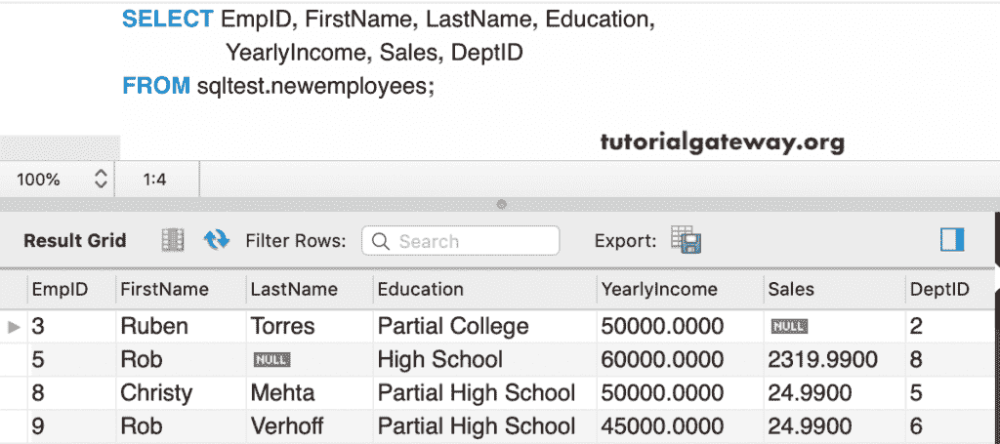

# MySQL `DELETE`语句

> 原文：<https://www.tutorialgateway.org/mysql-delete/>

MySQL `DELETE`语句帮助我们从表中删除不想要的行或数据。您可以使用这个 MySQL delete 命令删除临时表和永久表。

MySQL Delete 命令删除表中的一行或多行或所有记录。它是从数据库表中删除不必要数据的强大命令之一。

## MySQL 删除语法

MySQL Delete 命令的基本语法如下所示

```sql
DELETE FROM `Schema_Name`.`Table_Name`
[WHERE Conditions]; — Optional
```

让我用下表来演示这个删除命令。


## 从 MySQL 命令提示符中删除数据

在本例中，我们将使用命令提示符或终端从表中删除一条记录。

```sql
DELETE FROM sqltest.newemployees
WHERE EmpID = 1
```


注:如果不使用 [`WHERE`子句](https://www.tutorialgateway.org/mysql-where-clause/)，则该命令将从表中删除所有记录。因此，始终使用`WHERE`子句来限制消除记录。

## MySQL 删除单行

在本例中，我们使用`WHERE`子句来删除员工 Id = 4 的记录。

```sql
DELETE FROM newemployees
WHERE EmpID = 4;
```


让我们看看剩下的数据


### MySQL 删除多行

这里，我们正在删除部门标识为 1 的记录。如您所见，有多行与此部门标识链接。让我们看看他们中有多少人被移除了？

```sql
DELETE FROM newemployees
WHERE DeptID = 1;
```


从下面的截图可以看到，已经删除了部门 id = 1


的所有员工

### 多条件下的 MySQL 删除

让我告诉你，如何在`WHERE`子句中使用多个条件来删除记录。下面的查询删除了名字为约翰、销售额小于 1000 的行。

```sql
DELETE FROM newemployees
WHERE FirstName = 'John' AND Sales < 1000;
```


这个表里面剩下的数据是


### MySQL 删除限制

通过使用 [`ORDER BY`子句](https://www.tutorialgateway.org/mysql-order-by/)和 [Limit 子句](https://www.tutorialgateway.org/mysql-limit/)，您可以根据需要删除前 5 行或后 10 行。在这里，我们删除了销售额高的前两条记录。

```sql
DELETE FROM newemployees
ORDER BY Sales DESC LIMIT 2;
```


该新员工表中剩余数据


### 删除包含空值的行

该查询删除部门标识[为空](https://www.tutorialgateway.org/mysql-is-null/)的行。您可以尝试使用[不为空](https://www.tutorialgateway.org/mysql-is-not-null/)删除 id 不为空的行。

```sql
DELETE FROM newemployees
WHERE DeptID IS NULL;
```


员工表，删除 3 条记录后



### 删除所有行

如果您忘记包含`WHERE`子句，它将从表中删除所有记录。

```sql
DELETE FROM newemployees;
```


在这里，你可以看到一张空桌子


### 从工作台执行

如果可以选择访问 MySQL 工作台，可以选择要执行删除操作的表。接下来，选择发送到 SQL 编辑器，然后选择下面显示的选项。


它生成以下 [MySQL](https://www.tutorialgateway.org/mysql-tutorial/) 代码。你可以根据你的要求修改`WHERE`子句。

```sql
DELETE FROM `sqltest`.`department4`
WHERE <{where_expression}>;
```