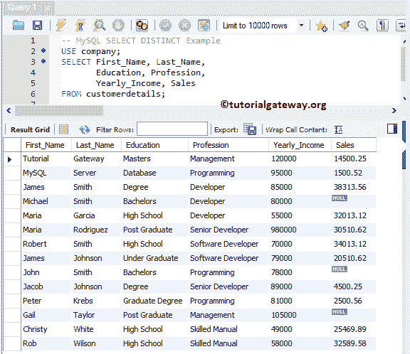
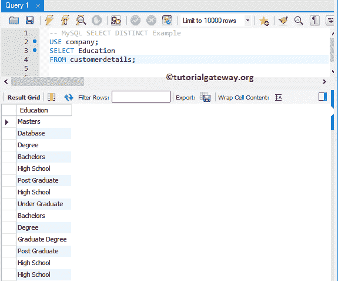
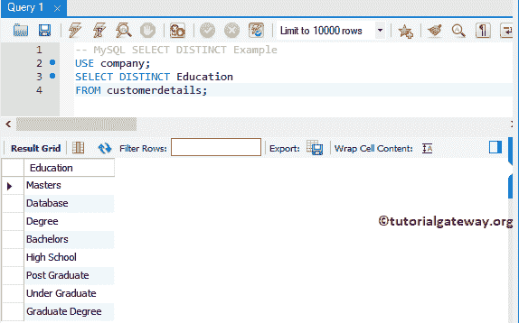
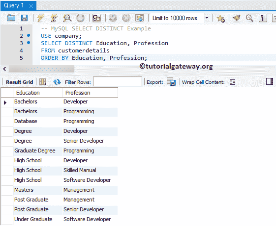
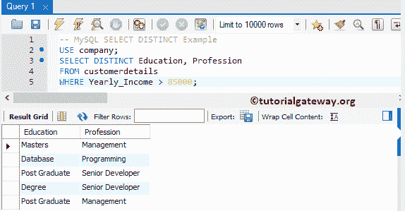
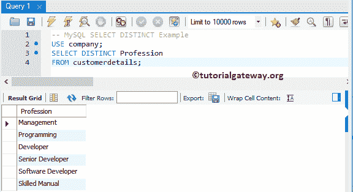
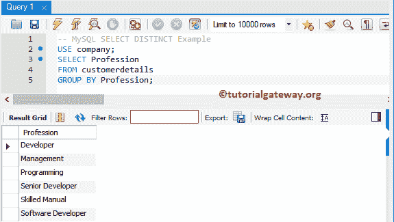
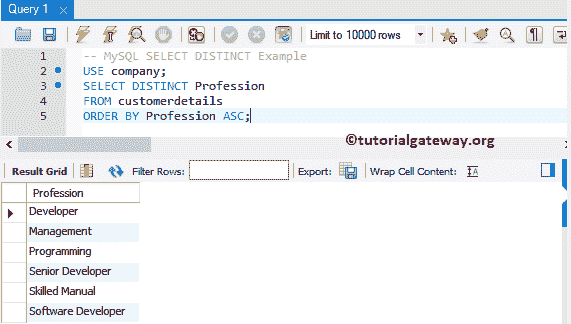
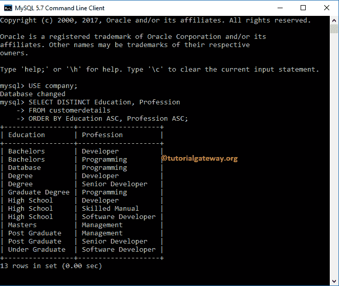

# MySQL Distinct

> 原文：<https://www.tutorialgateway.org/mysql-distinct/>

MySQL Select Distinct 语句用于从`SELECT`语句的指定列中检索唯一的行(通过删除重复的行)。

## MySQL 选择不同的语法

MySQL 中选择不同的基本语法可以写成:

```
SELECT DISTINCT [Columns]
FROM Source
WHERE Conditions -- This is Optional
```

*   DISTINCT:此关键字返回唯一列
*   列:它允许我们从表中选择要使用的列数。它可能是一个或多个。
*   来源:它可以是数据库中的一个或多个表。使用 MySQL 连接来连接多个表。

我们将使用下面显示的数据来用例子解释 MySQL 中的 Select Distinct。



## 单列上的 SQL DISTINCT

在这个 MySQL Distinct Single 列示例中，我们将从教育列中选择唯一的记录。在我们获得唯一记录之前，让我从教育栏中选择所有记录。

```
USE company;
SELECT Education
FROM customerdetails;
```



现在，让我在 [`SELECT`语句](https://www.tutorialgateway.org/mysql-select-statement/)中使用这个关键字。

```
USE company;
SELECT DISTINCT Education
FROM customerdetails;
```



## 多列上不同的 MySQL

当我们在多列上使用 MySQL Distinct 时，`SELECT`语句会写入多列的唯一组合，而不是唯一的单个记录。在这个 [MySQL](https://www.tutorialgateway.org/mysql-tutorial/) 示例中，我们将选择教育栏和职业栏中存在的唯一记录。

```
USE company;
SELECT DISTINCT Education, Profession
FROM customerdetails
ORDER BY Education, Profession;
```



虽然我们在`SELECT`语句中使用了 MySQL Distinct 关键字。从上面的截图中，您可以看到，它正在返回重复项，因为

*   单身汉和开发者是一个独特的组合
*   学士和编程是一个独特的组合，等等。

## MySQL 独特的 Where 子句示例

在本例中，我们向您展示了如何将此语句与 [WHERE 子句](https://www.tutorialgateway.org/mysql-where-clause/)一起使用。以下语句从年收入大于或等于 85000 的客户表中返回唯一的教育、职业。

```
USE company;
SELECT DISTINCT Education, Profession
FROM customerdetails
WHERE Yearly_Income > 85000;
```



虽然教育、专业栏目组合有 13 个独一无二的记录。10 条记录与 Where 子句中的条件不匹配。这就是为什么下面的截图显示了 5 条记录。

注意:它将空记录视为有效的唯一记录。因此，请使用任何非空函数来删除空值。

## MySQL 不同与分组依据

从分组依据继承而来的 MySQL 选择不同行为。如果您使用没有任何聚合函数的 Group By 子句，则它充当 Distinct 关键字。它们之间唯一的区别是:

*   分组方式首先对数据进行排序，然后执行分组。
*   此关键字不执行任何排序。

如果您将此关键字与[排序依据](https://www.tutorialgateway.org/mysql-order-by/)一起使用，它将提供与[分组依据](https://www.tutorialgateway.org/mysql-group-by/)相同的结果。以下语句从客户详细信息中返回唯一的职业值

```
USE company;
SELECT DISTINCT Profession 
FROM customerdetails;
```



让我删除关键字，并使用 Group By 子句:

```
USE company;
SELECT Profession 
FROM customerdetails
GROUP BY Profession;
```

如你所见，他们返回的结果相同，但顺序不同



这一次，我使用了这个关键字和排序依据

```
USE company;
SELECT DISTINCT Profession 
FROM customerdetails
ORDER BY Profession ASC;
```

如你所见，它返回的结果与



组相同

## MySQL 选择不同的命令提示符示例

让我向您展示如何使用命令提示符选择唯一记录。在这里，我们从客户详细信息栏中选择不同的教育和职业记录。

```
USE company;
SELECT DISTINCT Education, Profession 
FROM customerdetails
ORDER BY Education ASC, Profession ASC;
```

