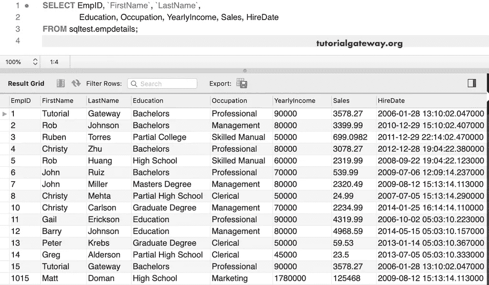
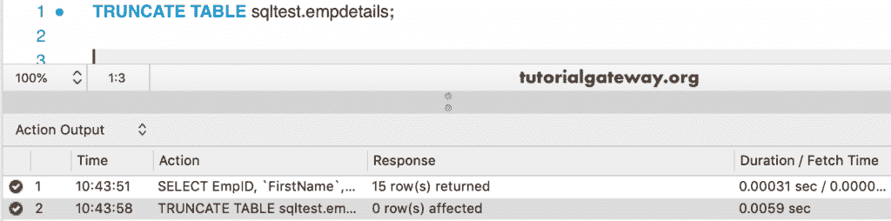
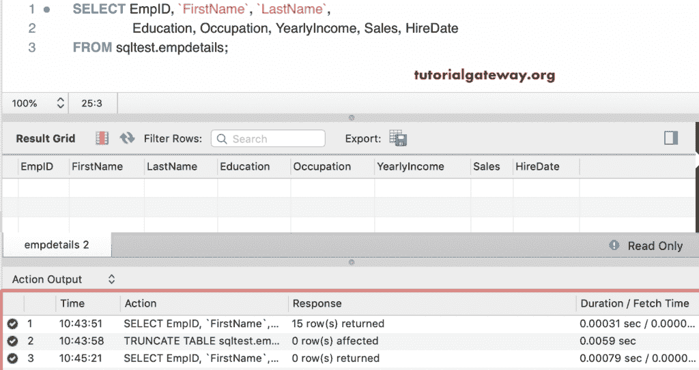
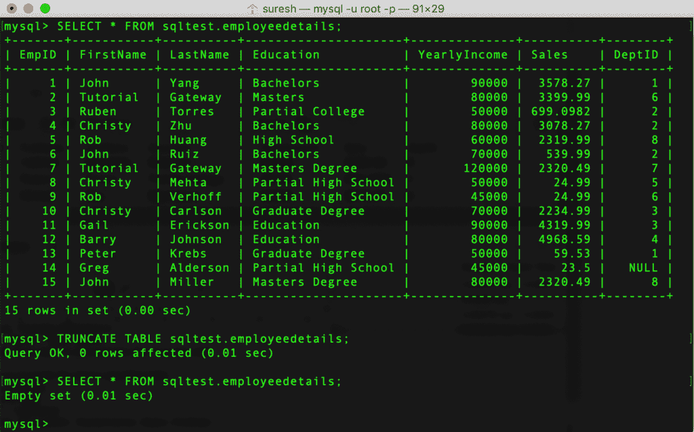
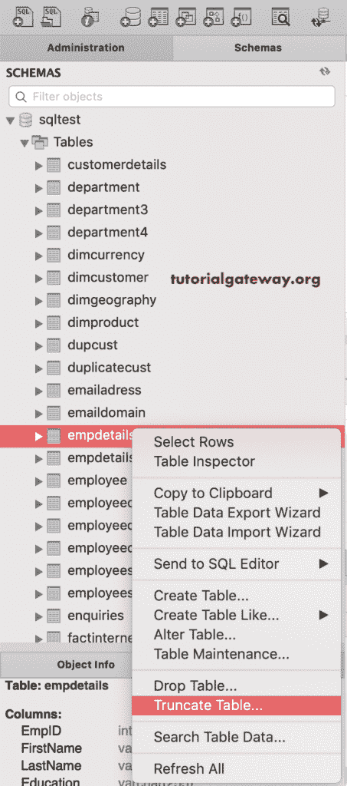
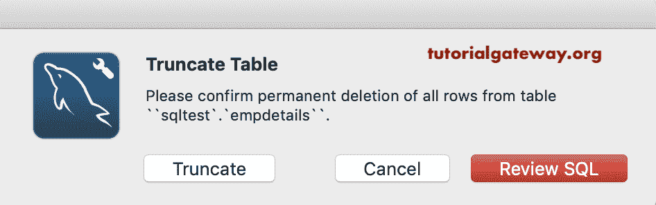
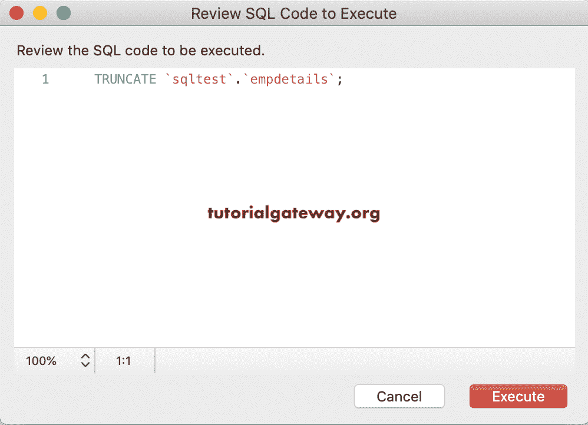
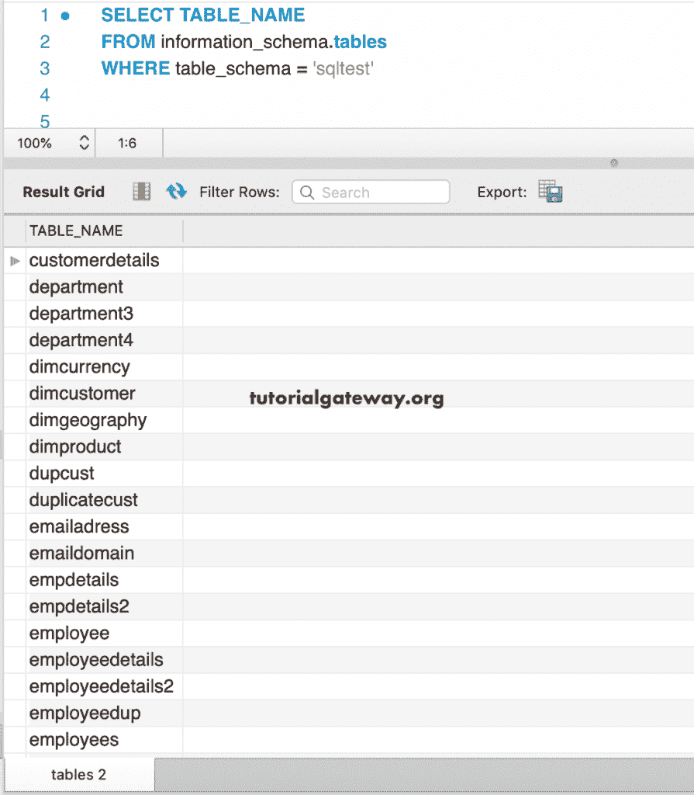

# MySQL 截断表

> 原文：<https://www.tutorialgateway.org/mysql-truncate-table/>

MySQL Truncate Table 语句在不影响表结构或索引的情况下删除所有记录或完整数据。当您想要删除所有现有记录时，MySQL Truncate Table 语句是您的最佳选择。MySQL Truncate 语句的基本语法是

```
TRUNCATE TABLE `Schema_Name`.`Table_Name`
```

我们将使用以下内容来演示这个 MySQL Truncate 表。



## MySQL 截断表示例

在这个 MySQL 截断表的例子中，我们将清除上面指定的。

```
TRUNCATE TABLE sqltest.empdetails;
```



让我们看看上面的数据

```
SELECT EmpID, `FirstName`, `LastName`,Education, 
       Occupation, YearlyIncome, Sales, HireDate
FROM empdetails;
```



如您所见，它返回了 0 条记录。

通过查看上面的 [MySQL](https://www.tutorialgateway.org/mysql-tutorial/) 结果，你可能会想为什么我们需要 Truncate，而没有 [Where 子句的](https://www.tutorialgateway.org/mysql-where-clause/) [Delete 语句](https://www.tutorialgateway.org/mysql-delete/)可以做类似的事情？。

*   嗯，它会自动将 AUTO_INCREMENT 计数器重置到起点，这是 Delete 语句不可能出现的情况。
*   该语句删除现有表并重新创建该表。因此，在此过程中，任何删除触发器都不会触发。

这是使用命令提示符或终端的另一个例子。

```
TRUNCATE TABLE sqltest.employeedetails;
```



### 使用工作台

如果您可以访问 MySQL 工作台，那么截断表就很容易了。首先，选择并右键单击要清除的表。接下来，选择下面显示的选项



它会打开一个弹出窗口



如果需要，可以选择



查看 SQL，查看该选项生成的 SQL 查询

或者，只需单击截断按钮

### MySQL 截断所有表

在 MySQL 中，您可以使用 information_schema 来获取数据库中的所有表。从那里，您可以删除所需的。

例如，下面的查询返回数据库中所有可用的数据。这有助于找到可供您使用的表格列表。然后执行所需的操作。

```
SELECT TABLE_NAME
FROM information_schema.tables
WHERE table_schema = 'sqltest'
```



接下来，您可以使用 this 语句一个接一个地清除。

```
TRUNCATE TABLE department
```

或者，您可以使用下面的代码生成一个语句来删除 MySQL 数据库中的所有内容。

```
SELECT CONCAT('TRUNCATe TABLE ' , TABLE_NAME )
FROM information_schema.tables
WHERE table_schema = 'sqltest'
```

上面的代码返回所有这些语句的 truncate table 语句。您可以简单地复制并执行这些代码。