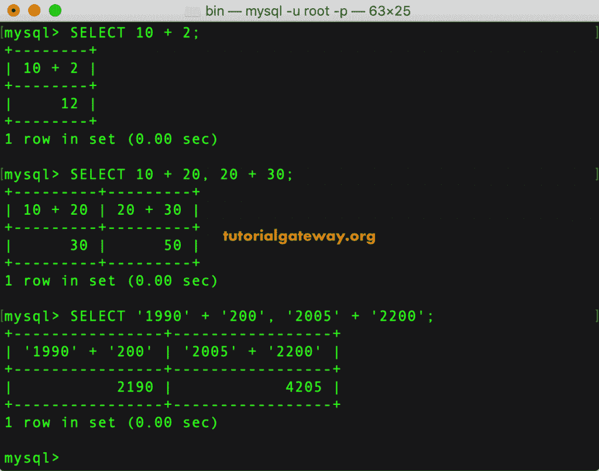
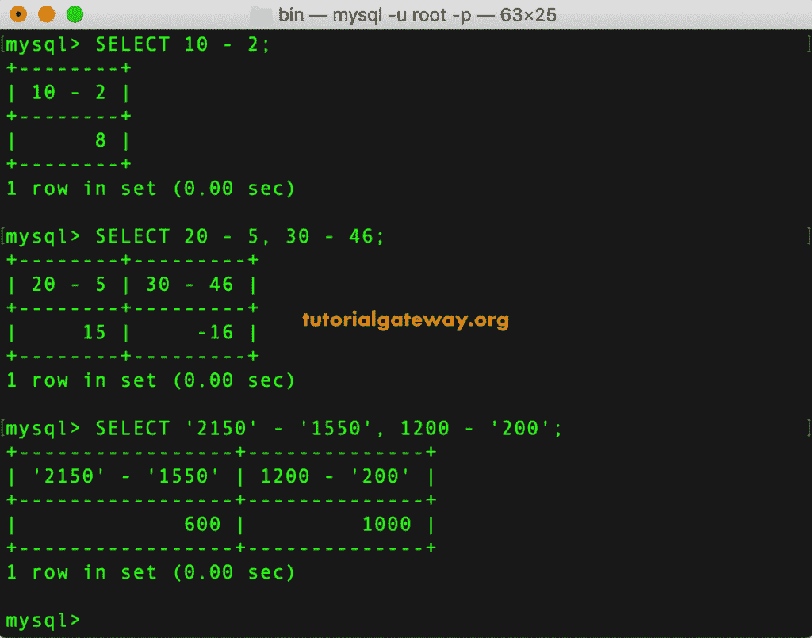
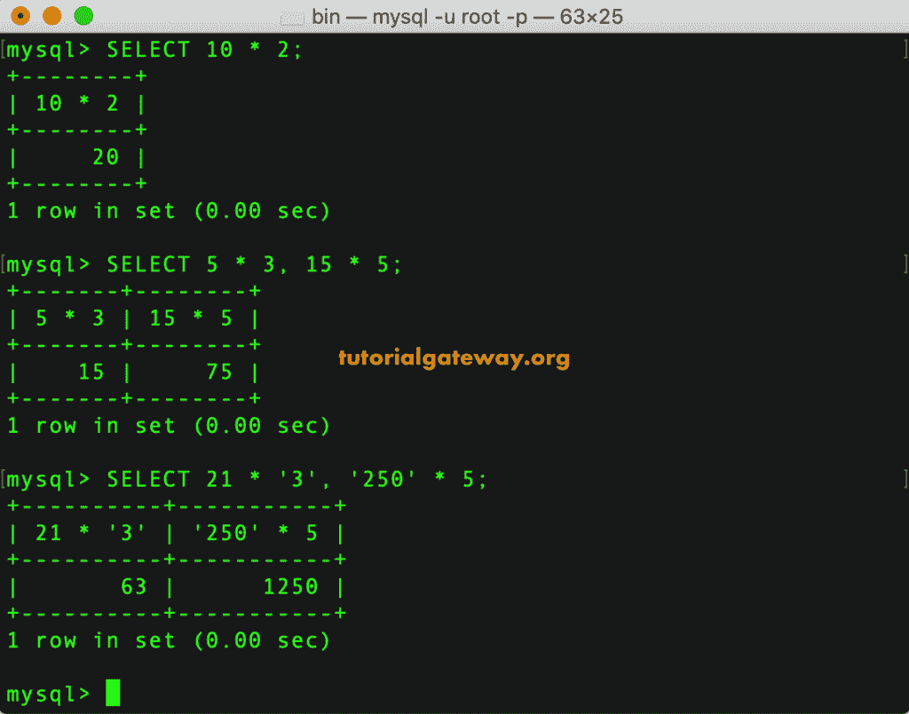
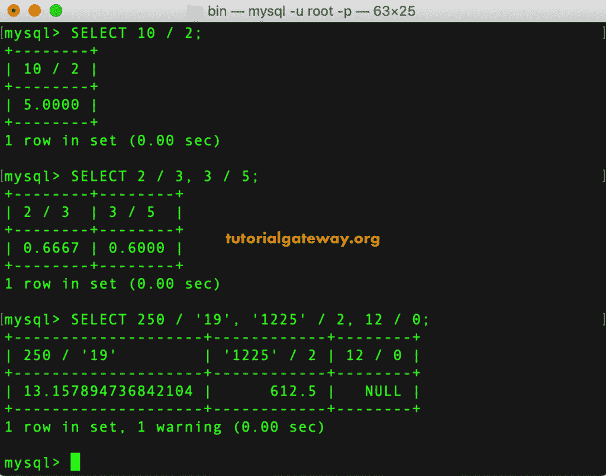
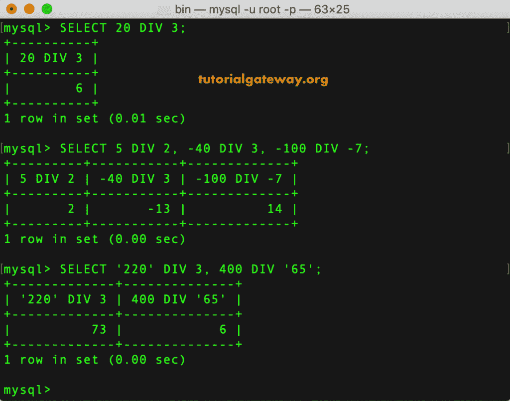
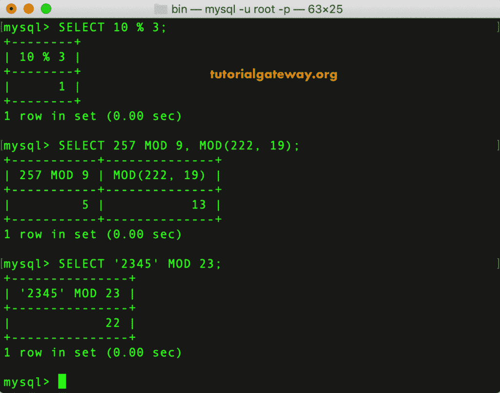
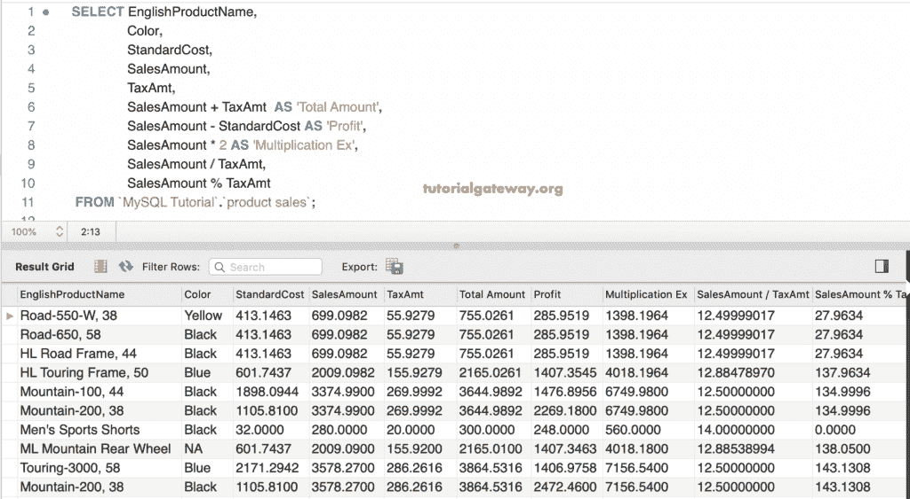

# MySQL 算术运算符

> 原文：<https://www.tutorialgateway.org/mysql-arithmetic-operators/>

MySQL 算术运算符用于对列数据执行算术运算，如加法、减法、乘法、除法和模数。下表显示了可用的 MySQL 算术运算符列表。

| MySQL 算术运算符 | 操作 | 例子 |
| + | 加法算子 | 选择 10 + 2 = 12 |
| – | 减法运算符 | 选择 10–2 = 8 |
| * | 乘法运算符 | 选择 10 * 2 = 20 |
| / | 除法算符 | 选择 10 / 2 = 5 |
| 差异 | 整数除法 | 选择 10 / 2 = 5 |
| %或 MOD | 模数算子 | 选择 10 % 2 = 0
选择 10 % 3 = 1 |

在本文中，我们将通过示例向您展示如何使用这些 MySQL 算术运算符。

## MySQL 算术运算符示例

以下是帮助您理解这些运算符以执行算术运算的示例列表。

### MySQL 加法运算符

MySQL 加法运算符对于添加值很有用。以下语句向您展示了如何在 MySQL 中添加值。在第三条语句中，我们使用了字符串格式的数字。然而，MySQL 将它们转换成整数，并返回加法的输出。

```
SELECT 10 + 2;

SELECT 10 + 20, 20 + 30;

SELECT '1990' + '200', '2005' + '2200';
```



### MySQL 减法运算符

MySQL 减法运算符用于从一个值中减去另一个值。

```
SELECT 10 - 2;

SELECT 20 - 5, 30 - 46;

SELECT '2150' - '1550', 1200 - '200'; 
```



### MySQL 乘法运算符

MySQL 乘法运算符用于将一个值与另一个值相乘。下面 [MySQL](https://www.tutorialgateway.org/mysql-tutorial/) 的查询显示你也一样

```
SELECT 10 * 2;

SELECT 5 * 3, 15 * 5;

SELECT 21 * '3', '250' * 5;
```



### MySQL 部门操作员

MySQL 除法运算符将一个值除以另一个值。下面的例子向你展示了同样的情况。

```
SELECT 10 / 2;

SELECT 2 / 3, 3 / 5;

SELECT 250 / '19', '1225' / 2, 12 / 0;
```



### MySQL DIV(消歧义)

在 MySQL 中，可以使用这个 DIV 对整数值进行除法运算。

```
SELECT 20 DIV 3;

SELECT 5 DIV 2, -40 DIV 3, -100 DIV -7;

SELECT '220' DIV 3, 400 DIV '65';
```



### MySQL %运算符[模数]

MySQL 模数运算符或 [`MOD()`函数](https://www.tutorialgateway.org/mysql-mod-function/)返回除法的余数。

```
SELECT 10 % 3;

SELECT 257 MOD 9, MOD(222, 19);

SELECT '2345' MOD 23;
```



## MySQL 算术运算符示例 2

在本例中，我们将对列数据使用这些算术运算符。在这个算术运算演示中，我们使用了销售额、税额和标准成本列。

```
SELECT EnglishProductName,
       Color,
       StandardCost,
       SalesAmount,
       TaxAmt,
       SalesAmount + TaxAmt  AS 'Total Amount',
       SalesAmount - StandardCost AS 'Profit',
       SalesAmount * 2 AS 'Multiplication Ex',
       SalesAmount / TaxAmt,
       SalesAmount % TaxAmt
  FROM `product sales`;
```

