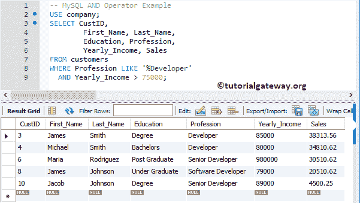

# MySQL 和运算符

> 原文：<https://www.tutorialgateway.org/mysql-and-operator/>

MySQL AND 运算符是逻辑运算符之一，通常用于 WHERE 子句中，对`SELECT`语句返回的记录应用多个筛选器。它将结果返回为:

*   1，如果所有操作数都是非零的，而不是空的。
*   0，如果其中一个操作数为零。
*   空，如果其中一个操作数为空，而其余操作数为非零。

让我们看看如何在 WHERE 子句中使用 MySQL 逻辑与运算符来过滤数据。为了解释这一点，我们将使用下面显示的数据。


## MySQL 和操作员命令提示符

在本例中，我们以不同的组合传递 1、0 和空值。它帮助你理解 MySQL AND 运算符背后的真值表。

```
SELECT 0 AND 0;

SELECT 1 AND 0;

SELECT 1 AND 1;

SELECT 1 AND NULL;

SELECT 0 AND NULL;

SELECT NULL AND NULL;
```


## MySQL 和运算符示例

这里测试 [WHERE 子句](https://www.tutorialgateway.org/mysql-where-clause/)中的多个条件。如果所有条件都为真，则仅显示记录。

```
USE company;
SELECT CustID,
		First_Name, Last_Name,
        Education, Profession,
        Yearly_Income, Sales
FROM customers
WHERE Profession LIKE '%Developer'
  AND Yearly_Income > 75000;
```

以上 [`SELECT`语句](https://www.tutorialgateway.org/mysql-select-statement/)检索所有出现在 [MySQL](https://www.tutorialgateway.org/mysql-tutorial/) 客户表中的客户，其职业包含开发者，年收入大于 75000。



你也可以在 3 到 4 种情况下使用这个。让我们使用 MySQL AND 运算符应用三个条件

```
USE company;
SELECT CustID,
		First_Name, Last_Name,
        Education, Profession,
        Yearly_Income, Sales
FROM customers
WHERE Profession LIKE '%Developer'
  AND Yearly_Income > 75000
  AND Sales > 10000;
```

上面的语句返回“客户”表中所有可用的客户，这些客户的职业包含开发人员，年收入大于 75000，销售额大于 10000。

