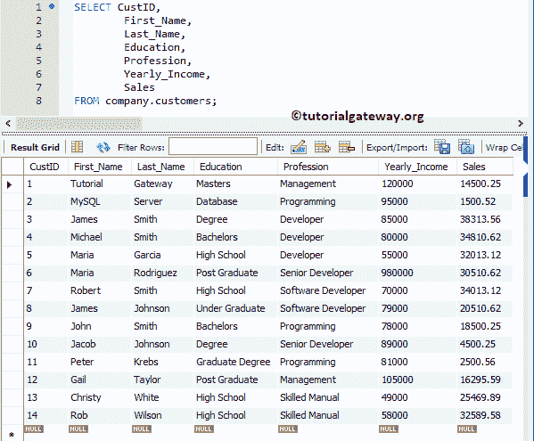
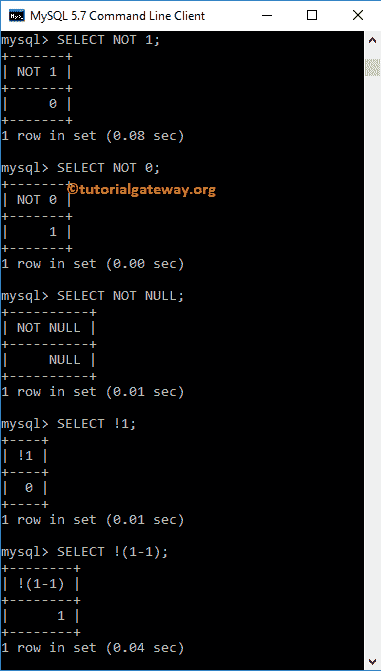

# MySQL `NOT`运算符

> 原文：<https://www.tutorialgateway.org/mysql-not-operator/>

MySQL NOT 运算符是逻辑运算符之一，它在`WHERE`子句中用于对`SELECT`语句返回的行应用过滤器。该运算符将结果返回为:

*   1，如果操作数为零
*   0，如果操作数是 1。
*   如果操作数为空，则为空。

为了解释`WHERE`子句中的 MySQL 逻辑`NOT`运算符来过滤数据，我们将使用下面显示的数据。



## MySQL `NOT`运算符命令提示符

在这个 [MySQL](https://www.tutorialgateway.org/mysql-tutorial/) 的例子中，我们用不同的组合传递零、一和空值。这个例子帮助你理解`NOT`运算符后面的真值表。

```
SELECT NOT 1;

SELECT NOT 0;

SELECT NOT NULL;

SELECT !1;

SELECT !(1 - 1);

```



## MySQL 不是例子

`NOT`运算符用于根据[`SELECT`语句](https://www.tutorialgateway.org/mysql-select-statement/)记录测试 [`WHERE`子句](https://www.tutorialgateway.org/mysql-where-clause/)中用户指定的条件。

```
USE company;
SELECT CustID,
		First_Name, Last_Name,
        Education, Profession,
        Yearly_Income, Sales
FROM customers
WHERE Education != 'High School';
```

