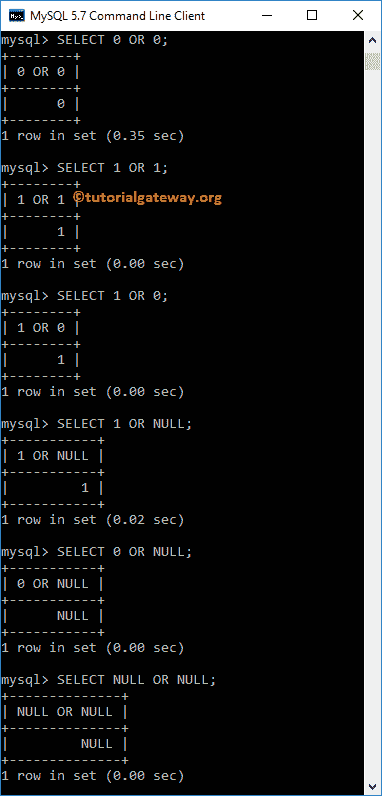
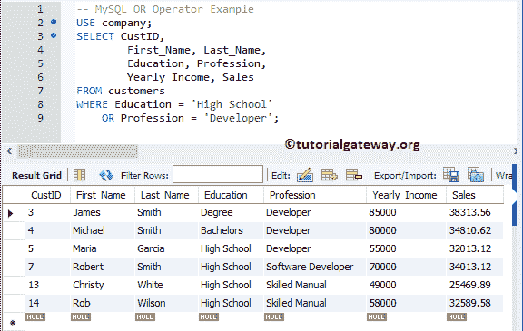
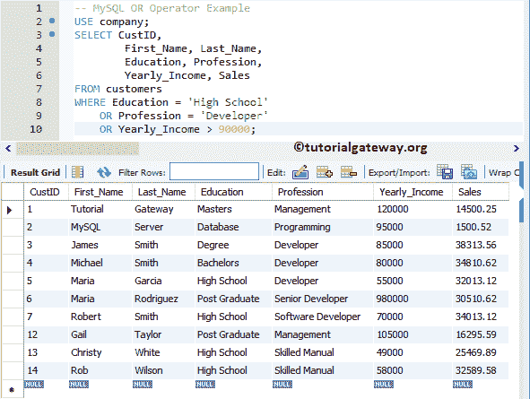

# MySQL OR 运算符

> 原文:[https://www.tutorialgateway.org/mysql-or-operator/](https://www.tutorialgateway.org/mysql-or-operator/)

MySQL OR 运算符是逻辑运算符之一。一般来说，我们在 WHERE 子句中使用这个函数对 SELECT 语句返回的记录应用多个筛选器。这个 MySQL OR 运算符返回的结果如下:

*   1，如果所有操作数都不是空值，并且任何一个操作数都不是零。
*   0，如果所有操作数都不是空值，并且都是零。
*   如果其中一个操作数为空，其余操作数为零，则为 1。

让我们看看如何在 WHERE 子句中使用 MySQL 逻辑运算符 or 来过滤数据。为了解释它，我们将使用下面显示的数据。


## MySQL 或操作员命令提示符

在这个或的例子中，我们用不同的组合传递 1、0 和空值。这个例子帮助你理解 MySQL OR 运算符背后的真值表。

```
SELECT 0 OR 0;

SELECT 1 OR 1;

SELECT 1 OR 0;

SELECT 1 OR NULL;

SELECT 0 OR NULL;

SELECT NULL OR NULL;
```



## MySQL 或运算符示例

它测试 [WHERE 子句](https://www.tutorialgateway.org/mysql-where-clause/)中的多个条件。如果任一条件为真，则显示记录。

```
USE company;
SELECT CustID,
		First_Name, Last_Name,
        Education, Profession,
        Yearly_Income, Sales
FROM customers
WHERE Education = 'High School'
   OR Profession = 'Developer';
```

以上 [SELECT 语句](https://www.tutorialgateway.org/mysql-select-statement/)检索 [MySQL](https://www.tutorialgateway.org/mysql-tutorial/) 客户表中学历为高中或职业为开发人员的所有客户。



您也可以在三个或四个条件之间使用 MySQL OR 运算符。让我们在三个条件之间应用它

```
USE company;
SELECT CustID,
		First_Name, Last_Name,
        Education, Profession,
        Yearly_Income, Sales
FROM customers
WHERE Education = 'High School'
	OR Profession = 'Developer'
    OR Yearly_Income > 90000;
```

上面的语句从“客户”表中检索教育程度为高中、职业为开发人员或年收入大于 90000 的客户。

