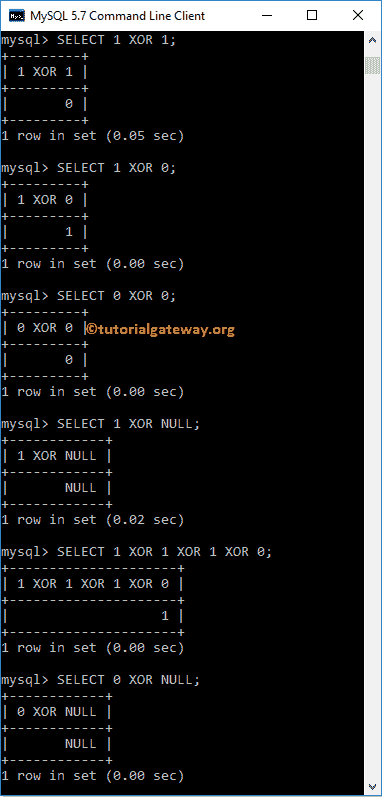
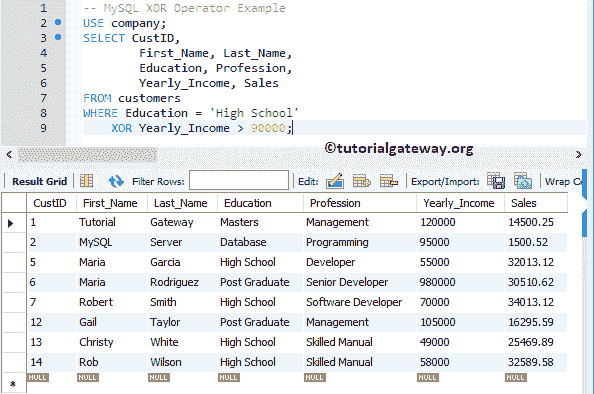

# MySQL `XOR`运算符

> 原文：<https://www.tutorialgateway.org/mysql-xor-operator/>

MySQL `XOR`运算符是逻辑运算符之一。在数学中，x XOR y 等于(x AND (NOT y))或((NOT x) AND y)。通常，我们在`WHERE`子句中使用这个 MySQL X`OR`运算符对`SELECT`语句返回的行或记录应用多个过滤器。这个 MySQL `XOR`运算符返回如下结果:

*   如果所有操作数都不为空，并且奇数个操作数不为零，则为 1，否则为 0。
*   如果其中一个操作数为空，则为空。

为了解释`WHERE`子句中的 MySQL 逻辑`XOR`运算符，我们将使用下面显示的数据。


## MySQL `XOR`运算符命令提示符

在这个 [MySQL](https://www.tutorialgateway.org/mysql-tutorial/) 的例子中，我们用不同的组合传递 1、0 和空值。这个例子帮助你理解这个`XOR`运算符背后的真值表。

```
SELECT 1 XOR 1;

SELECT 1 XOR 0;

SELECT 0 XOR 0;

SELECT 1 XOR NULL;

SELECT 1 XOR 1 XOR 1 XOR 0;

SELECT 0 XOR NULL;
```



## 逻辑`XOR`运算符示例

`XOR`运算符测试`WHERE`子句中的多个条件。如果 [`WHERE`子句](https://www.tutorialgateway.org/mysql-where-clause/)中的任一条件为真，则 [`SELECT`语句](https://www.tutorialgateway.org/mysql-select-statement/)显示记录。

```
USE company;
SELECT CustID,
		First_Name, Last_Name,
        Education, Profession,
        Yearly_Income, Sales
FROM customers
WHERE Education = 'High School'
	XOR Yearly_Income > 90000;
```

