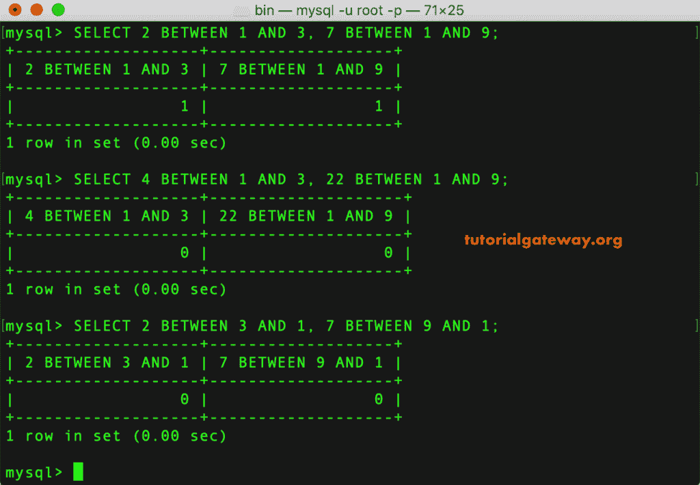
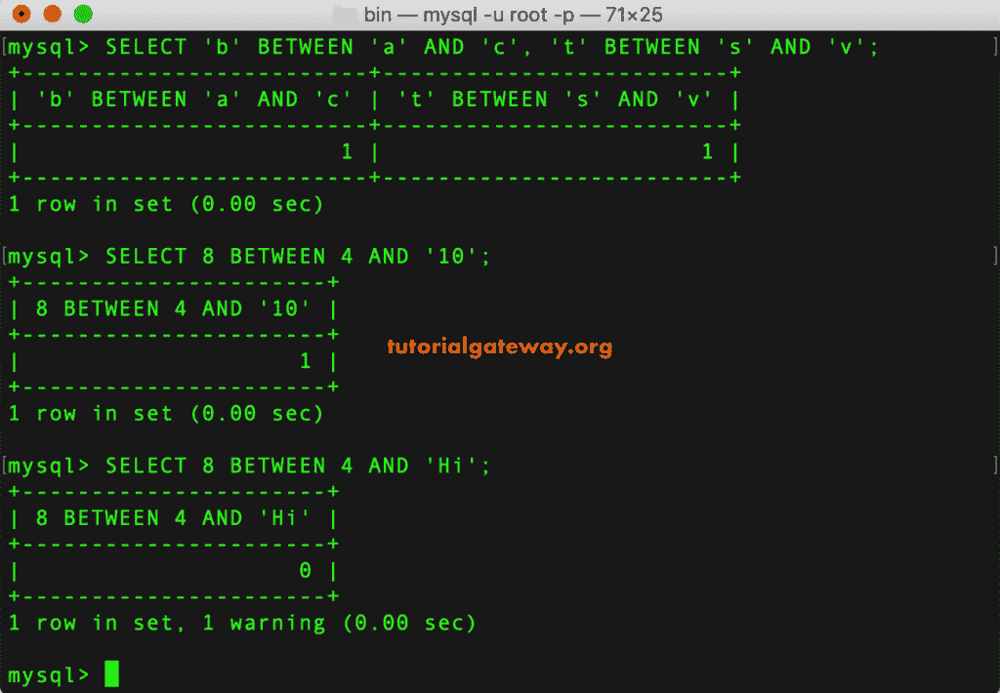
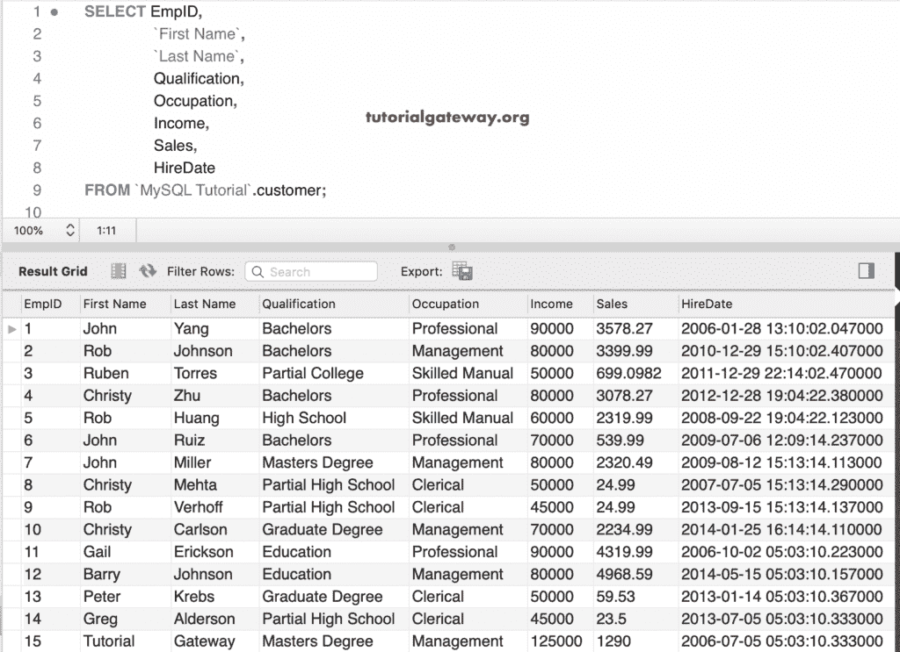
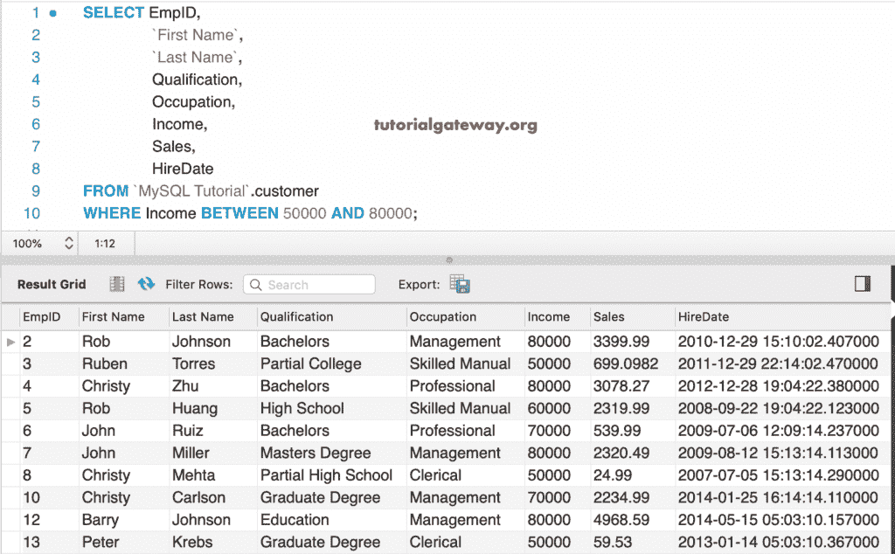
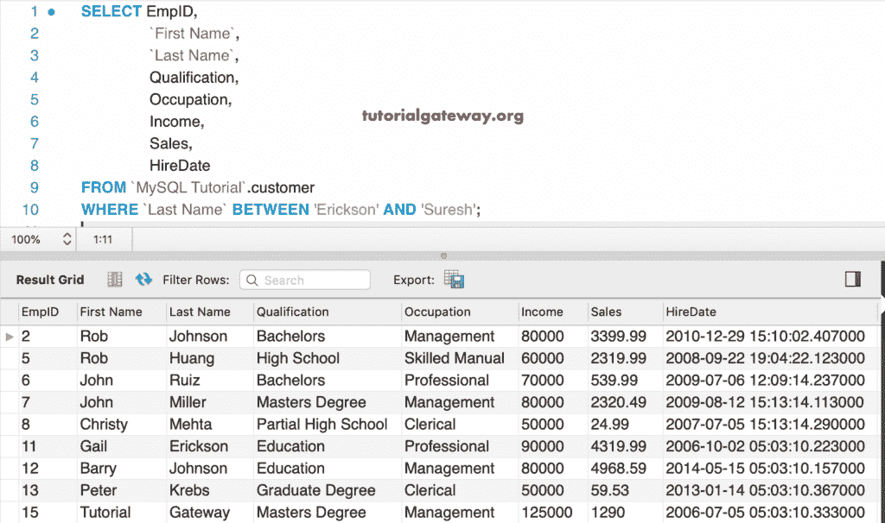
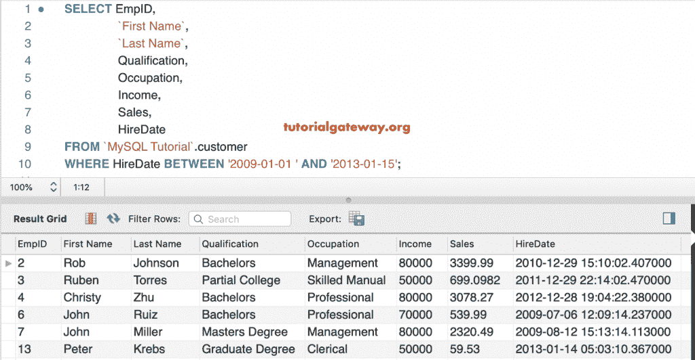
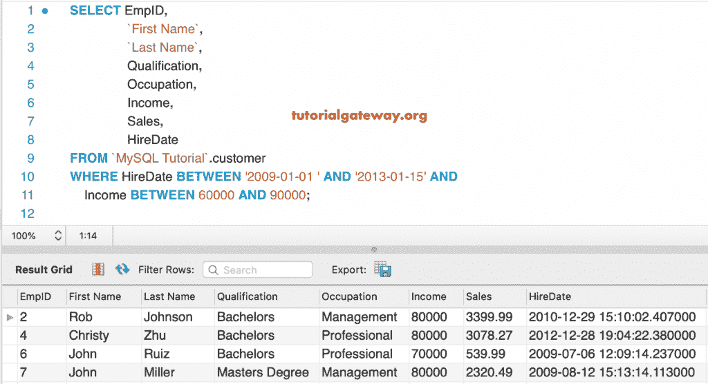

# MySQL `BETWEEN`运算符

> 原文：<https://www.tutorialgateway.org/mysql-between-operator/>

MySQL 中间运算符返回其值在给定的两个值或范围之间的行。例如，您可以使用这个 MySQL `BETWEEN`运算符来查找 2018 年 1 月至 2018 年 12 月日期之间的销售额。

## 运算符语法之间的 MySQL

MySQL Bever 运算符的基本语法可以写成:

```sql
SELECT Column_Names 
FROM Table_Name
WHERE Column_Value BETWEEN Value1 AND Value2
```

此运算符显示值 1 和值 2 之间的可用记录，包括它们。意思是，列值> =值 1，列值< =值 2。

## MySQL 之间的例子

这个简单的例子展示了 MySQL 在数值上的工作功能。在第一个语句中，2 是从 1 到 3，7 是从 1 到 9。所以，它返回 1。在下一条语句中，4 不在 1 和 3 之间，22 不在 1 和 9 的中间，因此它返回 0。

```sql
SELECT 2 BETWEEN 1 AND 3, 7 BETWEEN 1 AND 9;

SELECT 4 BETWEEN 1 AND 3, 22 BETWEEN 1 AND 9;

SELECT 2 BETWEEN 3 AND 1, 7 BETWEEN 9 AND 1;
```



在这个例子中，我们展示了如何在字符串数据上使用这个 MySQL Beth 运算符。第一条语句返回 1，1，因为 b 在 a 和 c 之间，t 在 s 和 v 的中间。在第二条 MySQL 语句中，它将字符串 10 转换为 int，并检查 8 是否在 4 和 10 之间。

```sql
SELECT 'b' BETWEEN 'a' AND 'c', 't' BETWEEN 's' AND 'v';

SELECT 8 BETWEEN 4 AND '10';

SELECT 8 BETWEEN 4 AND 'Hi';
```



### 数字和字符串数据上运算符之间的关系示例

在这个 MySQL 的中间运算符演示中，我们将使用客户表。以下 [MySQL](https://www.tutorialgateway.org/mysql-tutorial/) 截图显示了本表



内的数据

以下查询返回收入介于 50000 和 80000 之间的客户。或者，收入大于等于 50000 且小于等于 80000。

```sql
SELECT EmpID, 
       `First Name`,
       `Last Name`,
       Qualification,
       Occupation,
       Income,
       Sales,
       HireDate
 FROM customer
 WHERE Income BETWEEN 50000 AND 80000;
```



这个 MySQL 操作示例查找姓氏在埃里克森和苏雷什之间的所有客户

```sql
SELECT EmpID, 
       `First Name`,
       `Last Name`,
       Qualification,
       Occupation,
       Income,
       Sales,
       HireDate
FROM customer
WHERE `Last Name` BETWEEN 'Erickson' AND 'Suresh';
```

提示:我们也可以使用单个字符来代替完整的名字。这是因为这个“介于”函数将第一个字符视为引用。



### 日期之间的 MySQL 示例

在这个日期示例中，我们找到了所有雇佣日期在 2009-01-01 和 2013-01-15 之间的客户

```sql
SELECT EmpID, 
       `First Name`,
       `Last Name`,
       Qualification,
       Occupation,
       Income,
       Sales,
       HireDate
FROM customer
WHERE HireDate BETWEEN '2009-01-01 ' AND '2013-01-15';
```



这个 MySQL 介于日期之间的示例查找并返回所有雇佣日期在 2009-01-01 和 2013-01-15 中间，收入在 60000 和 90000 中间的客户。

```sql
SELECT EmpID, 
       `First Name`,
       `Last Name`,
       Qualification,
       Occupation,
       Income,
       Sales,
       HireDate
FROM customer
WHERE HireDate BETWEEN '2009-01-01 ' AND '2013-01-15' AND
      Income BETWEEN 60000 AND 90000;
```

