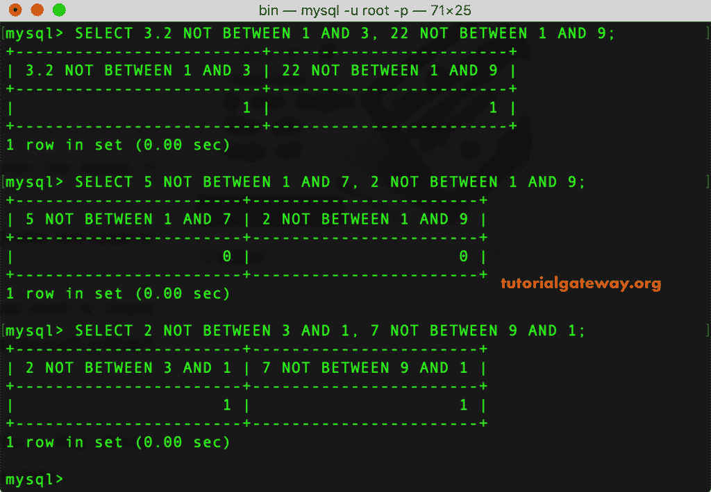
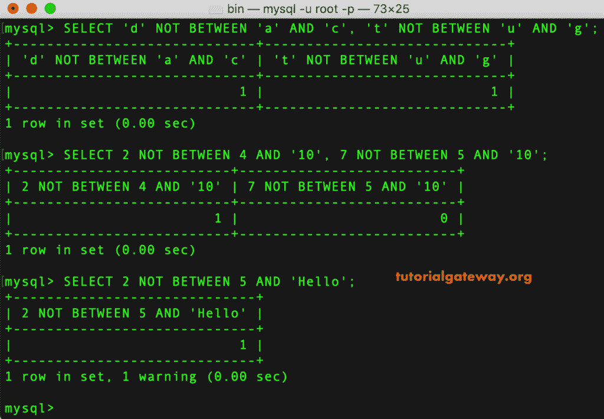
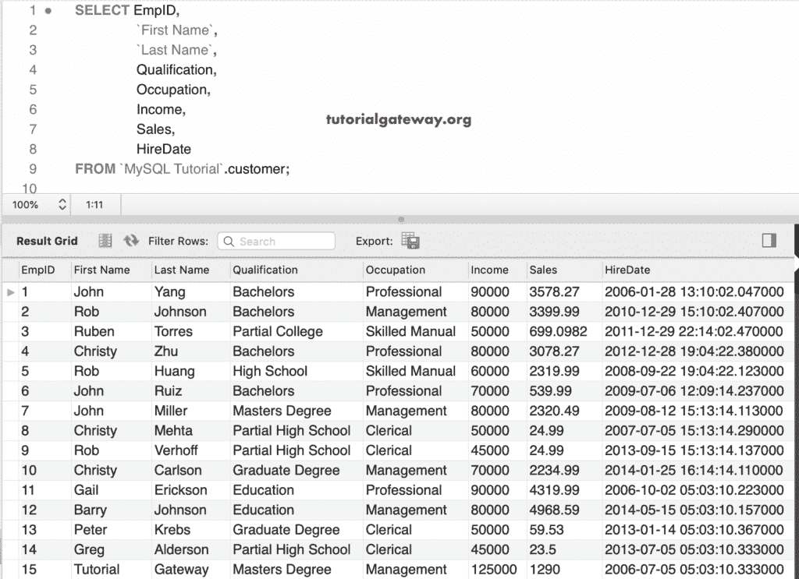
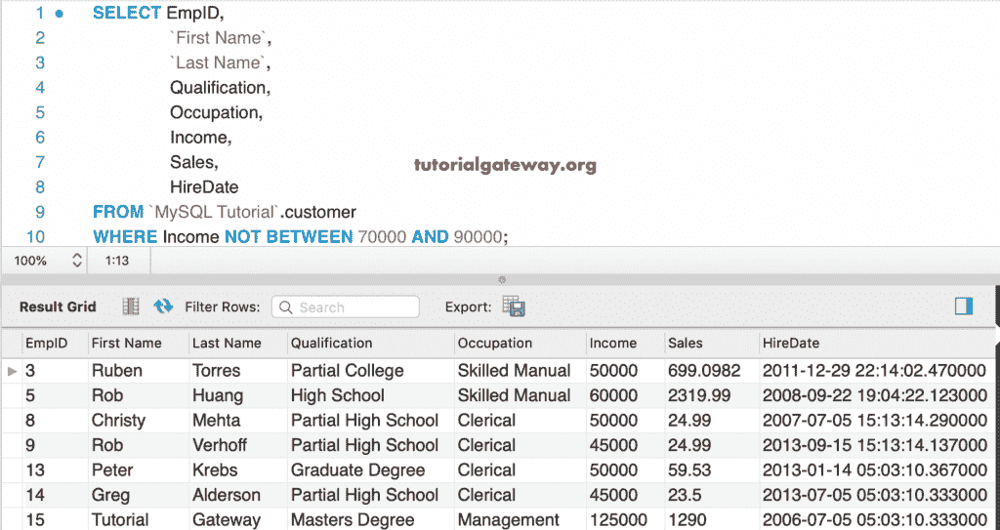
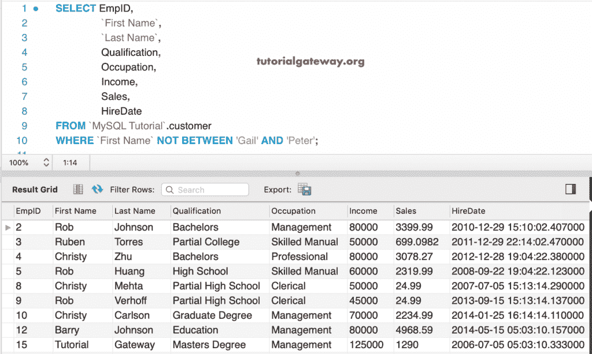
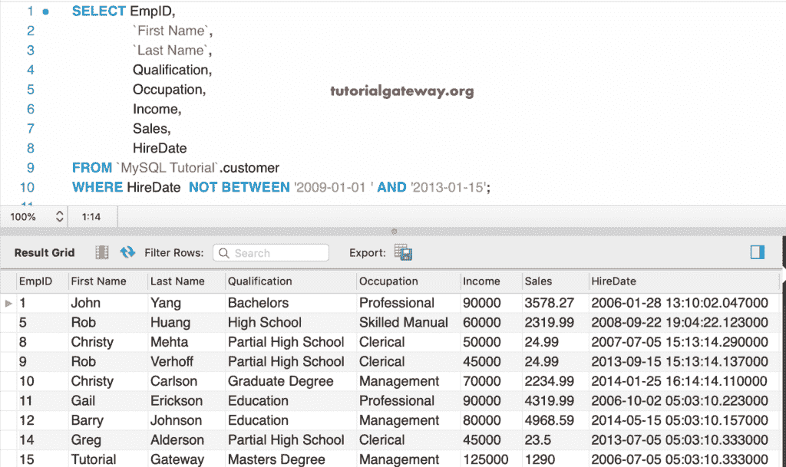

# 不在运算符之间

> 原文:[https://www.tutorialgateway.org/mysql-not-between-operator/](https://www.tutorialgateway.org/mysql-not-between-operator/)

MySQL 非介于运算符返回值不在给定的两个值或范围之间的记录。MySQL 非介于运算符与介于运算符完全相反

例如，如果您想查找 2018 年销售额。但是，您可能对 4 月和 5 月的销售额不感兴趣，那么使用这个 MySQL Not Between，以 4 月和 5 月为值。

## 不在运算符语法之间

MySQL 非介于运算符的基本语法是

```
SELECT Column_Names 
FROM Table_Name
WHERE Column_Value NOT BETWEEN Value1 AND Value2
```

“不在”运算符显示不在值 1 和值 2 之间的记录，包括它们。意思是，列 _ 值<= Value1 and Column_Value > =值 2。

## MySQL 非介于示例

这个简单的例子展示了 MySQL 的工作功能“不在数值之间”。

在第一个语句中，3.2 不在 1 和 3 之间[，22 不在 1 和 9 之间，所以返回 1。在下一个语句中，5 在 1 和 7 的中间，2 在 1 的中间& 9，所以返回 0。](https://www.tutorialgateway.org/mysql-between-operator/)

```
SELECT 3.2 NOT BETWEEN 1 AND 3, 22 NOT BETWEEN 1 AND 9;

SELECT 5 NOT BETWEEN 1 AND 7, 2 NOT BETWEEN 1 AND 9;

SELECT 2 NOT BETWEEN 3 AND 1, 7 NOT BETWEEN 9 AND 1;
```



在这个 MySQL 运算符示例中，我们向您解释了如何在字符串数据上使用这个 Not Between 运算符。

第一条 [MySQL](https://www.tutorialgateway.org/mysql-tutorial/) 语句返回 1，因为 d 不在 a 和 c 之间，t 不在 u 和 g 之间，在第二条语句内，它将字符串 10 转换为 int，并测试 2 是否不在 4 和 10 之间。

```
SELECT 'd' NOT BETWEEN 'a' AND 'c', 't' NOT BETWEEN 'u' AND 'g';

SELECT 2 NOT BETWEEN 4 AND '10', 7 NOT BETWEEN 5 AND '10';

SELECT 2 NOT BETWEEN 5 AND 'Hello';
```



### 数字和字符串数据的非运算符示例

对于这个 MySQL 非介于运算符演示，我们使用这个客户表。下面的截图显示了这个表格



中的数据

以下 MySQL Operator 查询返回收入不在 70000 到 90000 之间的客户。或者，收入低于 7 万，高于 9 万。

```
SELECT EmpID, 
       `First Name`,
       `Last Name`,
       Qualification,
       Occupation,
       Income,
       Sales,
       HireDate
FROM customer
WHERE Income NOT BETWEEN 70000 AND 90000;
```



这个 MySQL Not Between 运算符示例返回名字不在盖尔和彼得之间的客户。它返回字母 G 之前和 P 之后的名字

```
SELECT EmpID, 
       `First Name`,
       `Last Name`,
       Qualification,
       Occupation,
       Income,
       Sales,
       HireDate
FROM customer
WHERE `First Name` NOT BETWEEN 'Gail' AND 'Peter';
```

提示:我们也可以使用单个字符，因为 not between 运算符将第一个字符视为引用。



### MySQL 不在日期之间示例

在这个 MySQL 不在日期之间的例子中，我们返回所有雇佣日期不在 2009-01-01 和 2013-01-15 之间的客户

```
SELECT EmpID, 
       `First Name`,
       `Last Name`,
       Qualification,
       Occupation,
       Income,
       Sales,
       HireDate
FROM customer
WHERE HireDate  NOT BETWEEN '2009-01-01 ' AND '2013-01-15';
```

