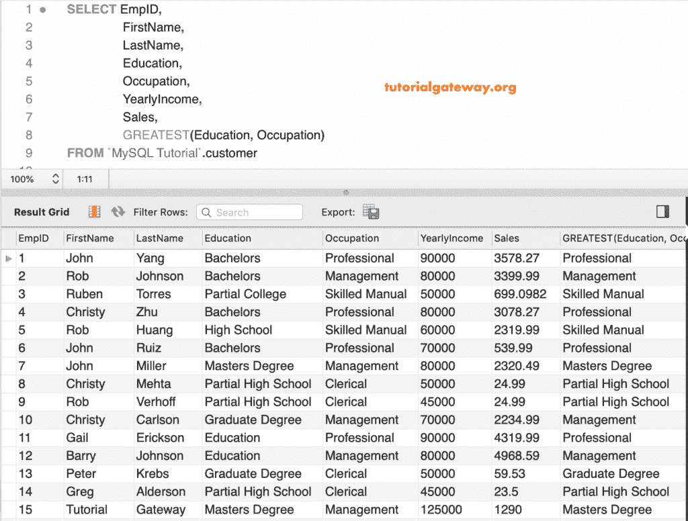

# MySQL 最大功能

> 原文：<https://www.tutorialgateway.org/mysql-greatest-function/>

MySQL 最大是比较函数之一，它返回最大的参数。这个 MySQL 最大函数遵循以下规则:

*   如果任何参数为空，则返回空值
*   如果所有参数都是整数，它会找到最大值。
*   而且，如果我们使用字符串作为参数，它会找到最大或最大的字符串。

在本节中，我们将通过示例向您展示如何在 MySQL 中的给定值中找到最大值。

## MySQL 最伟大的语法

MySQL`Magrest()`函数的基本语法如下所示:

```
GREATEST(Value1, Value2......, ValueN);
```

## MySQL 最大功能示例 1

下面的查询显示了使用这个 MySQL 最大函数的多种方法。首先，我们使用整数作为参数。第二条语句查找最大十进制数。接下来，它找到 g、t、d 和 o 中最大的字符。

```
SELECT GREATEST(20, 25, 10);

SELECT GREATEST(2.0, 3.2, 1.0, 2.5, 1.90);

SELECT GREATEST('g', 't', 'd', 'o');
```


这里，我们使用了字符串、整数和小数的组合。接下来，我们使用 NULL 作为 [MySQL 的](https://www.tutorialgateway.org/mysql-tutorial/)参数。

```
SELECT GREATEST('tutorialgateway', 'mysql', 'oracle');

SELECT GREATEST(10, '10', 10.0);

SELECT GREATEST(10, 20, NULL);
```


## MySQL 最大函数示例 2

在 MySQL 中，可以对列数据使用这个方法。这个例子告诉你如何在 [where 子句中使用这个。](https://www.tutorialgateway.org/mysql-where-clause/)这里返回年收入大于 7 万的所有记录。

```
SELECT EmpID, 
       FirstName,
       LastName,
       Occupation,
       YearlyIncome,
       Sales,
       HireDate
 FROM customer
 WHERE YearlyIncome > GREATEST(50000, 70000, 60000);
```


一般来说，我们使用这个最大函数在多列(而不是行)中找到最大的。下面的查询显示了每个员工标识的年收入列和销售额列中最高的。

```
SELECT EmpID,
       FirstName,
       LastName,
       YearlyIncome,
       Sales, 
       GREATEST(YearlyIncome, SALES)
 FROM customer
```


上面的查询将年收入值显示为输出，因为它们是最大的。

这一次，我们比较或发现每个员工标识的教育和职业列值中最大的值。

```
SELECT EmpID, 
       FirstName,
       LastName,
       Education,
       Occupation,
       YearlyIncome,
       Sales,
       GREATEST(Education, Occupation)
 FROM customer
```

