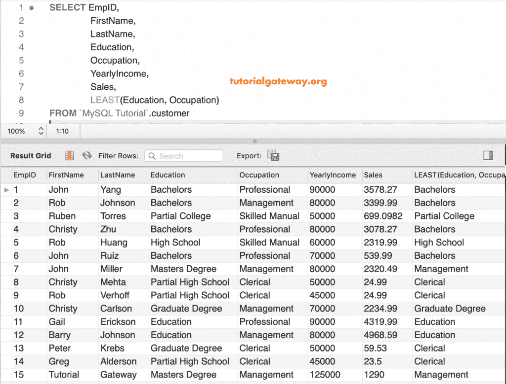

# 最小函数

> 原文：<https://www.tutorialgateway.org/mysql-least-function/>

MySQL 最小是比较函数之一，它返回最小的参数。这个 MySQL 最小函数遵循下面显示的规则:

*   如果任何参数为空，则返回空值。
*   如果所有参数都是整数，它会找到最小或最小的数。
*   而且，如果我们使用字符串作为参数，这个函数会找到最小或最小的字符串。

在本文中，我们通过示例向您展示了如何在 MySQL 中找到给定值中的最小值。

## MySQL 最少语法

MySQL 最小函数的基本语法如下所示:

```
LEAST(Value1, Value2......, ValueN);
```

## MySQL 最小函数示例 1

下面的查询显示了使用这个 MySQL 最小函数的多种方法。

在第一个语句中，我们使用整数作为参数。第二条语句查找最小的十进制数。接下来，它找到 g、d、M 和 z 中最小的字符。

```
SELECT LEAST(22, 5, 10);

SELECT LEAST(12.5, 3.2, 7.0, 2.5, 9.90);

SELECT LEAST('g', 'd', 'M', 'Z');
```


这里，我们在这个最小函数中使用了整数、字符串和小数的组合。接下来，我们使用 NULL 作为 [MySQL 的](https://www.tutorialgateway.org/mysql-tutorial/)参数。

```
SELECT LEAST('hello', 'hi', 'mysql');

SELECT LEAST(10, 10.0, '10');

SELECT LEAST(10, NULL, 20, 50);
```


## MySQL 最小函数示例 2

w 可以对列数据使用这个函数。这个例子展示了如何在表上使用这个函数。

一般来说，我们使用这个函数来寻找多列中最小的一列。下面的查询显示了每个员工标识的年收入列和销售额列中的最小值。

```
SELECT EmpID,
       FirstName,
       LastName,
       YearlyIncome,
       Sales, 
       LEAST(YearlyIncome, SALES)
 FROM customer
```


上面的查询将销售值显示为输出，因为这些值是两个值中最小的。这次，我们将比较或查找每个员工标识的教育和职业列值中的最小值。

```
SELECT EmpID, 
       FirstName,
       LastName,
       Education,
       Occupation,
       YearlyIncome,
       Sales,
       LEAST(Education, Occupation)
 FROM customer
```

