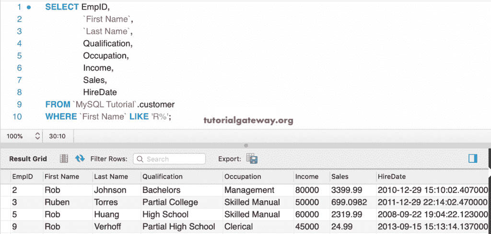
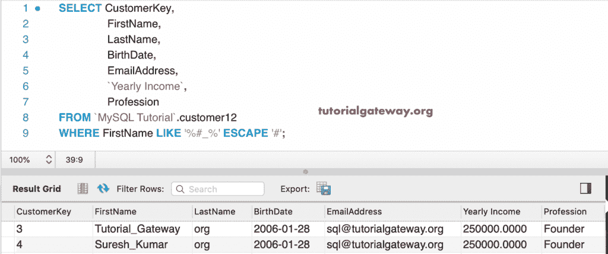

# MySQL LIKE 运算符

> 原文：<https://www.tutorialgateway.org/mysql-like-operator/>

MySQL LIKE 运算符用于对表执行任意搜索。MYSQL Like 运算符使用通配符来提取与指定模式匹配的记录。

例如，如果您忘记了产品的拼写或描述，那么使用 MySQL LIKE 运算符通配符来查找匹配的记录。以下是支持的通配符

| MySQL 通配符 | 描述 |
| % | 使用此选项匹配零个或多个字符 |
| _ | 使用它来精确匹配一个字符 |

在我们进入 MySQL LIKE 运算符示例中的通配符之前，让我向您展示语法。

## 类似运算符的语法

这个 MySQL 通配符背后的语法是:

```
SELECT Columns
FROM Table
WHERE Column_Name LIKE Wildcard_Expression ESCAPE 'escape_charcater'
```

通配符表达式可能包含%或 _。如果要转义任何特殊字符，请使用默认值或任何字符。如果您使用了\，则使用 ESCAPE 关键字指定该字符更安全。在这个演示中，我们将使用下面显示的数据。


## 类似 MySQL 的通配符%示例

通配符百分比表示零个或多个字符。例如，下面的%通配符查询返回名字以字母 r 开头的所有员工

```
SELECT EmpID, 
       `First Name`,
       `Last Name`,
       Qualification,
       Occupation,
       Income,
       Sales,
       HireDate
 FROM customer
 WHERE `First Name` LIKE 'R%';
```



这个 MySQL 通配符查询示例显示了职业以字母 l 结尾的员工。

```
SELECT EmpID, 
       `First Name`,
       `Last Name`,
       Qualification,
       Occupation,
       Income,
       Sales,
       HireDate
 FROM customer
 WHERE Occupation LIKE '%l';
```


### 多值示例 2

以下 MySQL Like 多值查询选择资格以字母 B 开头、以 s 结尾的员工

```
SELECT EmpID, 
       `First Name`,
       `Last Name`,
       Qualification,
       Occupation,
       Income,
       Sales,
       HireDate
 FROM customer
 WHERE Qualification LIKE 'B%s';
```


此多值查询示例返回其资格在任何位置包含 d 和 e 的客户。

```
SELECT EmpID, 
       `First Name`,
       `Last Name`,
       Qualification,
       Occupation,
       Income,
       Sales,
       HireDate
FROM customer
WHERE Qualification LIKE '%d%e';
```


## 类似 MySQL 的通配符示例

通配符下划线(_)代表单个字符。例如，下面的 [MySQL](https://www.tutorialgateway.org/mysql-tutorial/) 查询选择资格包含第二个字母 a 的员工

```
SELECT EmpID, 
       `First Name`,
       `Last Name`,
       Qualification,
       Occupation,
       Income,
       Sales,
       HireDate
FROM customer
WHERE Qualification LIKE '_a%';
```


此查询显示其资格包含第二个字母 a 和第四个字母 t 的客户。

```
SELECT EmpID, 
       `First Name`,
       `Last Name`,
       Qualification,
       Occupation,
       Income,
       Sales,
       HireDate
FROM customer
WHERE Qualification LIKE '_a_t%';
```


下面的 MySQL Like 通配符查询显示姓氏至少有六个字符的员工。

```
SELECT EmpID, 
       `First Name`,
       `Last Name`,
       Qualification,
       Occupation,
       Income,
       Sales,
       HireDate
FROM customer
WHERE  `Last Name` LIKE N'_%_%_%_%_%_%';
```


## MySQL 类转义示例

到目前为止，我们已经看到通配符显示一个或多个字符。但是，如果您的列有一些特殊字符，如 _ 或%或$，那么您必须使用 ESCAPE 字符。为此，我们将使用下面显示的数据。


从上面的截图中可以看到，我们的数据在名字列中有 _ 和%符号。在 MySQL Like 运算符中，\是转义任何特殊字符的默认转义字符。

例如，以下查询使用\从名字中转义。

```
SELECT EmpID, 
       `First Name`,
       `Last Name`,
       Qualification,
       Occupation,
       Income,
       Sales,
       HireDate
FROM customer
WHERE FirstName LIKE '%\_%';
```


您也可以通过使用 escape 关键字将自己的字符用作转义字符。下面显示的 MySQL Like 转义查询使用# 作为转义字符来跳过符号。

```
SELECT EmpID, 
       `First Name`,
       `Last Name`,
       Qualification,
       Occupation,
       Income,
       Sales,
       HireDate
FROM customer
WHERE FirstName LIKE '%# _%' ESCAPE '#';
```



这次我们使用$作为转义字符来转义电子邮件地址列中的@符号。

```
SELECT EmpID, 
       `First Name`,
       `Last Name`,
       Qualification,
       Occupation,
       Income,
       Sales,
       HireDate
 FROM customer
 WHERE EmailAddress LIKE '%[email protected]%' ESCAPE '$';
```


以下查询转义名中的%符号。

```
SELECT CustomerKey,
       FirstName,
       LastName,
       BirthDate,
       EmailAddress,
       `Yearly Income`,
       Profession
 FROM customer12
 WHERE FirstName LIKE '%\%%';
```


## 命令提示符示例

这只是一个在命令提示符下显示 Like 运算符的示例。

