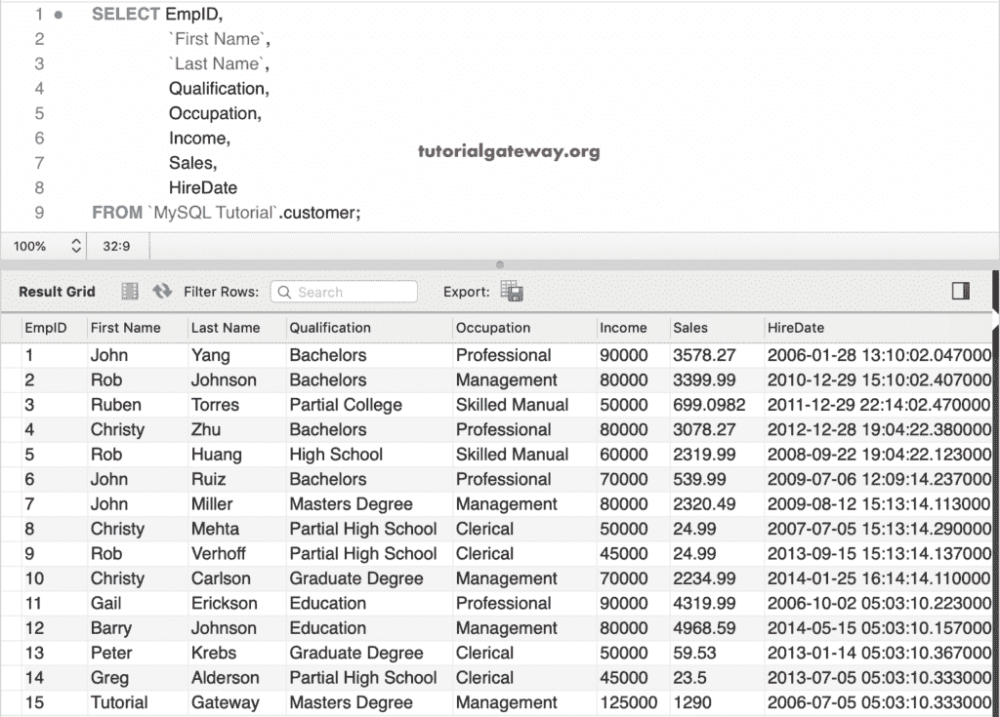
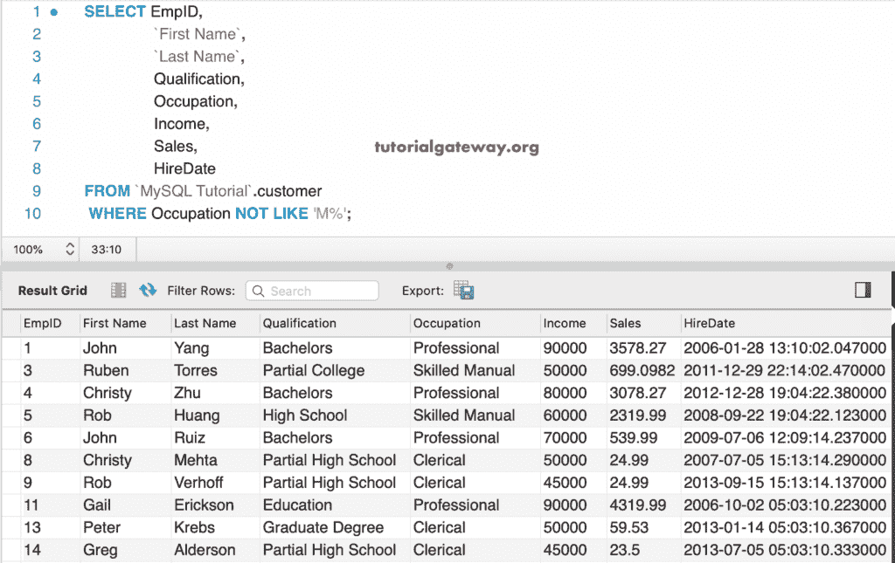
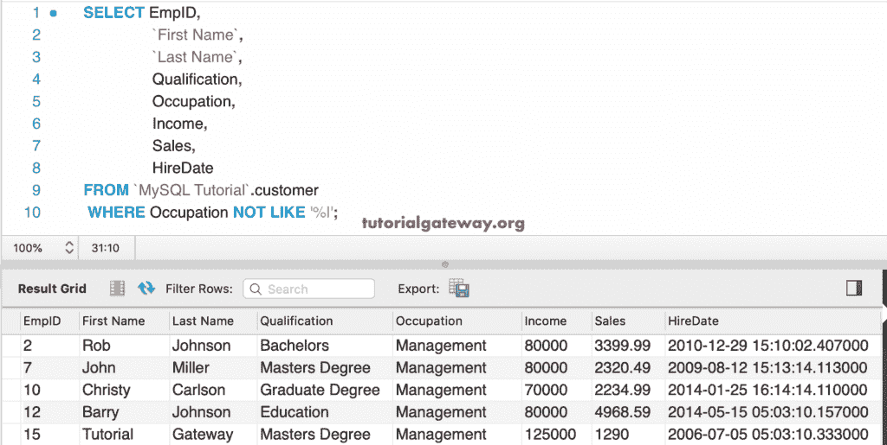
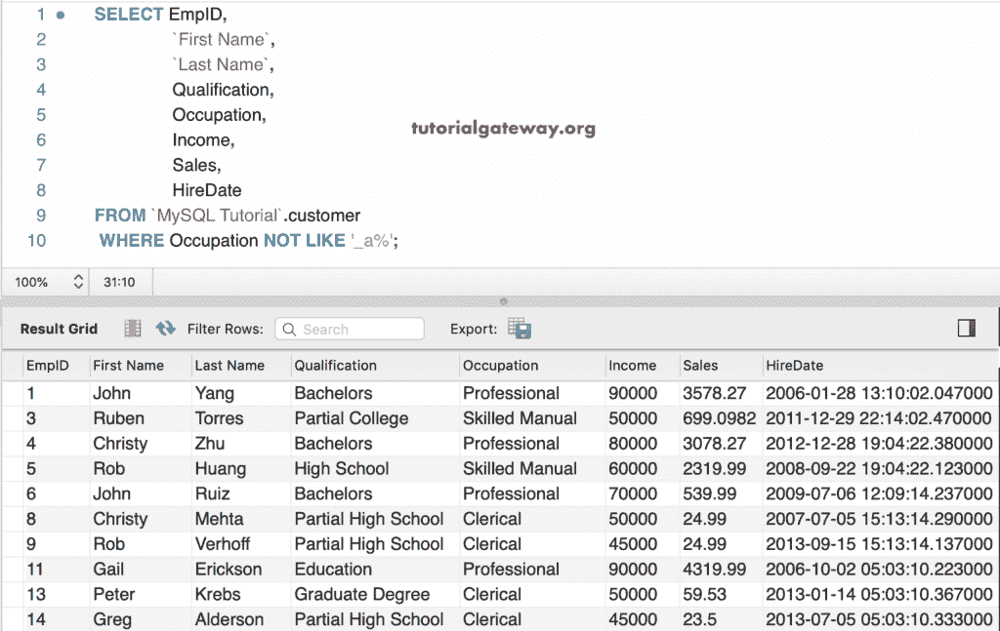
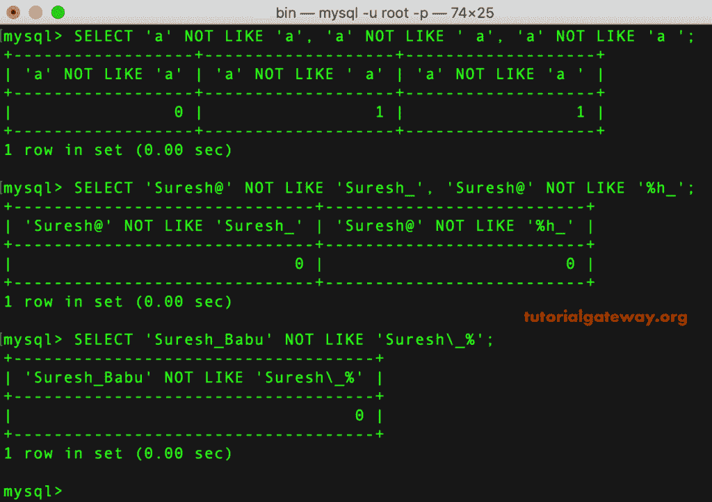

# MySQL `NOT LIKE`运算符

> 原文：<https://www.tutorialgateway.org/mysql-not-like-operator/>

MySQL 不相似运算符的性能与相似运算符完全相反。`NOT LIKE`运算符返回值与给定模式不匹配的记录。

对于这个 MySQL `NOT LIKE`运算符和通配符演示，我们使用了下面显示的数据。



## MySQL `NOT LIKE`运算符示例

在这个 MySQL 示例中，我们使用了百分比通配符和不相似运算符。以下查询返回所有职业不以 m 开头的客户

```
SELECT EmpID, 
       `First Name`,
       `Last Name`,
       Qualification,
       Occupation,
       Income,
       Sales,
       HireDate
FROM customer
WHERE Occupation NOT LIKE 'M%';
```



这个 MySQL 不喜欢查询显示了职业不以 l 结尾的员工

```
SELECT EmpID, 
       `First Name`,
       `Last Name`,
       Qualification,
       Occupation,
       Income,
       Sales,
       HireDate
FROM customer
WHERE Occupation NOT LIKE '%l';
```



### MySQL 不像示例 2

在本例中，我们使用下划线通配符来匹配单个字符。下面的 MySQL Not like 查询返回其职业不包含第二个字母作为 a 的员工

```
SELECT EmpID, 
       `First Name`,
       `Last Name`,
       Qualification,
       Occupation,
       Income,
       Sales,
       HireDate
FROM customer
WHERE Occupation NOT LIKE '_a%';
```



以下不喜欢查询选择职业以 M 开头，第三个字母或字符应为 n 的员工，请参考[喜欢的运算符](https://www.tutorialgateway.org/mysql-like-operator/)文章。

```
SELECT EmpID, 
       `First Name`,
       `Last Name`,
       Qualification,
       Occupation,
       Income,
       Sales,
       HireDate
FROM customer
WHERE Occupation NOT LIKE '%M_n%';
```


### MySQL `NOT LIKE`运算符命令提示符示例

此示例从命令提示符显示“不喜欢”的用法。您也可以使用上面的任何一个 [MySQL](https://www.tutorialgateway.org/mysql-tutorial/) 示例查询使用这个终端。

```
SELECT 'a' NOT LIKE 'a', 'a' NOT LIKE ' a', 'a' NOT LIKE 'a ';

SELECT '[email protected]' NOT LIKE 'Suresh_', '[email protected]' NOT LIKE '%h_';

SELECT 'Suresh_Babu' NOT LIKE 'Suresh\_%';
```

