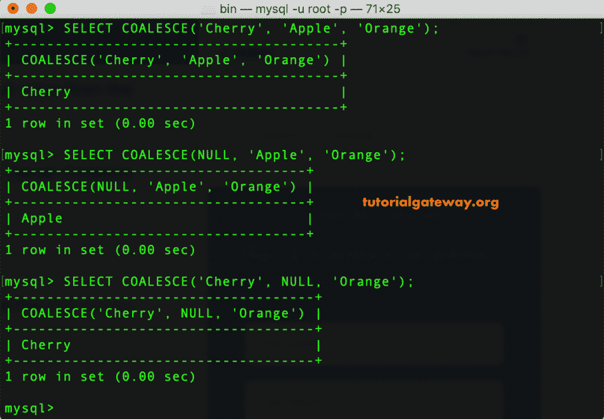

# MySQL `COALESCE()`函数

> 原文：<https://www.tutorialgateway.org/mysql-coalesce-function/>

MySQL `COALESCE()`函数从一系列表达式中返回第一个非空值，如果没有非空值，则返回空值。

让我们通过一个例子来看看如何使用这个 MySQL 凝聚。这个 MySQL 凝聚背后的语法如下所示:

```sql
COALESCE (exp1, exp2, ......, expN)
```

## MySQL `COALESCE()`函数示例

在这个例子中，我们向您展示了如何在字符串数据上使用这个 MySQL 凝聚函数。第一条语句返回 Cherry，因为该函数返回第一个非空值。第二条语句返回 Apple，因为第一个值为 NULL。

```sql
SELECT COALESCE('Cherry', 'Apple', 'Orange');

SELECT COALESCE(NULL, 'Apple', 'Orange');

SELECT COALESCE('Cherry', NULL, 'Orange');
```



这里，第二条语句返回 Orange，因为前两个参数或值是 NULLs。

```sql
SELECT COALESCE('Cherry', 'Apple', NULL);

SELECT COALESCE(NULL, NULL, 'Orange');

SELECT COALESCE(NULL, 'Orange', NULL);
```


这个例子展示了 MySQL 联合数值的工作功能。和上面的例子一样。

```sql
SELECT COALESCE(15, NULL, NULL);

SELECT COALESCE(NULL, 25, NULL);

SELECT COALESCE(NULL, NULL, 35);
```


## MySQL 聚结示例 2

在本例中，我们向您展示了如何在表数据上使用该函数。在本演示中，我们将使用 [MySQL](https://www.tutorialgateway.org/mysql-tutorial/) 员工详细信息表，该表包含以下记录。


在本例中，我们使用这个 MySQL 凝聚函数找到员工联系号码:

1.  如果员工有个人电话号码，请返回电话号码。
2.  如果他/她没有个人电话号码，但他/她有办公室电话号码，则返回办公室电话号码。
3.  如果员工没有个人电话号码或办公室电话，则该函数会查找移动电话号码并返回相同的号码。
4.  如果用户有所有的号码，那么 MySQL 凝聚函数返回个人电话号码。

```sql
SELECT 
       CustomerKey,
       CONCAT(FirstName,  ' ', LastName) AS FullName,
       EmailAddress,
       Phone,
       Office,
       Mobile,
       COALESCE(Phone, Office, Mobile)
 FROM EmployeeDetails;
```


在这个例子中，我们使用了办公室和移动电话号码

```sql
SELECT 
       CustomerKey,
       CONCAT(FirstName,  ' ', LastName) AS FullName,
       EmailAddress,
       Phone,
       Office,
       Mobile,
       COALESCE(Office, Mobile)
 FROM EmployeeDetails;
```

