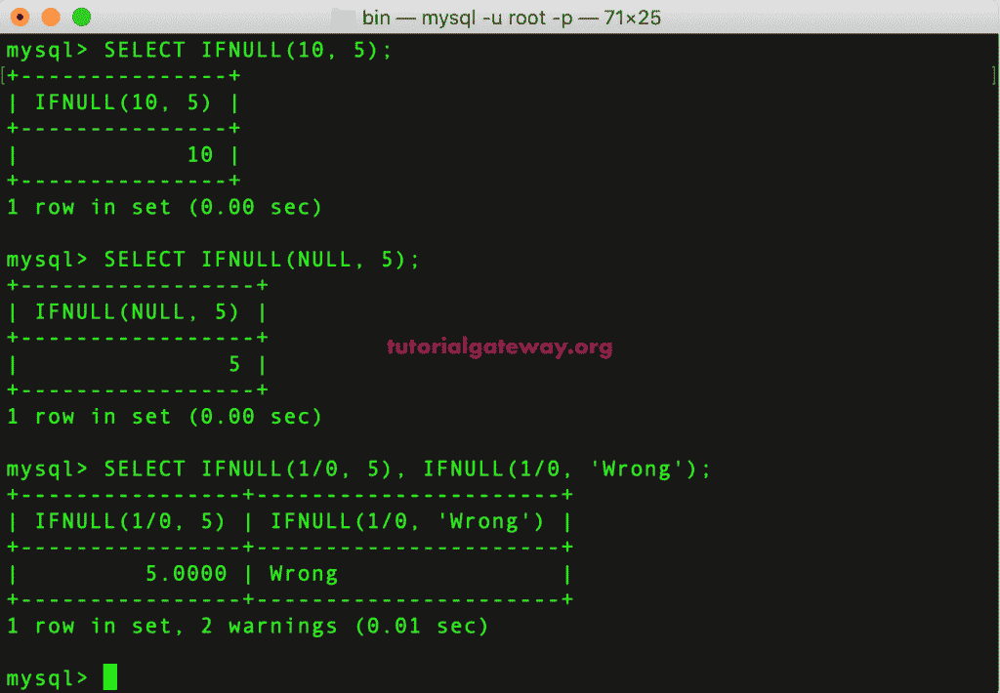
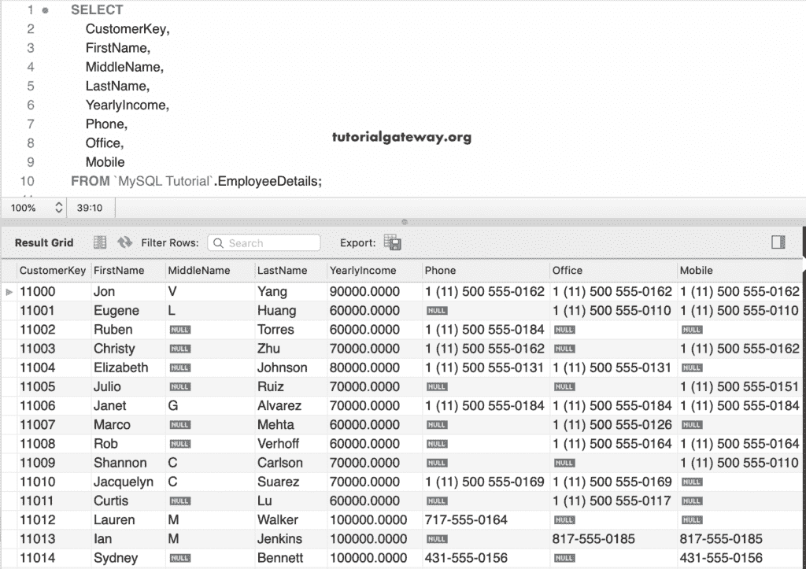
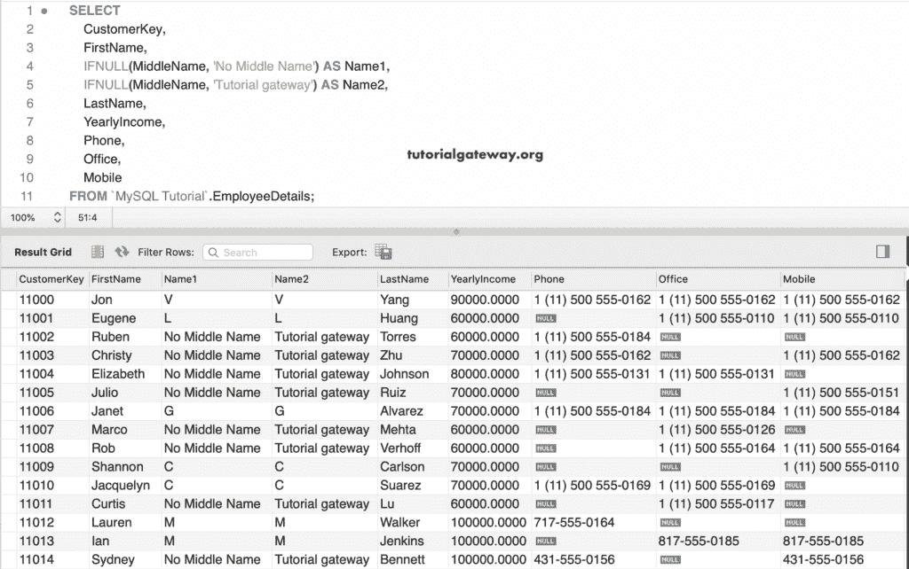
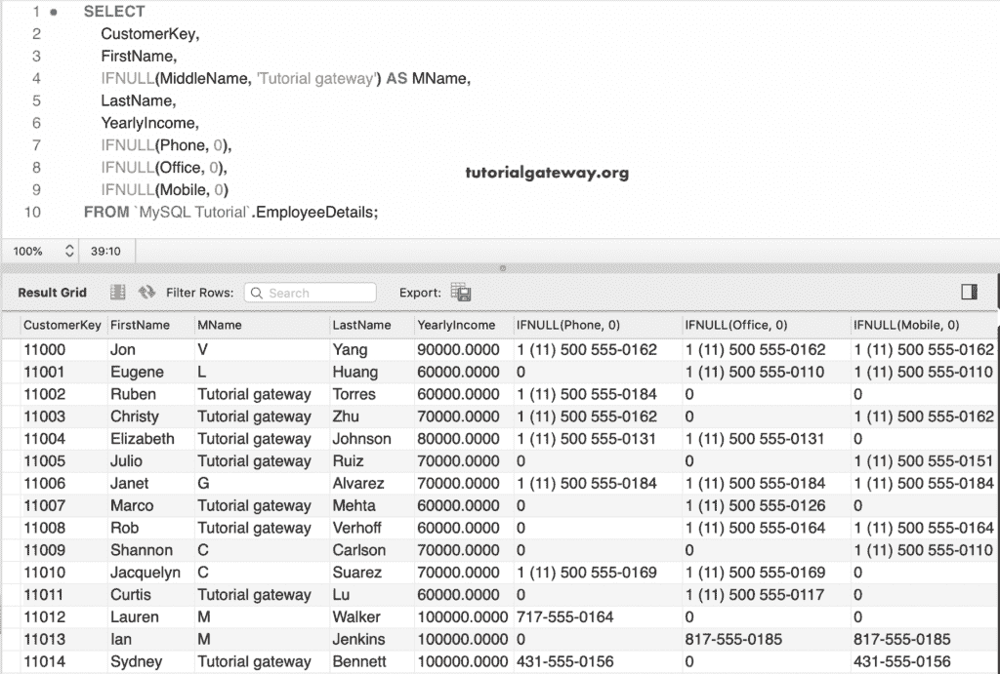
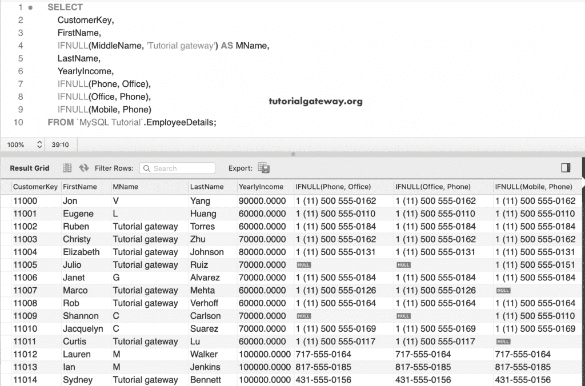

# MySQL `IFNULL`运算符

> 原文：<https://www.tutorialgateway.org/mysql-ifnull-operator/>

MySQL IFNULL 用于用自定义值或自定义文本替换空值。这个运算符对于用自定义信息替换烦人的 NULLS 非常有用。这个 MySQL IFNULL 背后的基本语法如下:

```
SELECT IFNULL(expression1, expression2) 
```

这个 MySQL IFNULL 运算符接受两个参数。如果第一个值(表达式 1)不是，则返回第一个值。如果表达式 1 的值为空，则返回表达式 2

## MySQL IFNULL 运算符示例 1

在这个示例查询中，我们向您展示了简单的 MySQL IFNULL 运算符示例。这里，第一条语句返回 10，因为 10 不是空值。第二条语句返回 5，因为第一个参数为 Null。在最后一条语句中，1/0 是空值，因此返回 5 和错误。

```
SELECT IFNULL(10, 5);

SELECT IFNULL(NULL, 5);

SELECT IFNULL(1/0, 5), IFNULL(1/0, 'Wrong');
```



## MySQL IFNULL 示例 2

我们将此员工详细信息表用于 IFNULL 运算符演示。下面的截图给大家展示了这个 [MySQL](https://www.tutorialgateway.org/mysql-tutorial/) 表

里面的数据T4】

在这个示例查询中，我们对中间名使用了 IFNULL 运算符。如果中间名为空，则替换为“没有中间名”作为名称 1，替换为“教程网关”作为名称 2。否则，它返回中间名。

```
SELECT 
     CustomerKey,
     FirstName, 
     IFNULL(MiddleName, 'No Middle Name') AS Name1,
     IFNULL(MiddleName, 'Tutorial gateway') AS Name2,
     LastName,
     YearlyIncome,
     Phone,
     Office,
     Mobile
 FROM EmployeeDetails;
```



这次，我们在中间名、电话、办公室和中间列上使用这个 MySQL IFNULL。如果电话号码中有任何空值，则用 0 替换它们。

```
SELECT 
     CustomerKey,
     FirstName, 
     IFNULL(MiddleName, 'Tutorial gateway') AS MName,
     LastName,
     YearlyIncome,
     IFNULL(Phone, 0),
     IFNULL(Office, 0),
     IFNULL(Mobile, 0)
 FROM EmployeeDetails;
```



到目前为止，我们使用它来用自定义文本替换列空值。但是，您也可以使用另一个列值作为替换值。在本例中，(电话、办公室)意味着，如果“电话”列中有任何空值，则它们将被相应的办公室号码替换。

```
SELECT 
     CustomerKey,
     FirstName, 
     IFNULL(MiddleName, 'Tutorial gateway') AS MName,
     LastName,
     YearlyIncome,
     IFNULL(Phone, Office),
     IFNULL(Office, Phone),
     IFNULL(Mobile, Phone)
 FROM EmployeeDetails;
```

