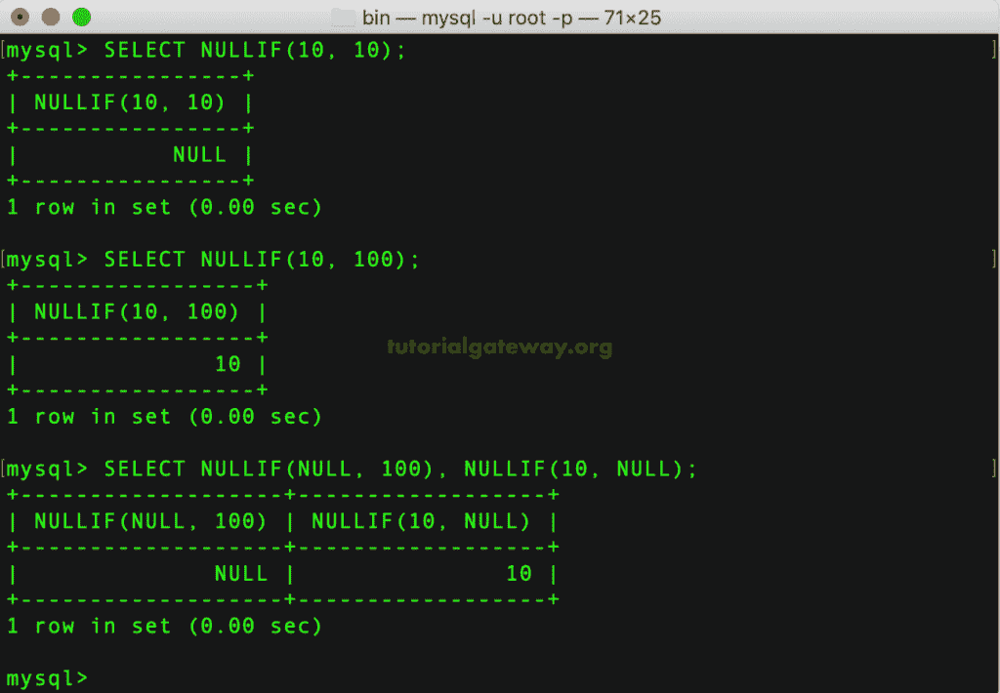
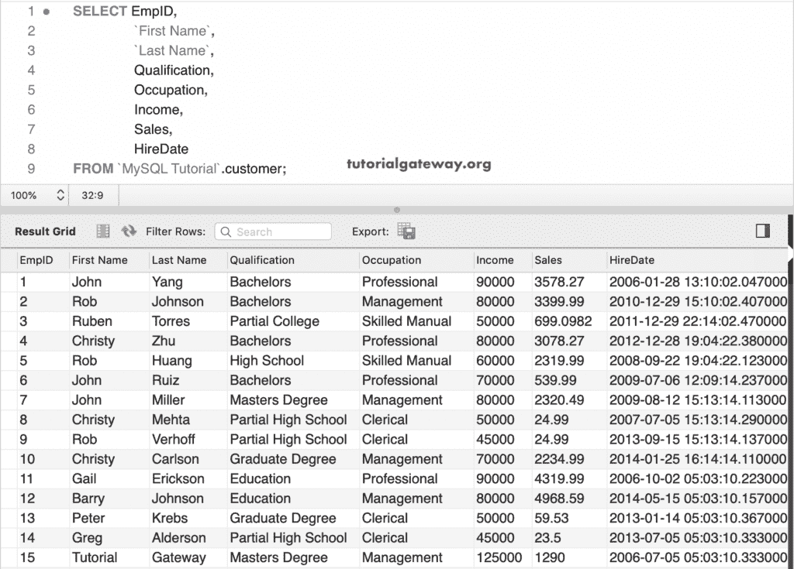
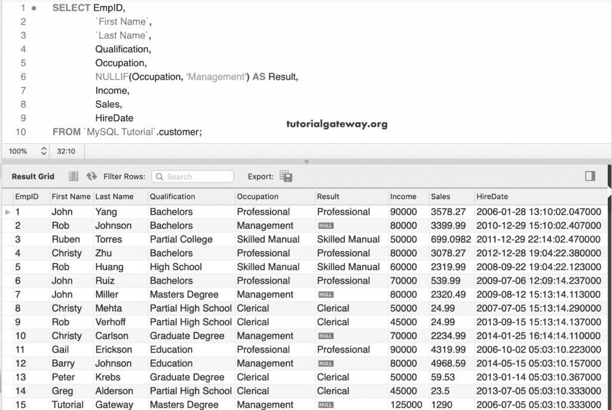
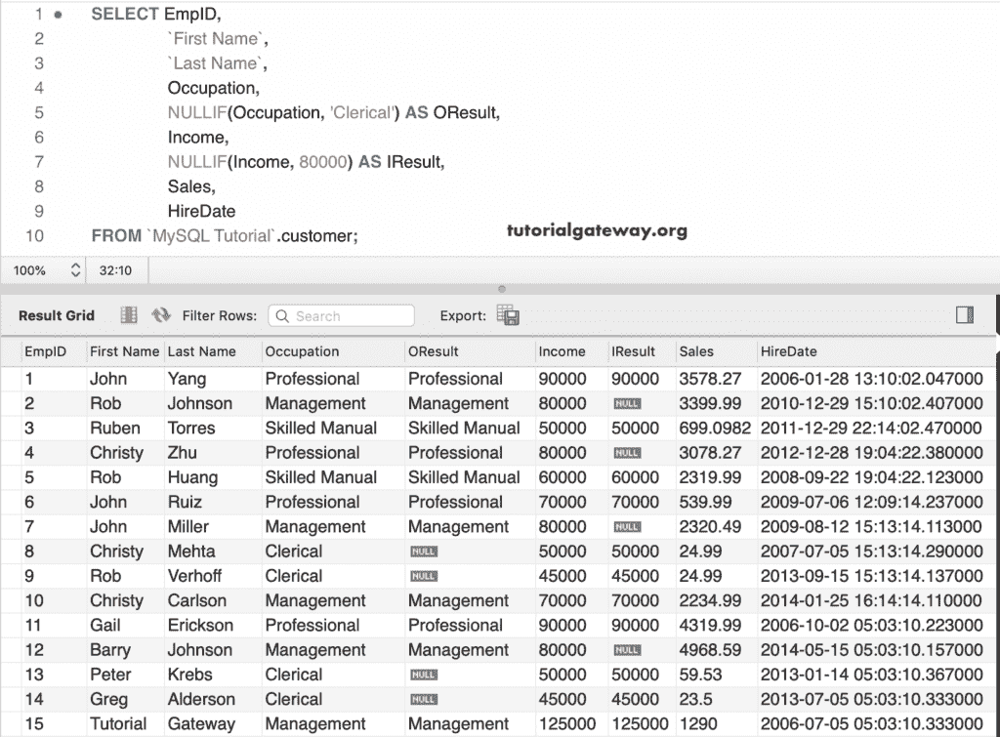

# MySQL NULLIF 运算符

> 原文：<https://www.tutorialgateway.org/mysql-nullif-operator/>

MySQL NULLIF 运算符是一个控制流函数，它接受两个参数。如果参数 1 等于参数 2，则返回空值。否则，返回参数 1。这个 MySQL NULLIF 背后的语法如下:

```
SELECT NULLIF(exp1, exp2) 
```

如果 exp1 = exp2，这个 MySQL `NULLIF()`函数返回空值。否则，它将返回表达式 1 的值。

## MySQL NULLIF 运算符示例 1

在本例中，我们向您展示了简单的 NULLIF 运算符示例。这里，第一条语句返回空值，因为 10 = 10 为真。第二条语句返回 10，因为 10！= 100.在最后一条语句中，我们使用空值作为参数值。这里，空！= 10 表示返回的第一个参数值。

```
SELECT NULLIF(10, 10);

SELECT NULLIF(10, 100);

SELECT NULLIF(NULL, 100), NULLIF(10, NULL);
```



## MySQL NULLIF 示例 2

我们使用这个客户表来演示 NULLIF 操作符。下面的截图给大家展示了这个 [MySQL](https://www.tutorialgateway.org/mysql-tutorial/) 表

里面的数据T4】

在这个例子中，我们使用了 MySQL NULLIF 操作符来对照管理检查职业列值。意思是，如果员工职业是管理，则返回空。否则，将返回“职业”列值。

```
SELECT EmpID, 
       `First Name`,
       `Last Name`,
       Qualification,
       Occupation,
       NULLIF(Occupation, 'Management') AS Result,
       Income,
       Sales,
       HireDate
 FROM customer;
```



这一次，我们在职业栏和收入栏中使用了 NULLIF 运算符。如果职业是文员，返回空值。接下来，如果收入为 80000，则返回空值作为收入值。

```
SELECT EmpID, 
       `First Name`,
       `Last Name`,
       Occupation,
       NULLIF(Occupation, 'Clerical') AS OResult,
       Income,
       NULLIF(Income, 80000) AS IResult,
       Sales,
       HireDate
 FROM customer;
```

