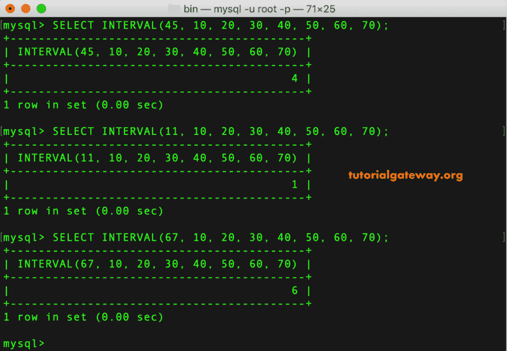
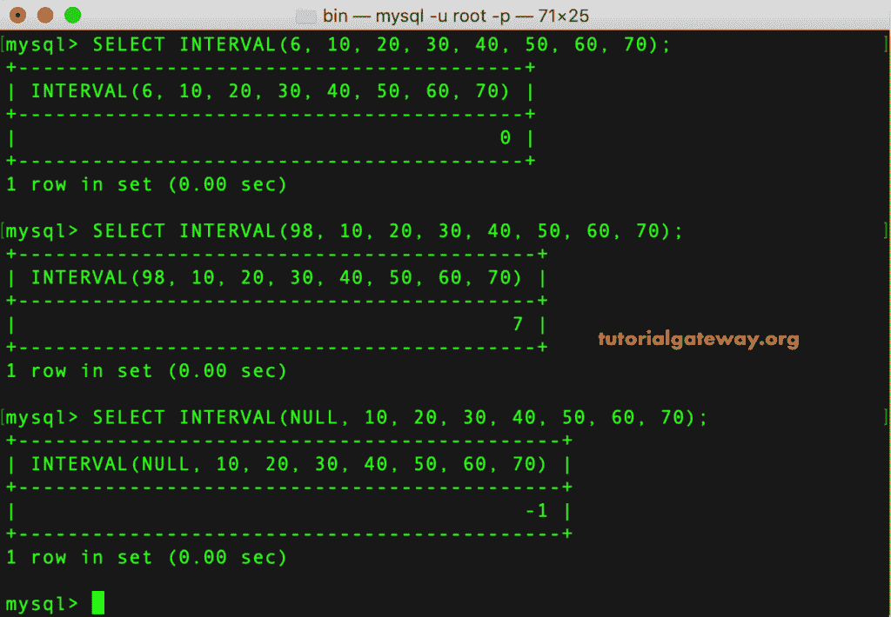
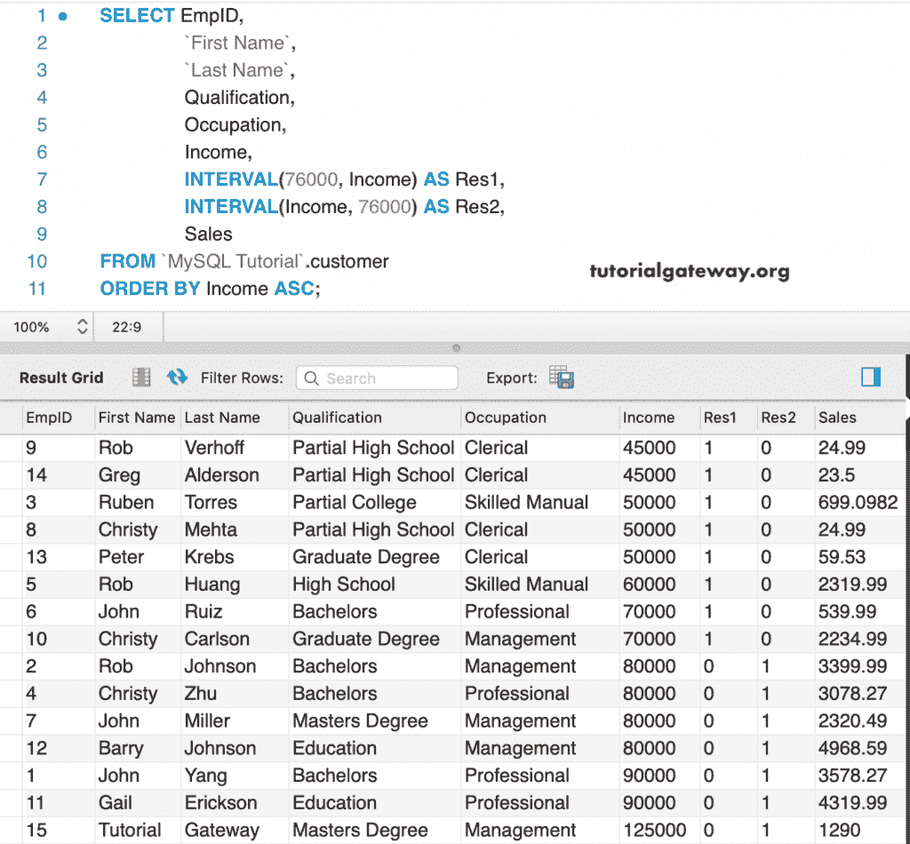

# MySQL 区间运算符

> 原文：<https://www.tutorialgateway.org/mysql-interval-operator/>

MySQL 区间运算符使用二分搜索法方法来搜索项目，并返回从 0 到 n 的值。在本文中，我们通过多个示例展示了如何使用 MySQL 区间运算符。

MySQL 区间运算符的基本语法是:

```
SELECT INTERVAL(N, N1, N2, N3,....Nn) 
```

如果 N < N1，则返回 0。N < N2 表示 1，N < N3 表示 2，以此类推。这个 MySQL 区间函数要求参数以升序排列。我的意思是，N1 < N2 < N3 < N4……。< Nn。否则就不行了。

## MySQL 间隔示例

在本例中，我们从 N1 到 N7 使用相同的值。但是，我们正在更改 N 值以检查间隔位置。

```
SELECT INTERVAL(45, 10, 20, 30, 40, 50, 60, 70);

SELECT INTERVAL(11, 10, 20, 30, 40, 50, 60, 70);

SELECT INTERVAL(67, 10, 20, 30, 40, 50, 60, 70);
```



在第一个语句中，我们使用了小于 N1 的 N 值，因此它返回 0。接下来，我们使用了大于 N7 的 N 值，所以，7 已经返回。在第三条语句内，我们用 NULL 作为 n，这就是原因， [MySQL](https://www.tutorialgateway.org/mysql-tutorial/) 已经返回-1。

```
SELECT INTERVAL(6, 10, 20, 30, 40, 50, 60, 70);

SELECT INTERVAL(98, 10, 20, 30, 40, 50, 60, 70);

SELECT INTERVAL(NULL, 10, 20, 30, 40, 50, 60, 70);
```



### MySQL 区间运算符示例 2

以下查询根据值 76000 查找客户的区间位置。第一，76000 充当 N，员工收入充当 N1。接下来，收入作为 N，76000 作为 N1。

这里，我们使用 [`ORDER BY`子句](https://www.tutorialgateway.org/mysql-order-by/)对收入进行升序排序；否则，该功能将不起作用。

```
SELECT EmpID, 
       `First Name`,
       `Last Name`,
       Qualification,
       Occupation,
       Income,
       INTERVAL(76000, Income) AS Res1,
       INTERVAL(Income, 76000) AS Res2,
       Sales
 FROM customer
 ORDER BY Income ASC;
```

